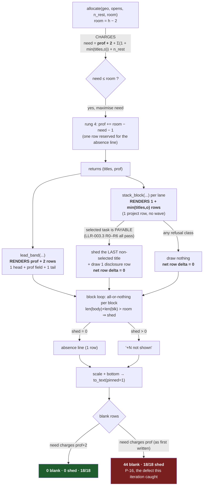

# Requirements Document — taskboard — Batch 2026-08-03-batch-03

> **Artifact language:** English (`state.json.language = en`).
> **Base ref:** `f237cb3` (= `origin/main`, HEAD, merge-base — RC-1 PASS, re-executed at draft: `git log --oneline -1` → `f237cb3 Close the vertical-fill batch and reconcile a day-stale backlog`).
> **Normative convention:** `shall` is binding and appears ONLY inside HLR/LLR **Statement** lines. `should` never appears inside one.
> **Authorship split — SUPERSEDED at the Phase-2 iteration.** The parallel split is what produced the colliding `AT` ids. **This document is now the single Phase-1 artifact**: `01b-qa-validation-plan.md` is folded in (its ATs into §3.0, its TCs into §5.2, its executed baselines into §2.7.1 and §3.0.1) and is retained on disk only as the origin record. §5 is filled here.
> **Iteration 2 (2026-08-06):** amended against `02-review-architect.md` (7 blockers · 11 majors · 6 minors) and `02-review-qa.md` (4 blockers · 7 majors · 6 minors). Every change is recorded in **§6.5** as Before → After / Deleted / New, and every threshold quoted below was **executed at this iteration**, read-only, from a temp directory. **No file under `taskboard/` or `tests/` was modified.**

---

## 1. Introduction

### 1.1 Purpose

Define, at HLR and LLR level, the change that (i) makes each stacked project row in the **lanes** view state in text what the project asks of the reader now, and (ii) moves the cumulative load curve out of that row into a disclosure row that appears only while a task is selected.

### 1.2 Scope

**In scope**
- The stacked-project row in `render_swimlanes` (`taskboard/views.py:1255`): its content, its height, its right edge.
- `allocate()` (`views.py:718`) and `swimlane_plan()` (`views.py:2110`): the row-budget search and the shape of its answer.
- A new disclosure row under the focused project's row, drawing `wave.load_curve` (`taskboard/wave.py:122`).
- The legend's swimlanes branch (`views.py:2249–2266`) and the parameter path that reaches it (`modals.py:1030–1042`).
- Docstrings in the touched surface that assert the project row draws a wave.

**Out of scope, explicitly**
- The gantt view (separate batch).
- Any new visual language (Ledger / Darkside / Naught stay uncommitted prototypes in `_prototypes/`).
- Deleting `wave.py` or `load_curve` — **the curve moves, it does not die.**
- The lanes geometry off-by-one (`today_cell` 44 vs the rule at column 43) — stays in the backlog.
- `report.py:_curve_svg` (`report.py:119`), the HTML report's independent rasteriser of the same curve. **Not edited.** Its docstring's claim is **materially falsified**, not merely narrowed — see §2.7 P-25 and §6.3 R-6 — and HLR-005's quantifier is scoped in writing to exclude it (§3 HLR-005, amendment A-12).

**Newly named in scope for VERIFICATION only (not edited) — the tests that observe the lanes render** (C-14; `grep -rln swimlanes tests/` returns 16 files, of which the pre-amendment census named 2): `tests/test_prism_laws.py`, `tests/test_palette_ration.py`, `tests/test_span_economy.py`, `tests/test_occupancy.py`, `tests/test_vertical_fill.py`. Two of them (`tests/test_vertical_fill.py`, `tests/test_occupancy.py:93`) are **edited** after all — see LLR-002.4 and LLR-002.5, which requirement the selected-state pass they are currently missing.

### 1.3 Definitions, acronyms, abbreviations

| Term | Definition |
|------|------------|
| **lanes view** | `render_swimlanes` (`views.py:1255`) — projects ranked by pressure on one shared axis of days. |
| **lead band** | The top-ranked project's multi-row block, `prof` rows tall (`lead_band`, `views.py:1163`). |
| **stacked lane / project row** | Every active project after the lead: one row built by `stack_block` (`views.py:1097`), currently followed by `wrows - 1` extra field rows and `titles` task rows. |
| **resting lane** | A project with nothing open (`LaneFacts.resting`, `views.py:661`); drawn by `resting_row` (`views.py:1115`); **never appears in `swimlane_nav`**. |
| **title row** | A named task under its project row (`_title_row`, `views.py:1070`). |
| **the field** | The row's shared ground: lattice `·` (`views.py:117`) + the today rule `╎` (`views.py:112`), drawn for every cell by `field_rows` (`views.py:173`). |
| **the curve / the wave** | The figure carved into the field by `project_wave` → `load_curve`: the project's cumulative load, normalised to its whole task set, stopping at its due date. |
| **mechanism D** | The operator-chosen replacement for the curve in the project row: open count · overdue count · next-due distance, **as text**. |
| **the disclosure row** | The new row that draws the curve for the selected task's project, present only while a task is selected. |
| **the shed** | Operator decision (a): the focused project gives up one title row to pay for the disclosure row. |
| **`wrows`** | `allocate()`'s third search dimension — wave rows granted to **each** stacked project (`views.py:754`). |
| **the ladder** | `allocate()`'s four rungs: (1) name, (2) resolve, (3) say what is not there, (4) the hero absorbs the rest. |
| **the prohibition** | `views.py:744–753` — the field may not grow while any task is unnamed. Encoded as `top = 1 if unnamed else max(1, prof - 1)`. |
| **the no-ghost law** | The legend may not describe a mark the view is not drawing (`tests/test_legend.py:79`). |

### 1.4 References

- `.dev-flow/2026-08-03-batch-03/PLAN.md` — the living plan (objective, stories, premises P1/P2/P4/P5/P6, risks, decision log).
- `.fast-dev-flow/archive/2026-08-03-fastflow-02-PROMOTED-spec.md` — the promoted fast-flow spec.
- `~/.claude/templates/dev-flow/req-template.md` — the artifact shape enforced here.
- IEEE 830-1998 · EARS (Easy Approach to Requirements Syntax).

### 1.5 Document overview

§2 states the world this change lands in and **executes every premise it relies on** (§2.7). §3 states five HLRs, each with a black-box Acceptance block. §4 decomposes them into LLRs with declared touched symbols (C-26). §5 is the validation skeleton for `qa-reviewer`. §6 carries the supersession census, the risks, and the two places where the operator's decision needs a ruling.

---

## 2. Overall description

### 2.1 Product perspective

The lanes view is one of four view modes in a single-process Textual app. It has no network, no persistence beyond a local JSON board, and no user other than the board's owner. Everything in this batch is a pure-render change plus one allocator signature change; nothing crosses a trust boundary. `security_required: false` — no pattern matched (no auth, no secrets, no external tool, no new write surface).

The one architectural fact that makes this batch bigger than a visual swap: **`allocate()` is a search over a row budget, and the change removes one of its three search dimensions.** The renderer, the navigation model, the legend and the archive census all read that answer. Getting it wrong does not look like a bug; it looks like a view that pads or overflows.

### 2.2 Product functions

1. Each stacked project row states, in text, its open count, its overdue count and the distance to its soonest-due open task.
2. The project row occupies exactly one row.
3. **While a task is selected AND its lane can pay for the row** (§4 LLR-003.3's payability test), a disclosure row under that lane's project row draws that project's cumulative load curve. **In every state where the lane cannot pay, no disclosure row is drawn and nothing else changes** — the refusal is silent and total (operator ruling O-1).
4. The disclosure row is not navigable and does not participate in cursor scrolling.
5. The legend explains the curve **exactly while a disclosure row is on screen**, and not otherwise.
6. No docstring or comment in the touched surface asserts that a stacked project's own row draws a wave, or that the allocator searches over a wave-row dimension.
7. The lead's bench has an explicit upper bound that a test can execute (LLR-002.6), replacing the bound `wrows < prof` that this batch removes.

### 2.3 User characteristics

One role: the board's owner, an expert operator of their own board, reading a terminal panel. Two named modes in the source stories: **operating** (scanning, triaging — US-A) and **stopping on a project** (having just asked a question about one project — US-B).

### 2.4 Constraints

| # | Constraint | Source (executed) |
|---|---|---|
| C1 | **Every rendered row is exactly the requested width.** | `tests/test_swimlanes.py:88` sweeps `WIDTHS = (24,25,31,32,40,63,72,96,97,130,201)` × `h ∈ (0,14,24,30,44)`. |
| C2 | **The view fills the height it is given and never pads.** Re-verified at draft, not carried: probe rendered calm and busy boards at 96×{24,30,44,60} → `rows == h` and `blank == 0` in 8/8 cases. | probe `_probe_p5.py`, executed 2026-08-06, deleted after use. |
| C3 | **The today rule runs unbroken down the whole panel.** At `col = label_w + today_dc // 2` every `▎`/`▌` row shall carry a `RULE_PHASES` glyph or a braille glyph — a letter or digit there **breaks the law**. | `tests/test_spend.py:124–136`. |
| C4 | **The right edge is the six-cell due meter and nothing else.** `METER_W = 6` (`views.py:817`); `figs_w = min(METER_W + 1, max(4, inner // 3))` (`views.py:1026`). | `views.py:900–914`. |
| C5 | **Never a zero standing in for a blank.** A figure the data cannot support is not invented. | `sitting()` docstring, `views.py:1142–1146`. |
| C6 | **The legend may not describe a mark the view is not drawing.** | `tests/test_legend.py:79`. |
| C7 | **The legend's swatches are drawn by calling the same function the view calls.** | `tests/test_legend.py:5–10`, `modals.py:1023–1025`. |
| C8 | ≤5 files per increment; review packet per increment; operator approves every gate; **no merge authority** — the batch stops at "PR opened, CI green". | `PLAN.md` §Batch-kickoff authorization. |

### 2.5 Assumptions and dependencies

- The board's data model, `LaneFacts` (`views.py:645`), already carries `open`, `late`, `due_in`, `total`, `done_n` — no model change is needed. *(Evaluated: P-4.)*
- `refresh_view()` (`app.py:271`) repaints the whole view on every keypress, so a selection-dependent row costs no new reflow class. *(Carried from PLAN P2, recorded P-2.)*
- The occupancy floor has 27–38 points of headroom, so removing 114 cells of wave does not threaten it. *(Carried from PLAN P1, recorded P-1 — but see §6.3 R-4: the post-change tree owes a re-measure.)*

> ⚠ Every assumption above that this batch relies on is evaluated in **§2.7** with a verdict.

### 2.6 Source user stories

| ID | User Story | Source | DoR status |
|----|------------|--------|------------|
| **US-A** | As the board's owner **operating** the board, I want each project row in the lanes view to tell me open count, overdue count and next due distance, so I can triage without decoding a mark. | Phase 0 intake, promoted from `/fast-dev-flow` | **READY** |
| **US-B** | As the board's owner **stopping on a project**, I want its cumulative load curve where I am already looking (a disclosure row that appears only while a task is selected), so the shape answers a question I just asked. | Phase 0 intake; operator decision (a) at the fast-flow Phase-A gate | **READY** (ordered after US-A) |

#### Refinement log

**US-A — the row says what the project asks of you now**
- **INVEST:** I ✓ · N ✓ · V ✓ · E ✓ · S ✓ · T ✓
- **Functionality (V, N):** user = the board's owner mid-scan · outcome = three figures readable without decoding a braille figure · why = triage · out of scope = the lead band's own header (it already carries `N open`, `!N` and the pressure chip, `views.py:1173–1176`).
- **Feasibility (E, S):** every figure is derivable from `LaneFacts` with no model change; the row already has the cells (measured: `field_w = 73` at 96 wide vs ~26 cells of text). Fits one batch.
- **Evaluability (T):** *When the lanes view renders a board with a project holding 8 open tasks, 2 of them overdue and the soonest due 3 days ago, the owner observes that project's row stating `8 open`, `2 over` and `-3d` as readable text.* → `AT-001`.
- **Open questions:** resolved at draft — see §2.7 P-5 (the "next due distance" is the **soonest open task's** distance, not the project's own due date, because the row's right edge already carries the latter).
- **Classification:** `READY`.

**US-B — the curve where I am already looking**
- **INVEST:** I ✗ — depends on US-A for its row budget · N ✓ · V ✓ · E ✓ · S ✓ · T ✓
- **Functionality (V, N):** user = the board's owner who has just stopped on a task · outcome = that task's project's cumulative load curve, drawn under its project row, gone again when nothing is selected · why = the shape answers a question just asked instead of decorating a row being scrolled past · out of scope = the lead band's own field (unchanged).
- **Feasibility (E, S):** `load_curve` takes a `Bitmap` and plain lists (§2.7 P-6); the disclosure row is one `field_rows(...)` call. The hard part is not drawing it — it is paying for it (§2.7 P-9, P-10).
- **Evaluability (T) — AMENDED (A-1), because the previous wording asserted what O-1 forbids:** *When the owner moves the cursor onto a task that is **drawn as a title row of a stacked lane that has at least one other drawn title and whose one-row curve rasterises at least one lit dot**, the owner observes one new row immediately under that lane's project row carrying braille curve glyphs, and that lane's drawn title count falls by exactly one while the panel's total row count is unchanged. When the cursor moves to a task in **any** of the nine states of LLR-003.3, the owner observes **no** such row and no other change.* → `AT-003` (positive limb, driven through the pilot) and `AT-004` (the nine refusal states).
  > The previous wording — *"when the owner selects a task belonging to a drawn stacked project… one new row"* — was **unsatisfiable on the calm board**, the board O-1 exists for (measured: `titles = 1` at 96×30/44/24, 72×30, 40×20, 5/5). It is deleted, not softened.
- **Open questions:** O-1 and O-2 are now **ruled** (§6.3). What remains open and is surfaced for a ruling is **O-3** (the `prof` ceiling's value) and **O-4** (how the legend learns a disclosure row was drawn). Neither blocks derivation; both carry a specified, measured default.
- **Classification:** `READY` (ordered after US-A).

### 2.7 Premise evaluation (C-43)

All probes executed 2026-08-06 against the tree at `f237cb3`. Regime for every allocator/geometry figure: `lane_geometry(96, h)` unless stated; `TODAY = 2026-07-30`; boards built in a temp dir from `Board`/`Project`/`Task`. **No probe read the operator's real board.**

| # | Premise, as a truth-apt proposition | Tier | Verdict | Executed evidence | Disposition |
|---|---|---|---|---|---|
| **P-1** | Removing the wave breaks the occupancy floor. | hypothesis | ❌ **FALSE** | Carried from PLAN: `test_occupancy.census` → marked **72.3 / 80.9 / 83.8 %** vs floor **45 %**; wave = **114 cells = 4.0 %** of a 96×30 render. **Not re-executed here.** | Carried. **Re-measure owed on the POST-change tree** — 27–38 points is a margin, not a proof. → §6.3 R-4, LLR-002.5. |
| **P-2** | The disclosure row introduces a reflow cost class. | hypothesis | ❌ **FALSE** | Carried from PLAN: marginal cost of one extra row **−0.17 ms** (4.51 → 4.34 ms); `app.refresh_view()` (`app.py:271`) already repaints the whole view every keypress. **Not re-executed here.** | Carried. No performance LLR. |
| **P-3** | The lanes view never pads: at every height it renders exactly `h` rows with **zero** blank rows. | premise | ✅ **TRUE** | Probe rendered calm (4 projects × 1 open) and busy (5 projects, 5–8 open) at 96×{24,30,44,60}: `rows=24 blank=0 · 30/0 · 44/0 · 60/0` for both boards — 8/8. | — |
| **P-4** | `LaneFacts` already carries every figure mechanism D needs (open, overdue) without a model change. | premise | ✅ **TRUE** | `views.py:645–659`: `open: list`, `late: list`, `due_in: int\|None`, `total: int`, `done_n: int`. Probe on the busy board printed `Atlas open=8 over=2`, `Beacon open=7 over=0`, `Cinder open=6 over=0`, `Delta open=6 over=0`, `Ember open=5 over=0`. | — |
| **P-5** | The row's right edge already states the project's own due-date distance, so a "next due" figure sourced from `lane.due_in` would be a duplication. | premise | ✅ **TRUE** | `lane_due_days()` (`views.py:892–897`) returns `lane.due_in` and nothing else; `_figures()` (`views.py:911`) feeds it to `due_meter`. Probe, busy board, `figs_w=7`: meter renders `···10d / ···24d / ···17d / ···31d / ···38d` — i.e. **the project's date**. The soonest **open task** distances on the same lanes are `-3d / +0d / +1d / +2d / +4d` — a different number in 5/5 cases. | **Binds LLR-001.1**: mechanism D's third figure is the soonest open task's distance. |
| **P-6** | `views.py:986` is `load_curve`'s only caller. | premise (inherited from PLAN P5) | ❌ **FALSE** | `grep -rn "load_curve" taskboard/ --include=*.py` → **`views.py:986` AND `report.py:137`** (inside `_curve_svg`, `report.py:119`). Two callers, not one. | **Corrected here.** The premise's *intent* — "`load_curve` is callable outside the lane machinery" — is ✅ **TRUE and now proven twice over**: `report.py` already calls it with its own `Bitmap(span, 32)` and its own `steps`. **Does not block**; it enlarges §6.3 R-6 (the report's docstring claim). |
| **P-7** | The legend has never described the wave, so a legend requirement here **adds** an entry rather than moving one. | premise (inherited from PLAN P6) | ❌ **FALSE** as the PLAN phrased it ("the legend describes the wave today") — ✅ confirmed in the direction the batch needs | Swept `legend_entries`'s swimlanes branch (`views.py:2249–2266`), every `out.append`: `▌` lead · `▎` spine · `▏` resting · `·`/`·`/`╎` field ground · `◆` project due · status marks · phase glyphs · `!N`. `grep -n "wave\|curve\|cumulative\|load"` over the whole function body → the **only** hit is a comment inside the **gantt** branch (`views.py:2271`). | **Confirmed.** HLR-004 **ADDS** an entry. |
| **P-8** | `_figures`' docstring is the only live false claim this batch creates. | hypothesis | ❌ **FALSE** | `grep -rn "own wave" taskboard/ tests/ --include=*.py` → **three** sites: `views.py:903` (`_figures`, the one named in the plan), `views.py:1100` (`stack_block`: *"A project: its own wave in its own hue…"*), and **`tests/test_swimlanes.py:164`** — a **test docstring** repeating the same reason. | **Enlarges HLR-005 from one site to three.** The test-docstring site is inside the reverse-census surface (§6.1). |
| **P-9** | Retiring `wrows` leaves the calm board's surplus with no consumer but the hero, inflating the lead band. | hypothesis | ✅ **TRUE** | Simulated `allocate()` with the `wrows` loop removed and per-project cost pinned to 1, over the same boards/regimes. Calm (1 open each): `96×30 (1,8,5) → (1,19)`; `96×44 (1,10,9) → (1,33)`; `96×24 (1,5,4) → (1,13)`; `72×30 (1,7,5) → (1,19)`. Light (2 each): `96×44 (2,10,8) → (2,30)`. Busy (5–8 each): `96×30 (4,6,1) → (4,6)` — **unchanged**. `lead_band(lane, geo, TODAY, 96, prof=33, 0)` returns 35 rows and does **not** raise. | **Does not block.** Requirement it: LLR-002.5 + §6.1 supersession of `tests/test_spend.py:277`. |
| **P-10** | Operator decision (a) — "the focused project sheds one title" — is payable in every state the view can be in. | hypothesis | ❌ **FALSE** | On a calm board `titles = 1` (measured: calm 96×30/44/24, 72×30, 40×20 all give `titles=1`; light boards give `titles=2`). With `titles=1`, shedding the focused project's only title **unnames the selected task itself** — the cursor lands on a row the view does not draw, the exact failure `swimlane_plan`'s own docstring names (`views.py:2113–2115`: *"asking it twice with different numbers is how a cursor ends up on an undrawn task"*). | **BLOCKS as written; dispositioned.** Decision (a) is **extended** with an explicit payability rule and a refusal class — LLR-003.2 / LLR-003.3. Surfaced to the operator as §6.3 **O-1** with a specified default so Phase 3 is never blocked on an answer. |
| **P-11** | The curve still reads as a curve at one row (4 dot-rows). | hypothesis | ✅ **TRUE** | Executed `project_wave(lane, geo, TODAY, rows=1)` → `field_rows(...)` for all 5 active lanes of the busy board. Distinct braille glyphs per row: Atlas **7**, Cinder **6**, Beacon **8**, Delta **4**, Ember **5**. Atlas at `rows=1`: `···················⢀⣀⢠⣤⣤⣴⣾⡇····…` (29 lit dots) — a monotone rise, not a bar. | — |
| **P-12** | `legend_entries` can condition an entry on the live selection without a signature change. | premise | ❌ **FALSE** | `legend_entries(mode, board, today=None, width=96, height=30, show_archived=False)` (`views.py:2223–2225`) — **no `selected_id`**. Its only production caller, `LegendModal.compose` (`modals.py:1039–1042`), holds `_mode/_board/_today/_show_archived/_dims` and no selection either (`modals.py:1030–1037`). | **Dispositioned, not blocking.** LLR-004.2 threads the selection through both signatures and declares the touched symbols. Alternative (condition on *reachability* rather than live selection) is recorded and rejected in §6.2 D-4. |
| **P-13** | Retiring `wrows` is a signature change with a reverse-census footprint in `tests/`. | premise | ✅ **TRUE** | `grep -rln` per symbol across `tests/`: `wrows` → `test_spend.py` only; `allocate` → `test_spend.py`; `swimlane_plan` → `test_swimlanes.py`; `field_rows` → `test_field.py`; `_figures` → `test_swimlanes.py`; `load_curve` → `test_wave.py`; `lane_titles` → `test_swimlanes.py`; `legend_entries` → `test_legend.py`, `test_archive.py`. `project_wave` and `stack_block` → **0 test files** (rendered-output tests only). | Full census in §6.1. |
| **P-14** | `allocate()`'s doctrine supports paying for the change out of curve resolution. | premise (inherited from PLAN P4) | ✅ **TRUE** | Re-executed, not cited: `views.py:722–726` reads *"the search maximises rows actually used, breaking ties toward titles first (**a named task outranks a taller curve on a mission-control surface**) and toward a taller LEAD before taller stack waves."* | — |
| **P-15** | Mechanism D's text can be placed in the project row without breaking the today rule (C3). | premise | ✅ **TRUE** | `lane_geometry(96, 30)` → `label_w=15 figs_w=7 field_w=73 dot_w=146 today_dc=42`, so the today cell is field column **21** of 73, leaving **51** cells to its right. Longest D string at the busy board's widest lane (`8 open · 2 over · -3d`) = **20** visible cells — fits entirely right of the rule. `tests/test_spend.py:135` accepts a `RULE_PHASES` glyph **or** a braille glyph at that column and nothing else — so a digit or letter there is a violation. | **Binds LLR-001.3.** At narrow widths the margin shrinks; LLR-001.5 makes the rule the thing that survives, not the text. |

#### 2.7.1 Premises added at the Phase-2 iteration (all executed 2026-08-06 from `C:\Users\jjgh8\AppData\Local\Temp\arch2`, read-only, synthetic boards in a temp dir — **no probe read the operator's real board**)

| # | Premise, as a truth-apt proposition | Tier | Verdict | Executed evidence | Disposition |
|---|---|---|---|---|---|
| **P-16** | The post-change cost model `need = prof + Σ(1 + min(titles,o)) + n_rest` (LLR-002.1 as first written) spends the panel exactly. | premise | ❌ **FALSE — and it is the batch's most consequential error.** | `lead_band` returns `1 head + prof field rows + 1 tail` = **`prof + 2`** rows (`views.py:1163–1218`, executed: at 96×30 calm, `prof=24` → `len(lead_band(...)) == 26`). `need` charges `prof`. Pre-change the 2-row undercount was harmless because `wrows` absorbed budget; post-change rung four drives `need` to `room − 1` on every calm board, so actual rows = `room + 1`. Rendered, **18/18** board×size renders **shed a real lane** and printed `+N not shown` — on a **2-project** calm board — and padded 1–4 blank rows (total 44 blank rows over 18 renders). With `need` charging `prof + 2`: **0 blank rows, 0 renders shedding, 18/18.** Pre-change baseline on the same 18 renders: **0 blank, 0 shed.** | **BLOCKS LLR-002.1 as first written. Amended (A-6).** `need` **shall** charge `prof + 2`. |
| **P-17** | Post-change, the lead's bench occupies a bounded share of the panel. | hypothesis | ❌ **FALSE.** | Corrected cost model, occupancy `calm` fixture: `prof/h` = **67 % @ h=24 · 73 % @ h=30 · 82 % @ h=44 · 87 % @ h=60**; monotone in `h` and asymptotically 1. Synthetic calm boards give the same shape (`prof=51` at 72×60). There is **no** upper bound on `prof` post-change other than the room itself. | **Requires LLR-002.6 (NEW) and O-3.** |
| **P-18** | A taller lead bench carries more information about the same curve. | hypothesis | ❌ **FALSE beyond ~4 rows.** | `project_wave(lead, geo, TODAY, prof)` swept `prof ∈ {1,2,3,4,6,8,10,12,16,24,32,52}` on all three `LOADS` leads: distinct column heights in the raster reach their maximum at **prof = 3–4** and are **unchanged through prof = 52** (calm 5→5, typical 8→8, extreme 8→8) while lit dots grow **16×** (calm 53 → 819). The curve is a step function with at most `lane.total + 1` levels; the panel cannot add levels the data does not have. | **Answers O-3's design question. Recorded; see O-3 for why it is NOT the ceiling that gets legislated.** |
| **P-19** | Every current fixture has `open == total`, so LLR-003.5's mutation is not runnable (R-9, and the PLAN decision-log row "Phase 1 approved with a named Evidence gap"). | premise | ❌ **FALSE — the accepted Evidence gap did not exist.** | `open < total` on **15 of 16** lanes across three on-disk fixtures (`tests/test_swimlanes.py::typical` Atlas 2/3; `tests/test_occupancy.py::fixture` calm 1/2, typical **5/5**, extreme **8/8**). Cause: `fixture` cycles `phases=["Backlog","Doing","Done"][j % 3]`, so one task in three is Done. Raster under the mutation genuinely differs (hamming 2–33). | **Corrected here (A-9).** The debt was never a fixture; it was the **observable** (P-20). The `ledger` fixture is retained for a different, stated reason: **margin**. |
| **P-20** | LLR-003.5's observable (`≥ 4 distinct braille glyphs`) reddens under its declared C-40 mutation. | premise | ❌ **FALSE — inverted, and it false-fails correct code.** | The mutant (`open`-normalised) is **≥** the correct code in 21/21 synthetic and 13/13 occupancy cases; and `≥ 4` is **violated by correct code** on 3 of 13 occupancy lanes at 96×30, in regime. Replacement executed here: presence of the full-height cell **`⣿` (U+28FF)**. Correct vs mutant on the `rows=1` disclosure row: reddens on **13 of 15** lanes swept (`ledger` 4/12 ✓; occupancy `typical` 4 of 5; `extreme` **8 of 8**). The two non-reddening lanes are exactly the two with `open == total` — which is the anti-vacuity companion, not a miss. | **BLOCKS LLR-003.5 as written. Amended (A-10).** |
| **P-21** | Every drawn stacked lane with dated open work rasterises at least one lit dot at `rows=1`. | premise | ❌ **FALSE.** | Reproduced: a lane whose **project** due date is in the past clamps `wave_edge` to `geo.today_dc` (measured `42 == 42`), and `load_curve` skips every `x > edge`, so a future-dated open task fills nothing. `Delta` (project due −9d, 1 open task at +1d) → **`bm.lit() == 0`**; `Atlas` (due +20d) → 76. `Delta` is a lane of `tests/test_swimlanes.py::typical`, on disk today. | **Fifth refusal class. Amended (A-8).** |
| **P-22** | A drawn stacked lane's drawn titles cover the tasks in it that the cursor can select. | premise | ❌ **FALSE, on every fixture.** | Selectable-but-undrawn open tasks, `swimlane_plan` at the stated size: calm **2 of 4 (50 %)** at 96×30/24 and 72×24; typical **4 of 16 (25 %)**; extreme **18 of 32 (56 %)** at 96×30 and **25 of 32 (78 %)** at 96×24/72×24. `App._select_first` (`app.py:217–222`) validates only against `board.visible_tasks(...)`, and its own docstring says the selection "may not be individually navigable in a compact view". | **Sixth refusal class — the semantic inversion. Amended (A-8).** Drawing the curve here would put it next to a row the cursor is not on, which inverts US-B's premise. |
| **P-23** | The Inbox pseudo-lane is a fourth lane kind needing its own clause. | hypothesis | ❌ **FALSE — it needs none, and here is why.** | `lanes_of` (`views.py:710–715`) builds Inbox with `lane_facts(board, today, "Inbox", "dim", "on_track", None, inbox)` — an ordinary `LaneFacts` that sorts with the rest and can be lead, stacked or resting. Executed on a 1-project + 2-orphan board: `hue="dim"` (**member of `HEX`**, so LLR-003.6's ration set already admits it), `due_in=None` → `wave_edge` falls back to the max open-task column (**47**, well-defined), `total=2`, `bm.lit()=10`. | **No clause needed. Recorded as a totality obligation discharged, not as a gap.** |
| **P-24** | Post-change, at `selected_id=None`, only the lead band contributes braille, so `tests/test_prism_laws.py:147` collapses to one lane (the cross-review's M-2). | hypothesis | ❌ **FALSE as stated; ⚠ TRUE in degree.** | `_title_row` paints the phase glyph in **`lane.hue`** (`views.py:1088–1089`) and the phase glyphs `⣀⠤⠒⠉` are members of that file's `FIELD_GLYPHS`, so **title rows keep contributing**. Measured on the law's own board at 120×44: rows carrying an identity-hued field glyph fall **35 → 20** (−43 %), and the `▎`-led share falls **27 → 12**. It does **not** collapse to the lead (8 lead rows + 12 title rows survive). | **M-2's mechanism is corrected here; its concern is upheld at −43 % coverage.** Requiremented as a named observation in LLR-001.2, not as a blocker. |
| **P-25** | `report.py:_curve_svg`'s claim only *narrows* after this batch (R-6 as first written). | premise | ❌ **FALSE — it becomes materially false.** | `build_report` (`report.py:241`) emits `_project_section(ln, …)` for **every** lane, and every section emits `<figure>{_curve_svg(lane, today)}` (`report.py:219`) **unconditionally**. Post-change the app draws **at most one** curve outside the lead band, and only while a payable selection exists. So *"the document cannot describe a shape the app stopped drawing"* (`report.py:122–124`) is falsified for every non-selected project. | **HLR-005's quantifier is scoped in writing (A-12); the `report.py` docstring is named as an out-of-scope known-false claim and carried to the post-mortem, not silently left as "narrowed".** |
| **P-26** | `grep -rn "own wave"` (3 pre-state hits) can detect the false claims this batch creates. | premise | ❌ **FALSE — it detects 3 of a 26-line claim set.** | Tokenised every comment and docstring line in `taskboard/*.py` + `tests/*.py` (excluding `taskboard/wave.py`, whose module name is not a claim) matching `wave|wrows`: **26 lines across 6 files** — `taskboard/report.py` 1 · `taskboard/views.py` **15** (`:108, :720, :725, :729, :750, :752, :761, :903, :972, :1057, :1100, :1492, :1631, :2112, :2271`) · `tests/test_field.py` 1 (`:132`) · `tests/test_spend.py` **5** (`:84, :127, :239, :240, :278`) · `tests/test_swimlanes.py` 2 (`:164, :204`) · `tests/test_wave.py` 2 (`:80, :205`). The `"own wave"` grep matches **3**. | **BLOCKS HLR-005's threshold. Re-derived (A-11).** |

**Gate rule applied (amended):** P-6, P-7, P-8, P-10, P-12 came back ❌ at draft; **P-16, P-17, P-18, P-19, P-20, P-21, P-22, P-23, P-24, P-25, P-26 came back ❌ at this iteration.** Every one lands in an amendment recorded in §6.5. **P-16 is the one that would have shipped a defect**: the allocator LLR-002.1 specified sheds a lane on every calm board.

**Gate rule applied (original draft):** P-6, P-7, P-8, P-10, P-12 came back ❌. P-6/P-7/P-8/P-12 are dispositioned **in writing** above and each lands in a requirement. **P-10 is the one that changes the shape of the story** — it is dispositioned with a specified default plus an operator ruling requested at the Phase-2 gate (§6.3 O-1). No premise is ❓.

---

## 3. High-level requirements (HLR)

### 3.0 THE CANONICAL `AT` REGISTER — one register, this document owns it

`01b-qa-validation-plan.md` is **folded into this artifact** and ceases to be a separate register. Its acceptance content lives here; its `TC` content lives in §5.2. The id space is fixed by the orchestrator and is not renumbered by any later phase:

- `AT-001`…`AT-006` keep the meanings they had in **this** document.
- Every acceptance that existed only in `01b` is renumbered into **`AT-020`+**, keeping its subject.
- Two `01b` ids describe the same acceptance as an existing one; both are **retired into** the surviving id, with both origins cited.

**No id appears twice with different subjects. Every AT is one distinct on-disk node (C-18), all in a new `tests/test_lane_readout.py`.**

| id | story | subject | observation surface | reddening mutation (C-40) |
|---|---|---|---|---|
| **AT-001** | US-A | The stacked project row states this project's **open count**, **overdue count** and **next-due distance**, each equal to the value recomputed from the board. Set of project rows derived from the render by spine glyph (`▌`/`▎`/`▏`); completeness against `board.visible_projects(False)` (+ `"Inbox"` iff orphans) and `"not shown"` absent. | `render_view("swimlanes", …)` plain text | render the overdue count as a constant `0` → reddens on the lane with 2 overdue; render `total` where `open` belongs → reddens on any lane with a done task |
| **AT-002** | US-A / HLR-002 | The panel is exactly `h` rows with **0** blank rows and every line exactly `max(24, w)` cells, on a calm and a busy board, over `WIDTHS × h`. | `render_view` swept | charge `0` instead of `1` per stacked lane in `allocate` → blank rows appear at the bottom on every board |
| **AT-003** | US-B | **Through the running app:** moving the cursor onto a **payable** title (LLR-003.3) makes exactly one curve row appear immediately under that lane's project row, and moving away makes it **move with the cursor**. The key is read from `taskboard/keymap.py`, never typed; the anchor row is located by the task's **title string**, never by index and never by the highlight (`.plain` discards it — P-27/QA). | `App.run_test(size=(96,30))` | render the disclosure row from a stale selection (not re-rendered on keypress) → the row does not move → red |
| **AT-004** | US-B | **The nine refusal states of LLR-003.3 each draw 0 disclosure rows**, while `rows == h`, `blank == 0` and `"not shown"` is unchanged. One node, one subject, parameterised over the nine states — each state constructed and each asserted individually so a missing state is a missing parameter, not a silent pass. | `render_view` / `App.run_test()` | make any one refusal fall through to drawing the row → that state's row count changes → red |
| **AT-005** | US-B | The legend carries **exactly one** entry naming the cumulative load curve **iff** a disclosure row is on screen, and its swatch is produced by calling the drawing function the view calls. | `LegendModal` via `App.run_test()`, `?` over lanes | default the new legend parameter to a truthy sentinel → the entry appears with nothing payable → `tests/test_legend.py:79` no-ghost goes red |
| **AT-006** | US-A | **No surviving prose claim** that a stacked project's own row draws a wave, or that the allocator searches a wave-row dimension. Set = the **26** pre-state prose lines of P-26, derived by tokenising comments/docstrings, not by one grep string. | the repository on disk | revert any one amended line → the classified set gains a hit → red |
| **AT-020** | US-A | *(was `01b` AT-002)* A project with open work but **no due dates** states its counts and reads the honest no-date form for the distance — **not** `0d`, **not** blank, **not** `+0d`. | `render_view` on an undated fixture | make the undated case fall through to `0` days → red |
| **AT-021** | US-A | *(was `01b` AT-003)* The readings degrade by **dropping whole tokens**, never by truncating a number: no digit run ends at the row edge without its unit, no `…` falls inside a number. `WIDTHS` **imported** from `tests/test_swimlanes.py`, with `assert min(WIDTHS) <= 25 and len(WIDTHS) >= 8` so shrinking the ladder reddens (MIN-4). Swept at `h ∈ {12, 24, 30, 44}` because `label_w` is 12/74 at `h ≤ 24` and 15/71 at `h ≥ 30` (MIN-3). | `render_view` swept | replace token-dropping with a raw slice → a number loses its `d` at width 24/25 → red |
| **AT-022** | US-A | *(was `01b` AT-004)* The legend gains an entry naming the **row's readout**, and its swatch is **byte-equal to the corresponding span of the actual rendered row** for a known project. Completeness: **every** swimlanes entry's swatch occurs somewhere in the render (no-ghost), asserted over a set derived from the return value **and** compared against the marks the render actually contains (MIN-5). | `legend_entries("swimlanes", …)` + the render | hand-write the swatch string instead of calling the drawing function → drifts from the row → red |
| **AT-023** | US-B | *(was `01b` AT-010)* **Differential:** `rows_selected == rows_none ∪ {i}` for exactly one new curve-bearing row index `i`, and `abs(i − r) == 1` where `r` is the row whose text contains the selected task's title. Curve ink identified by the **adjacency classifier** (§3.0.1) with all three anti-vacuity companions asserted **in this test body**. | two `render_view` calls, same board/size/today | (a) draw the row unconditionally → delta 0 → red; (b) append it at the end of the lane → adjacency fails; (c) draw the row with a blank curve → no curve cells added |
| **AT-024** | US-B | *(was `01b` AT-011)* **No lane other than the selected one** gains a curve row. Completeness companion **fixed per C-31 (MAJ-3)**: the other-lane set is derived from the render **and** asserted to equal `{p.name for p in board.visible_projects(False)} − {selected lane}` (+ `"Inbox"` iff orphans), **and** `"not shown"` absent in both renders — so dropping a real lane reddens instead of shrinking the set silently. `≥ 2` members is kept as a floor, not as the completeness check. | two `render_view` calls | give every lane a disclosure row → red |
| **AT-025** | US-B | *(was `01b` AT-012)* The focused lane draws **one fewer** title (`n1 == n0 − 1`), the **selected** title survives, line counts are equal, and `"not shown"` is absent in both renders. `n0` measured at run time; `assert n0 >= 2` is the fixture-accident guard. | two `render_view` calls, occupancy `typical` | (a) pay from the lead's bench → title delta 0; (b) shed from the wrong lane; (c) shed the selected title; (d) leave the row unpaid → `"not shown"` or line counts diverge |
| **AT-026** | US-B | *(was `01b` AT-013 — **UNBLOCKED** by O-1, which is `01b`'s own option (i))* On a lane that **cannot pay** (`titles == 1`, the single drawn title selected), the lane's row block is **byte-identical** to the `selected_id=None` render's, and `rows == h`, `blank == 0`, `"not shown"` absent. | two `render_view` calls, the repo lanes fixture | let the refusal fall through → the block differs → red |
| **AT-027** | US-B | *(was `01b` AT-014 — **UNBLOCKED** by the fifth refusal class, LLR-003.3 clause 6)* On a lane whose one-row bitmap has **zero lit dots** (project due in the past; `Delta`, on disk, measured `lit == 0`), **no** disclosure row is drawn and **no** legend entry appears. | `render_view` + `legend_entries` | draw the row anyway → a blank stripe appears under the cursor and the legend describes an absent mark (C5 + C6) → red |
| **AT-028** | US-A + US-B | *(was `01b` AT-015)* **Output-then-consume (C-12):** the shipped `render_view` output is fed **unmodified** into `tests/test_occupancy.py::census` and the never-pads law, **in both the `None` and the selected state** — six occupancy readings, not three. | `render_view` → the existing laws | let the disclosure row overflow the height → a stranded row or a changed line count → red |

**Retirements, recorded explicitly (same acceptance, two ids):**

| retired id | retired into | why they are the same acceptance |
|---|---|---|
| `01b` **`AT-001`** | **`AT-001`** | Both certify US-A's golden path — the stacked row's three readings equal the values the board implies, over a spine-derived row set. `01b`'s set-derivation and completeness companion are the surviving text. |
| `01b` **`AT-016`** | **`AT-003`** | Both certify US-B **through the running app** with a real cursor move. `01b` AT-016's three additions — read the key from `taskboard/keymap.py`, locate the anchor by title string, assert the row **moves with** the cursor — are folded into `AT-003`'s predicate above and are the reason `AT-003`'s text changed. |

#### 3.0.1 The curve-ink classifier (adopted verbatim from `01b` §2, with its one limitation corrected)

A braille cell counts as **curve ink** iff at least one horizontal neighbour is braille or field ground (`·`, `╎`, `╽`, `╿`). A phase glyph sits between two literal spaces; a curve cell always abuts ground or more curve. **It references no internal symbol.**

Three anti-vacuity companions (C-31), each executed and each required *in the test body*: (1) the `None` render yields **> 0** curve cells (measured 60 at typical 96×30); (2) the same render yields **> 0** glyph cells (measured 12); (3) an undated fixture yields **0** curve and **> 0** glyph cells (measured 0/3).

**Corrected limitation (blocker — the write-up had it backwards).** The classifier is fooled by a task title whose **LAST** character is braille, not its first — and only when the title is long enough to close the gap to the lattice tail. Measured (QA cross-review §1, pasted output): `▎  ⠤ progress bar ⣿···…` classifies the `⣿` at index 18 as **curve**, while `▎  ⠤ bar ⣿     ···…` classifies the same character at index 9 as **glyph**. The threshold is `vis(title) >= label_w − 5` (**= 10** at `label_w = 15`). The guard is therefore `assert t.title.isascii()` over **every** fixture task — guarding the first character would guard the wrong end and leave the real vector open. *(Both attack vectors on the classifier were swept over 66 renders and closed structurally: the phase glyph is pinned at visible index 3 with literal spaces at 2 and 4 while ground starts no earlier than `label_w ≥ 7`; and `field_rows` never emits a space inside the field, with `field_w ≥ 7` at every supported width.)*

---

### HLR-001 — The project row states what the project asks of you now

- **Traceability:** US-A
- **Statement:** When the lanes view renders a stacked project lane, the system **shall** state, in text within that lane's project row, the lane's open-task count, its overdue-task count, and the distance in days to its soonest-due open task.
- **Rationale (informative):** The row's only quantitative content today is a braille figure the operator reported not being able to decode, plus a six-cell meter carrying the *project's* date. Neither answers "what does this project ask of me now". Three named numbers do, and the row already has 51 free cells to the right of the today rule to put them in (P-15).
- **Validation:** `test`
- **Executed verification:** `pytest tests/test_swimlanes.py -k "figures or asks_of_you"` (file/`-k`/node-id provisional-until-Phase-3 per V-5) + `AT-001`.
- **Numeric pass threshold — AMENDED (A-5), because the previous one was keyed to a fixture that is not on disk:** for **every** active non-lead lane of **`tests/test_occupancy.py::fixture("typical")` (on disk: 5 projects / 21 tasks)**, the rendered project row contains all three figures and each **equals the value recomputed from that project's tasks against `TODAY` at run time** — **0 mismatches over the lanes the render actually contains**, with the lane set derived from the render by spine glyph and completeness asserted against `board.visible_projects(False)`. **No lane count, figure count or figure value is written into the assertion** (C-39); the counts below are the fixture's justification, not its predicate.
  > **What was deleted and why.** The previous threshold read *"the busy fixture (5 lanes) … 5/5 lanes, 3/3 figures"* and LLR-001.1's read *"exactly `("8 open","2 over","-3d")` for Atlas … the `over` figure is `None` for the **4** lanes"*. The "busy fixture" existed only as a Phase-1 probe described in prose (*"5 projects, 5–8 open"*); its **dates** — which are what produce `-3d` and `+0d` — were never stated, so Phase 3 could not reconstruct it and every constant was unverifiable. The fixture is replaced by one on disk and the constants by run-time recomputation.
- **Priority:** high
- **Acceptance (black-box):**
  - **Observable outcome:** On a board where project *Atlas* has 8 open tasks, 2 overdue and its soonest open task due 3 days ago, the owner reads `8 open`, `2 over` and `-3d` in Atlas's row, as text, without decoding a glyph.
  - **Shipped surface:** `render_swimlanes` through `App.run_test()` — the lanes view as the `?`-less operator sees it.
  - **Deliverable + observation:** the rendered lanes screen; the project row identified by its spine `▎` + name; assertion on the **stripped plain text** of that row.
  - **Acceptance test(s):** `AT-001` (representative), `AT-002` (width × height sweep + panel exactness), `AT-020` (the undated boundary), `AT-021` (narrow-width order of loss), `AT-022` (the legend entry for the readout).
  - **Boundary catalog (QC-3):**
    - ☑ **empty** — a lane with 0 open tasks is a *resting* lane and draws `resting_row`, not a project row. Covered by `AT-002` asserting no D-text appears on a `▏` row. **N/A for D itself by construction.**
    - ☑ **boundary** — 0 overdue (the figure must be *absent*, never `0 over`, per C5); exactly 1 open task; a lane whose open tasks are **all undated** (no next-due distance exists → the figure is absent, never `+0d`). `AT-002`.
    - ☑ **invalid** — a lane whose soonest open task is due *today* → `+0d` is a real distance and **shall** be drawn (this is the one legitimate zero). `AT-002`.
    - ☑ **error** — narrow widths where `field_w` collapses below the text's width: the row **shall** stay width-exact and the today rule **shall** survive; the text sheds. `AT-002` sweeps `WIDTHS`.

### HLR-002 — The project row is exactly one row, and the allocator's third dimension retires

- **Traceability:** US-A (enables US-B's row budget)
- **Statement:** The lanes view **shall** draw exactly one row per stacked project lane before its title rows, and `allocate()` **shall** no longer search over a per-project wave-row dimension.
- **Rationale (informative):** The curve is what made a project row `wrows` rows tall. Once it leaves, the row's height is a constant, so `wrows` loses its consumer. Leaving a dimension in the signature that no longer varies anything would be exactly the lie this codebase refuses elsewhere — *"a condition that cannot be false is not a safeguard"* (`views.py:769`). **This is a one-way-ish door:** it changes two public-in-repo signatures and supersedes three shipped laws in `tests/test_spend.py` (§6.1). Reversible by revert, but not by configuration.
- **Validation:** `test`
- **Executed verification:** `pytest tests/test_spend.py tests/test_swimlanes.py tests/test_vertical_fill.py tests/test_occupancy.py` + a height sweep asserting `len(rows) == h and blank == 0`.
- **Numeric pass threshold:** for every board fixture × every `h ∈ [12, 60]` × every `w ∈ WIDTHS`: rendered rows `== h`, blank rows `== 0`, and no row exceeds its width — **0 violations**. Suite: **0 failures, 0 skips**.
- **Priority:** high
- **Acceptance (black-box):**
  - **Observable outcome:** The panel is still exactly as tall as the terminal gives it, with no blank band and nothing cut off, on both a calm and a busy board.
  - **Shipped surface:** `render_swimlanes` via `App.run_test(size=...)`.
  - **Deliverable + observation:** the rendered screen; count of lines and count of all-blank lines.
  - **Acceptance test(s):** `AT-002` (shares the sweep with HLR-001's boundary catalog).
  - **Boundary catalog (QC-3):** ☑ empty (no projects — the `not lanes` branch, `views.py:1277`) ☑ boundary (`h=12`, the smallest height the existing suite sweeps; `h=60`) ☑ invalid (`h=0`, which `render_swimlanes` maps to 24, `views.py:1261`) ☑ error (a board where `need > room` so `shed > 0` and the scale row must say `+N not shown`, `views.py:1312`).

### HLR-003 — The curve appears where the reader is already looking, and only then

- **Traceability:** US-B
- **Statement — AMENDED (A-2):** While the selected task is **payable** — that is, while it is drawn as a title row of a stacked project lane that the current render draws, that lane draws at least one other title, and that lane's one-row cumulative-load bitmap carries at least one lit dot — the lanes view **shall** draw exactly one disclosure row immediately below that lane's project row carrying that project's cumulative load curve; and in **every** state that is not payable the lanes view **shall not** draw any disclosure row and **shall not** alter any other row.
- **Rationale (informative):** The curve's problem was never the curve — it was that it decorated every row on a surface being scrolled past. Bound to selection it answers a question the reader just asked. Bound to *payability* it never costs a row the view cannot pay for, never fires beside a row the cursor is not on, and never draws a stripe with nothing in it. The word "payable" is defined once, in LLR-003.3, and this Statement is the only place HLR-003 uses it — so the refusal set has exactly one definition to keep total.
- **Validation:** `test`
- **Executed verification:** `pytest tests/test_lane_readout.py -k disclosure` + `AT-003`, `AT-004`, `AT-023`, `AT-024`, `AT-026`, `AT-027` (provisional selectors per V-5).
- **Numeric pass threshold:** on `tests/test_occupancy.py::fixture("typical")` at 96×30 with a **payable** task selected, the curve-bearing row set (§3.0.1 classifier) is exactly the `selected_id=None` set **plus one index**, that index is adjacent to the row carrying the selected task's title, and the panel's line count is **identical** in both states with `blank == 0` and `"not shown"` absent in both. In each of the **nine** states of LLR-003.3, the added-index count is **0**.
- **Priority:** high
- **Acceptance (black-box):**
  - **Observable outcome — AMENDED (A-2):** Moving the cursor onto a payable task makes one new row of braille curve glyphs appear directly under that lane's project row, and it **moves with the cursor**; moving onto a task in any refusal state leaves the screen otherwise unchanged with no such row; the panel does not change height or scroll position because of it.
  - **Shipped surface:** `render_swimlanes` driven through `App.run_test()` with real cursor keys, so the selection is the app's own, not a kwarg. The key is read from `taskboard/keymap.py`, never typed as a literal.
  - **Deliverable + observation — AMENDED (A-3), because the previous wording reached past the shipped surface:** the rendered screen only. (i) The row immediately below the focused lane's project row contains ≥1 character in `U+2800–U+28FF` classified as **curve ink** by §3.0.1; (ii) the anchor row is found by searching the render for the **selected task's title string** — never by index, and never by the highlight, because `.plain` discards it (measured: `str(render_view(… None …)) == str(render_view(… selected …))` is `True` for **6 of 6** selectable tasks on the repo's lanes fixture); (iii) **non-navigability is observed as a behaviour** — driving the cursor key through every position of the lane, the selection never lands such that the highlighted row is the curve row, the highlight being read from the Pilot's **styled** screen (segment style), not `.plain`.
    > **Deleted:** *"and that row's index is **absent** from `App._line_map` (`app.py:275`)"*. `App._line_map` is a private attribute; an `AT` whose predicate reads it is white-box. The assertion is not lost — it is **demoted to Layer A** as `TC-014` against LLR-003.4, where reading an internal is legitimate.
  - **Acceptance test(s):** `AT-003` (payable path through the running app), `AT-004` (the nine refusal states), `AT-023` (the differential + adjacency), `AT-024` (no other lane gains one), `AT-026` (the unpayable lane, byte-identical block), `AT-027` (the zero-ink lane).
  - **Boundary catalog (QC-3) — AMENDED (A-8), one entry per refusal class of LLR-003.3:**
    - ☑ **empty** — R0: nothing selected, or the selected id names no visible task (`selected_task_id is None`, reachable via `action_clear`, `app.py:400`) → no disclosure row. `AT-004`.
    - ☑ **boundary** — R5: the lane draws exactly one title and it **is** the selection (calm board, `titles = 1` measured 5/5 regimes, P-10) → refusal. `AT-004`, `AT-026`.
    - ☑ **boundary** — R6: the lane's one-row bitmap has **zero lit dots** (project due in the past clamps `wave_edge` to `today_dc`; `Delta` on disk, `lit == 0`, P-21) → refusal. `AT-004`, `AT-027`.
    - ☑ **invalid** — R2: the selection is in the **lead** lane (no title rows to shed; the lead names only its worst-late task, `views.py:2138–2139`). R3: the selection is in a **resting** lane (no titles, no field). `AT-004`.
    - ☑ **invalid** — R4: the selection is a real, selectable task that this render **does not draw a title row for** — measured on every fixture: calm **2 of 4 (50 %)**, typical **4 of 16 (25 %)**, extreme **18 of 32 (56 %)** at 96×30 and **25 of 32 (78 %)** at 96×24 (P-22). Drawing the curve here would put it beside a row the cursor is not on, which **inverts US-B's premise**, so it refuses. `AT-004`.
    - ☑ **error** — R1: the selected task's lane was **shed off-screen** by the block loop (`views.py:1294–1300`, the `+N not shown` path) → refusal; no row is drawn for a lane the view is not showing. `AT-004`.
    - ☑ **not a boundary, recorded as discharged** — the **Inbox** pseudo-lane needs no clause: it is an ordinary `LaneFacts` (`views.py:710–715`) with `hue="dim"` (a member of `HEX`, so LLR-003.6 already admits it), a well-defined `wave_edge` fallback, and a real `total` (P-23). It flows through R0–R6 like any other lane. An **archived** title as the selection likewise needs no clause: `lane_titles` orders `dated + undated + archived`, so an archived title is drawn only when `titles > len(lane.open)`, and LLR-003.2's victim rule (the last non-selected drawn title) then picks the least-urgent archived title — which is the ordering the codebase already ratified.

### HLR-004 — The legend explains the curve

- **Traceability:** US-B
- **Statement — AMENDED (A-4):** While the lanes view is drawing a disclosure row, the legend **shall** carry an entry describing the cumulative load curve, and while it is not, the legend **shall not** carry that entry; and the legend **shall** learn whether a disclosure row was drawn from **the renderer's own answer**, never by recomputing the payability chain a second time.
  > **Why the extra clause (closes MAJ-5).** `LLR-004.2` as first written threaded only `selected_id`. To honour "only while a disclosure row is being drawn", `legend_entries` would then have to re-derive the whole nine-state payability chain from `board`, `width`, `height` alone — a **second copy of `render_swimlanes`' shed logic**, which is exactly the failure `swimlane_plan`'s own docstring names (`views.py:2113–2115`: *"asking it twice with different numbers is how a cursor ends up on an undrawn task"*). And `selected_id is not None` is **not a usable gate**: `App._select_first` (`app.py:217–222`) runs at the top of every `refresh_view` and guarantees a non-`None` selection on any board with a visible task, so the entry would be near-always on — the exact ghost C6 forbids. **Ruling requested as O-4**, with the specified default in LLR-004.2.
- **Rationale (informative):** P-7 executed: the legend has never described this mark. The operator's *"I am not certain what they do"* was about a figure the app draws and its own legend has never named — which is why this batch **adds** an entry rather than moving one. The no-ghost law (C6) runs one way only (every entry is drawn); this requirement is its converse for one mark, and the asymmetry itself is a candidate control for the post-mortem (§6.3 R-7).
- **Validation:** `test`
- **Executed verification:** `pytest tests/test_legend.py -k curve` + `AT-005`.
- **Numeric pass threshold:** with a task selected, `legend_entries("swimlanes", …)` returns **exactly 1** entry whose text names the curve; with nothing selected, **exactly 0**; and the entry's swatch is produced by calling the same drawing function the view calls (C7) — asserted by glyph-set membership, **0 hand-written swatches**.
- **Priority:** medium
- **Acceptance (black-box):**
  - **Observable outcome:** With a task selected, pressing `?` shows a legend line explaining the curve; with nothing selected, that line is absent.
  - **Shipped surface:** `LegendModal` opened by `?` over the lanes view (`modals.py:1020`), driven via `App.run_test()`.
  - **Deliverable + observation:** the modal's rendered entry list; presence/absence of the curve entry.
  - **Acceptance test(s):** `AT-005` (the curve entry), `AT-022` (the readout entry + the no-ghost completeness companion), `AT-027` (a zero-ink lane earns **no** entry).
  - **Boundary catalog (QC-3):** ☑ empty (empty board — legend "promises nothing", `tests/test_legend.py:116`) ☑ boundary (selection exists but is in **any** of LLR-003.3's nine refusal states → **no** entry; the zero-ink lane is the one that would otherwise describe an absent mark and break C6) ☑ invalid (a non-swimlanes view mode with a selection → no entry; `tests/test_legend.py:161`) ☑ error — **N/A**: `legend_entries` is a pure function over board + selection with no failure mode reachable from the UI.

### HLR-005 — No surviving claim that the project row draws a wave

- **Traceability:** US-A
- **Statement — AMENDED (A-11, A-12):** After this batch, **`taskboard/views.py`, `taskboard/modals.py`, `taskboard/app.py` and `tests/`** shall contain no docstring or comment asserting (i) that a stacked project's own row draws its wave or its progress, or (ii) that `allocate()` / `swimlane_plan()` searches over or returns a per-project wave-row dimension.
  > **Quantifier scoped, in writing.** The previous quantifier was *"the repository"*, which contradicted §1.2's `report.py` carve-out (M-9). `taskboard/report.py` is **excluded here and named in §6.3 R-6 as a known-false claim left standing**: post-change `build_report` (`report.py:241`) draws `_curve_svg` for **every** project unconditionally (`report.py:219`) while the app draws at most one, so *"the document cannot describe a shape the app stopped drawing"* (`report.py:122–124`) is **materially false, not narrowed** (P-25). It is left standing because editing `report.py` is out of this batch's scope, and it is carried to the post-mortem as a follow-up rather than pretended away.
- **Rationale (informative):** `_figures`' docstring gives *"the project's own wave already draws its progress"* as the stated reason `n/N` was removed from the right edge. This batch makes that reason false. A false reason left in place is worse than no reason: the next reader inherits it as a constraint. **And the two functions this batch re-signs state their return contracts in prose** — `views.py:720` (*"…, wave rows each"*) and `views.py:2112` (*"…, lead rows, wave rows"*) — so a threshold that cannot see them would pass while the signatures lie.
- **Validation:** `inspection`
- **Executed verification — RE-DERIVED (A-11), because the old threshold provably could not detect its own subject:** tokenise every **comment and docstring** line in `taskboard/*.py` and `tests/*.py` (excluding `taskboard/wave.py`, whose module name is not a claim) and select those matching `-iE "wave|wrows"`. **Pre-state executed 2026-08-06: 26 lines in 6 files** —
  | file | lines | count |
  |---|---|---|
  | `taskboard/views.py` | `108, 720, 725, 729, 750, 752, 761, 903, 972, 1057, 1100, 1492, 1631, 2112, 2271` | **15** |
  | `tests/test_spend.py` | `84, 127, 239, 240, 278` | **5** |
  | `tests/test_swimlanes.py` | `164, 204` | **2** |
  | `tests/test_wave.py` | `80, 205` | **2** |
  | `taskboard/report.py` | `122` | **1** *(excluded by the scoped quantifier)* |
  | `tests/test_field.py` | `132` | **1** |
  Each of the 26 is **read and classified** into `MUST-AMEND` or `SURVIVES`, and the classification is the artifact the test pins.
- **Numeric pass threshold — RE-DERIVED:** the derived set has **26** members pre-state (a count drift reddens the test, which is what makes the check non-vacuous). Of them, **16 are `MUST-AMEND`** — `views.py:720, 725, 729, 750, 752, 761, 903, 1057, 1100, 2112` and `tests/test_spend.py:84, 127, 239, 240, 278` and `tests/test_swimlanes.py:164, 204` — and **9 SURVIVE** (`views.py:108, 972, 1492, 1631, 2271` = engine/gantt/`project_wave`'s own contract; `tests/test_field.py:132` and `tests/test_wave.py:80, 205` = `field_rows`/`load_curve` contracts, all still true because the curve **moves, it does not die**). *(`report.py:122` is the 26th, out of scope.)* Pass condition = **0** surviving lines in the `MUST-AMEND` classification, verified by reading each hit's context, **and** the derived set still totalling 26 ± the lines this batch adds or removes, itemised.
  > `grep -rn "own wave"` matched **3** of the 16 that must change. It is retained only as a sub-check, never as the threshold.
- **Priority:** medium
- **Acceptance (black-box):**
  - **Observable outcome:** A reader opening `allocate`, `swimlane_plan`, `_figures`, `stack_block`, or any of the five `tests/test_spend.py` docstrings is told a true reason for what they are looking at — including a true statement of what the two re-signed functions return.
  - **Shipped surface:** the source files themselves (this requirement's deliverable is documentation, not screen output).
  - **Deliverable + observation:** `taskboard/views.py` and `tests/` on disk; the derived 26-line set, each line classified and each `MUST-AMEND` line read after the change.
  - **Acceptance test(s):** `AT-006` — the tokenised derivation, executed as a test with its pre-state pinned at **26 lines / 6 files / 16 must-amend**. It fails if a claim is silently left behind **and** if the set drifts without an itemised reason.
  - **Boundary catalog (QC-3):** ☑ empty — N/A, a static derivation over a fixed tree ☑ boundary — a *new* docstring describing the **disclosure** row's curve legitimately joins the set and must be classified `SURVIVES`, so the pinned total moves with an itemised reason rather than being loosened ☑ invalid — a paraphrase that avoids the words `wave`/`wrows` (e.g. *"the project row already draws its progress"*) is **outside the derived set**; recorded as a known limitation of any lexical derivation, mitigated by the inspector reading the amended `_figures` docstring directly ☑ error — N/A.

---

## 4. Low-level requirements (LLR)

> **Touched-symbol declarations (C-26)** are on every LLR that changes a code symbol or shared surface, so Phase 2 can reverse-grep them across `tests/`. The completed reverse census is §6.1.
> **Provisional-identifier scope (V-5):** every `Executed verification` file path, `-k` selector and node id below is **provisional-until-Phase-3** and reconciled from the real tree at Phase 4.

### LLR-001.1 — The three figures, and where each number comes from

- **Traceability:** HLR-001
- **Statement:** The stacked project row **shall** state `<N> open` from `len(lane.open)`, `<M> over` from `len(lane.late)`, and the signed day-distance from `today` to the earliest parseable `due_date` among `lane.open`; and it **shall** omit any of the three whose source set is empty rather than print a zero.
- **Touched symbols (C-26):** `stack_block` (`views.py:1097`) — **edited**; a new private formatter (**NEW — created in Phase 3**) reading `LaneFacts` (`views.py:645`); `lane.open` / `lane.late` / `parse_iso` (`views.py:678`, `:679`, grep-verified).
- **Validation:** `test (unit)`
- **Executed verification:** `pytest tests/test_swimlanes.py -k figures_state_the_three_numbers` (provisional).
- **Numeric pass threshold — AMENDED (A-5):** over **every** lane of `tests/test_occupancy.py::fixture("typical")` (on disk), the formatter's three outputs **equal the values recomputed from that lane's tasks against `TODAY` at run time** — **0 mismatches**, lane set derived, count not written into the assertion; **and** the `over` figure is `None` (absent, never `"0 over"`) for **exactly** the lanes with `len(lane.late) == 0`, that set likewise derived at run time. **The token shape is pinned here, not left to Phase 3** (closes M-3): the overdue figure is the literal `f"{n} over"` and **shall not** begin with `!`, because `tests/test_palette_ration.py:276` asserts `marks["swimlanes"] == [(HEX["ink"], "!1")]` by **exact list equality** over marks starting `!`, and a `!2` rendering would redden a shipped law this batch never names.
  > **Deleted:** `("8 open","2 over","-3d")` for Atlas and `("6 open", None, "+0d")` for Cinder, and the count `4`. These were keyed to an off-disk Phase-1 probe fixture whose **dates** were never recorded, so they could not be reconstructed or falsified. See HLR-001's amendment note.
- **Acceptance criteria (informative):**
  - Executed at draft (C-35), busy fixture, `lane_geometry(96,30)`, `TODAY=2026-07-30` — actual emitted values: `Atlas open=8 over=2 next=-3d`, `Cinder open=6 over=0 next=+0d`, `Beacon open=7 over=0 next=+1d`, `Delta open=6 over=0 next=+2d`, `Ember open=5 over=0 next=+4d`. The predicate above is written against **this paste**, not a prediction.
  - The `next` figure differs from the row's meter (`···10d / ···24d / ···17d / ···31d / ···38d`) in **5/5** lanes — the two are not redundant (P-5).
  - A lane whose open tasks are all undated yields `next = None`; the row states the other two and nothing in place of the third (C5, `views.py:1142–1146`).
- **C-36 literal reconciliation:** `"open"`, `"over"` and the `±Nd` form are **NEW — created in Phase 3**. `-3d`/`+0d` reconcile to a computed distance, not a constant. `METER_W = 6` (`views.py:817`) and `figs_w` (`views.py:1026`) are **DEFINED on disk**.
- **C-40 mutation that reddens this:** replace `len(lane.late)` with `len(lane.open)` in the `over` figure — Atlas would read `8 over`, and the predicate above fails on 1 of 5 lanes; **and** change the omission rule to print `0 over`, which fails on 4 of 5.

### LLR-001.2 — The curve leaves the project row; the field's ground stays

- **Traceability:** HLR-001, HLR-002
- **Statement:** `stack_block` **shall** build a stacked project's row from an **empty** dot bitmap — so the row carries the field's lattice ground and the today rule but no carved figure — and **shall not** call `project_wave` for that row.
- **Touched symbols (C-26):** `stack_block` (`views.py:1097–1112`) — **edited**; `project_wave` (`views.py:969`) — **call removed from `stack_block`, function retained** (its remaining caller is the disclosure row, LLR-003.5); `field_rows` (`views.py:173`) — **unchanged, called with a `Bitmap(geo.dot_w, DOT_ROWS)` of zero lit dots**; `Bitmap` (`wave.py:47`), `DOT_ROWS = 4` (`wave.py:30`).
- **Validation:** `test (unit)`
- **Executed verification:** `pytest tests/test_spend.py::test_a_named_row_carries_the_lattice_behind_it tests/test_spend.py::test_the_today_rule_is_one_unbroken_vertical_line` (both exist on disk: `tests/test_spend.py:114`, `:124`).
- **Numeric pass threshold:** on the 5-project/21-task fixture the project row contains **0** characters in `U+2800–U+28FF`, **> 20** `·` lattice cells (the existing threshold at `tests/test_spend.py:121`), and the today column carries a `RULE_PHASES` glyph on **100 %** of `▎`/`▌` rows.
- **Acceptance criteria (informative):**
  - The ground is drawn by the **same** `field_rows` call path, so the row cannot drift out of the field's colour vocabulary (ash behind today, dim ahead).
  - Removing the figure while keeping the ground is what keeps C3 intact: today's cell becomes `" "` in the bitmap, and `field_rows` (`views.py:191–192`) paints the rule there — **more** reliably than today, where a lit braille cell can sit on the rule column.
- **How the D-text and `field_rows`' output compose — SPECIFIED (A-13), closing the batch's single most consequential unstated mechanism (M-6):** `field_rows` returns per-cell markup, one `[hex]x[/]` segment per cell, and `_put_cell` (`views.py:1224–1231`) already exists to swap **one** such segment. The D-text **shall** be composited into the field by **replacing a contiguous run of field cells with one segment per character**, each painted in an **already-declared** hue (`mut` for the counts, `over` for the overdue figure, `dim` for the next-due distance) — never by string-slicing the composed markup, and never by drawing over the row after the fact. Two shipped laws depend on this and are named here so Phase 3 cannot discover them by going red:
  - `tests/test_prism_laws.py:128` (`test_every_lit_field_cell_carries_a_declared_hue`) sweeps **every coloured span** against `set(HEX.values())`; a hue invented for the readout reddens it.
  - `tests/test_span_economy.py` counts runs/spans over `render_view` for all four views; replacing ~114 braille cells with ~20 text cells per row changes the run profile, and the segment-per-character form is the one that keeps the profile in the same family as the field it replaces. **Re-measure owed at the Phase-3 gate** (§6.3 R-11).
- **Observed consequence for `tests/test_prism_laws.py:147`, recorded rather than discovered (P-24):** rows carrying an identity-hued field glyph fall **35 → 20** (−43 %) at 120×44 on the law's own board, because the stacked project row stops contributing braille. It does **not** go vacuous — `_title_row` paints the phase glyph in `lane.hue` (`views.py:1088–1089`) and those glyphs are members of that file's `FIELD_GLYPHS`, so 12 `▎` rows plus the lead's 8 still carry it. The law's own guard (`assert per_row`) is therefore **not** the thing keeping it honest; the measured 35 → 20 figure is. **Ruled:** the law is **retained unchanged** and this figure is recorded as its post-change coverage. Phase 3 **shall not** edit it.

### LLR-001.3 — The figures never occupy the today column

- **Traceability:** HLR-001
- **Statement:** If the mechanism-D text would occupy the field cell at index `geo.today_dc // 2`, then the row **shall** place that text entirely to the right of that cell, or shed figures until it fits, so that the today rule remains unbroken.
- **Touched symbols (C-26):** `stack_block` (`views.py:1097`); `FieldGeo.today_dc` / `today_cell` (`views.py:132–133`), `lane_geometry` (`views.py:1016`), `RULE_PHASES` (grep-verified in `field_rows`, `views.py:192`).
- **Validation:** `test (integration)`
- **Executed verification:** `pytest tests/test_spend.py::test_the_today_rule_is_one_unbroken_vertical_line` — pre-state at draft: **passes** on `f237cb3`.
- **Numeric pass threshold:** at column `label_w + today_dc // 2`, **100 %** of body rows carry a glyph in `RULE_PHASES` or `U+2800–U+28FF`; **0** rows carry a letter or digit there.
- **Acceptance criteria (informative):**
  - Measured headroom at 96 wide (P-15): the today cell is field column **21** of **73**; the widest D string measured is **20** visible cells; **51** cells lie right of the rule. The constraint binds only at narrow widths, which LLR-001.5 governs.
- **C-40 mutation that reddens this:** left-align the D text at field column 0 — at `w=96` it spans columns 0–19 and misses the rule at 21, so a **regime-honest** mutation must instead centre it (columns 26–46 at `field_w=73`… still misses) or place it at the field's start on a **narrow** width where `field_w` is small enough that column 21 falls inside the text. The mutation that actually reddens this is therefore **narrow-width**: render at `w=40` with the text left-aligned. Recorded so Phase 3 does not run an out-of-regime mutation and conclude the guard works (probe-regime rule).

### LLR-001.4 — Width exactness and the order of loss

- **Traceability:** HLR-001
- **Statement:** The stacked project row **shall** be exactly `inner` visible cells at every supported width, and when the row cannot hold all three figures it **shall** shed them left-first — momentum-style, the `over` count and the next-due distance surviving longest because they are the two that say something is wrong.
- **Touched symbols (C-26):** `stack_block` (`views.py:1097`), `_pad` (`views.py:1037`), `vis` / `_strip` (grep-verified via `views.py:1041`), `_rights_w` (`views.py:1158`) — the existing shed idiom this mirrors is `lead_band`'s `while rights and … : rights.pop(0)` (`views.py:1177–1178`).
- **Validation:** `test (integration)`
- **Executed verification:** `pytest tests/test_swimlanes.py::test_every_row_is_exactly_the_requested_width` (exists, `tests/test_swimlanes.py:88`) — pre-state at draft: **passes**, sweeping `WIDTHS = (24,25,31,32,40,63,72,96,97,130,201)` × `h ∈ (0,14,24,30,44)` = **55** render passes.
- **Numeric pass threshold:** `len(line) == max(24, w)` for **100 %** of lines across all 55 combinations — **0 violations**.
- **Acceptance criteria (informative):**
  - The order of loss mirrors `lead_band`'s documented rule (`views.py:1170–1172`): *"it sheds from the LEFT of the right-hand block… and the chip goes last because it is the only one that says anything is wrong."* Matching it is convention-conformance, not new design.

### LLR-002.1 — `allocate()` retires `wrows`

- **Traceability:** HLR-002
- **Statement — AMENDED (A-6), the correction P-16 forced:** `allocate(geo, opens, n_rest, room)` **shall** return `(titles, prof)`, and its cost model **shall** charge the lead band its **true** row count — `prof + 2`, being its head row and its worst-late tail row — plus exactly one row per stacked project lane plus `min(titles, o)` title rows:
  `need = prof + 2 + sum(1 + min(titles, o) for o in opens) + n_rest`.
  > **Before → After.** Before: `need = prof + sum(1 + min(titles, o) for o in opens) + n_rest`. That expression undercounts `lead_band` by **2 rows** (`views.py:1163–1218` returns `1 head + prof field + 1 tail`; executed: `prof=24` → `len(...) == 26`). Pre-change the undercount was inert because `wrows` gave the search another way to consume budget; **post-change rung four drives `need` to `room − 1` on every calm board, so the body overruns by 1 and the block loop sheds a whole lane.** Rendered over 3 boards × 6 sizes: **18/18 renders printed `+N not shown`** — on a **two-project** calm board — and padded **44** blank rows in total. With the corrected expression: **0/18 shed, 0 blank rows**, matching the pre-change baseline of 0/18 and 0 exactly. This is a defect the requirements would have shipped; it is caught here, not in Phase 3.
- **Touched symbols (C-26):** `allocate` (`views.py:718–773`) — **signature changed**; the `wrows` loop (`views.py:754`), the `need` expression (`views.py:755`), the `top` prohibition bound (`views.py:753`), the score tuple and `best` seed (`views.py:740, 756–757`), the rung-four block (`views.py:770–772`). Reverse-census consumers: `tests/test_spend.py` (7 call sites: `:89, :102, :234, :246, :257, :269, :284`).
- **Validation:** `test (unit)`
- **Executed verification:** `pytest tests/test_spend.py` (whole file — every test in it unpacks `allocate`'s return).
- **Numeric pass threshold — AMENDED (A-6):** `0 failures, 0 skips`; over the search space `room ∈ [4, 60)` × the six `opens` shapes already swept at `tests/test_spend.py:87`, `need <= room` holds in **100 %** of cases and the returned `titles` is the maximum information-feasible value in **100 %** of cases; **and** the rendered panel spends the height exactly — over 3 boards × 6 sizes, **0** renders containing `"not shown"` and **0** blank rows (executed pre-state on the pre-change tree: 0 and 0; executed on the corrected post-change simulation: 0 and 0; executed on the **as-first-written** cost model: **18 and 44**, which is the falsifiability evidence for this threshold).
- **Acceptance criteria (informative):**
  - **The table below was computed with the UNCORRECTED cost model and is retained as the record of what was measured at draft.** With `need` charging `prof + 2` the `titles` column is unchanged and every `prof` figure falls by 2 (executed: calm 96×30 `prof 24 → 22`, 96×44 `36 → 34` on the occupancy `calm` fixture). The load-bearing claims — `titles` unchanged in 12/12 regimes, `prof` unchanged on busy/heavy and growing on calm — hold under both.
  - Executed at draft (C-39), simulating the post-change search over the same regimes — actual output, **not predicted**:
    | board | 96×30 now → after | 96×44 now → after | 96×24 now → after |
    |---|---|---|---|
    | calm (1 open each) | `(1,8,5)` → `(1,19)` | `(1,10,9)` → `(1,33)` | `(1,5,4)` → `(1,13)` |
    | light (2 each) | `(2,8,4)` → `(2,16)` | `(2,10,8)` → `(2,30)` | `(2,5,3)` → `(2,10)` |
    | busy (5–8) | `(4,6,1)` → `(4,6)` | `(7,8,2)` → `(7,11)` | `(3,4,1)` → `(3,4)` |
    | heavy (12 each) | `(6,5,1)` → `(6,5)` | `(11,4,1)` → `(11,4)` | `(5,2,1)` → `(5,2)` |
  - **`titles` is unchanged in 12/12 regimes.** Rung one is not disturbed — the doctrine's first rung is safe (P-14).
  - **`prof` is unchanged on busy and heavy boards and grows on calm ones.** That growth is LLR-002.5's subject.
- **C-36 literal reconciliation:** `ceil = 10 if geo.large else 6` (`views.py:734`) and `floor = geo.profile_rows` (`views.py:727`, defined `views.py:148`) are **DEFINED on disk** and unchanged.
- **C-40 mutation that reddens this:** charge `0` instead of `1` per project lane — `need` drops by `len(opens)` and the height sweep of LLR-002.4 finds blank rows at the bottom on every board.

### LLR-002.2 — `swimlane_plan()` returns a four-tuple

- **Traceability:** HLR-002
- **Statement:** `swimlane_plan(board, show_archived, today, width, height)` **shall** return `(lanes, geo, titles, prof)`, and every caller **shall** be updated to that arity.
- **Touched symbols (C-26):** `swimlane_plan` (`views.py:2110–2128`) — **signature changed**. Forward call sites, grep-verified: `views.py:1265` (`render_swimlanes`), `views.py:2134` (`swimlane_nav`), `views.py:2261` (`legend_entries` phase-glyph branch), `views.py:2320` (`legend_entries` archived branch). Reverse-census consumers in `tests/`: `tests/test_swimlanes.py:208`, `:439`, `:440`.
- **Validation:** `test (integration)`
- **Executed verification:** `pytest tests/ -q` (whole suite) + `rg -n "swimlane_plan\(" taskboard/ tests/` — pre-state at draft: **7 call sites** (4 in `taskboard/`, 3 in `tests/`). Pass condition = **0 sites unpacking 5 values**.
- **Numeric pass threshold:** `0 failures, 0 skips`; `rg -c "_wrows|_wr\b"` over `taskboard/` returns **0**.
- **Acceptance criteria (informative):**
  - `tests/test_swimlanes.py:440` asserts `(tall[2], tall[3]) >= (short[2], short[3])` — indices 2 and 3 are `titles` and `prof`, which keep their positions. That assertion survives the arity change unmodified; only its unpacking neighbours at `:208` and `:439` need touching.

### LLR-002.3 — `LANE_TITLES` and the no-height default

- **Traceability:** HLR-002
- **Statement:** Where the lanes view is asked to plan without a usable height, the system **shall** keep the existing default title count and **shall not** introduce a second default for the retired dimension.
- **Touched symbols (C-26):** `LANE_TITLES = 2` (`views.py:1013`) — **read-only, must not change**; `nav_model` default `height: int = 0` (`views.py:2146`); `render_swimlanes`'s `h = height or 24` (`views.py:1261`) and `swimlane_plan`'s `h = height or 24` (`views.py:2116`).
- **Validation:** `inspection`
- **Executed verification:** inspect `views.py:1013` and every `height or 24` site; observable condition = `LANE_TITLES` is unchanged and no new module-level constant is added for wave rows.
- **Numeric pass threshold:** N/A (`inspection`) — observable condition: `git diff` touching `views.py:1013` is **empty**, and `rg -n "^WAVE_ROWS|^DISCLOSURE_ROWS" taskboard/` returns **0**.

### LLR-002.4 — The panel still spends every row and overflows none

- **Traceability:** HLR-002
- **Statement — AMENDED (A-7):** For every board, every height **and both selection states — `selected_id=None` and a payable stacked-lane task selected** — the lanes view **shall** render exactly `height` lines with zero all-blank lines, and **shall** report anything it could not fit through the existing `+N not shown` note rather than dropping it in silence.
  > **Why the quantifier had to be written down.** The Statement already said *"every board and every height"* with no selection qualifier, but the law that discharges it — `tests/test_vertical_fill.py` — renders **`selected_id=None` only** (`:52`, `:94`, `:111`, verified on disk). Discharging an LLR by sweeping a state its quantifier does not exclude, while never entering the state the feature creates, is a **vacuous close** (rule 12). Phase 3 **shall** add a second pass to `tests/test_vertical_fill.py`'s swimlanes sweep with a stacked-lane task selected, the task **chosen from the render at run time**, asserting the same `rows == h`, `blank == 0`, `pinned == 1`.
- **Touched symbols (C-26):** `render_swimlanes` block loop (`views.py:1294–1300`), `absence_line` (`views.py:1236`), `_scale_with_note` (`views.py:1311`), `to_text` (`views.py:1317`).
- **Validation:** `test (integration)`
- **Executed verification:** `pytest tests/test_vertical_fill.py tests/test_swimlanes.py::test_the_allocator_spends_the_height_it_is_given` (exists, `tests/test_swimlanes.py:436`, sweeping `h ∈ range(12, 46)`).
- **Numeric pass threshold:** **pre-state executed at draft**: calm and busy boards at 96×{24,30,44,60} → `rows == h` and `blank == 0` in **8/8**. Pass condition post-change = **the same 8/8, plus `h ∈ range(12,46)` from the existing sweep = 34 more, total 42/42 with 0 blank rows**.
- **C-40 mutation that reddens this:** cap rung four (`views.py:771–772`) at `ceil` — the calm board at 96×44 then spends 39 of 40 rows through the ladder and `to_text` pads the remainder, so `blank > 0` and this test goes red. Recorded deliberately: it is the mutation that proves LLR-002.5's tradeoff is real and not rhetorical.

### LLR-002.5 — The hero becomes the sole consumer of the calm board's surplus

- **Traceability:** HLR-002
- **Statement:** Where the ladder's first three rungs saturate before the room does, `allocate()` **shall** grant the remaining rows to the lead's bench, and the lanes view **shall** remain within its occupancy floor at the resulting bench heights.
- **Touched symbols (C-26):** the rung-four block (`views.py:770–772`) — **retained unchanged**; `lead_band` (`views.py:1163`) — **not edited**, but newly exercised at bench heights it has never been rendered at; `tests/test_occupancy.py::census` (`:72`).
- **Validation:** `test (integration)` + `analysis`
- **Executed verification:** `pytest tests/test_occupancy.py` re-run on the post-change tree; plus the executed derivation below.
- **Numeric pass threshold — AMENDED (A-7):** `census(...)["marked"] >= 45 %` (the existing floor) on **all three** `LOADS` fixtures at 96×30 **× both selection states** — **six readings, not three**, **0** below the floor. Pre-change baseline carried from P-1: **72.3 / 80.9 / 83.8 %** (`None` state only). A post-change reading below **45 %** in either state blocks.
  > **Why (closes MAJ-2).** `tests/test_occupancy.py:93` — the file this LLR names as its gate — renders `selected_id=None` exclusively (verified on disk: `return str(render_view("swimlanes", b, False, None, TODAY, …))`). US-B removes ~114 cells of wave from the project rows and returns them on **at most one** row, so the **selected** state is the occupancy-adverse case and it is precisely the one the gate cannot see. Phase 3 **shall** give `tests/test_occupancy.py::render` a `selected_id` parameter defaulting to `None` — so all existing call sites are untouched — and take the six readings.
- **Acceptance criteria (informative):**
  - **Executed derivation (C-39), not predicted.** Post-change bench height on a calm board: `96×30: prof 8 → 19` · `96×44: prof 10 → 33` · `96×24: prof 5 → 13` · `72×30: prof 7 → 19`. Light board: `96×44: 10 → 30`. Busy and heavy boards: **unchanged** in 6/6 regimes.
  - `lead_band(lane, geo, TODAY, 96, prof=33, 0)` was executed at draft: it returns **35** rows and does not raise. The bench is structurally sound at that size; whether a 33-row hero on a 44-row panel is *desirable* is a design ruling, not a defect — **§6.3 O-2**.
  - This LLR **supersedes** `tests/test_spend.py::test_the_calm_board_buys_RESOLUTION_and_not_just_a_taller_hero` (`:277`), whose docstring names this exact outcome as the failure it prevents. See §6.1 for the disposition and the argument that the law's *subject* ceases to exist rather than its *intent* being abandoned.

### LLR-002.6 — The ceiling on the lead's bench *(NEW — created by amendment A-14; replaces `tests/test_spend.py:238`)*

- **Traceability:** HLR-002 (product function 7)
- **Statement:** Whenever `allocate()` finds a feasible plan, the lead's bench **shall** be bounded above by what the panel has left after every drawn lane is paid: `prof <= room - 2 - sum(1 + min(titles, o) for o in opens) - n_rest`. The lanes view **shall not** grow the bench past that bound, and **shall not** leave a row unspent below it.
- **Touched symbols (C-26):** `allocate` (`views.py:718–773`) — the rung-four block (`:770–772`) and the `need` expression (`:755`); `lead_band` (`views.py:1163`) — **not edited**, but it is the function whose true row count (`prof + 2`) this bound is stated in terms of. Reverse census: `tests/test_spend.py:238` (**rewritten against this LLR**, not superseded).
- **Validation:** `test (unit)`
- **Executed verification:** the rewritten `tests/test_spend.py::test_the_lead_is_still_the_hero_when_the_wave_may_grow`, sweeping the **same** `(room, opens)` space the retired law swept (`room ∈ range(4, 60)` × `opens ∈ ([1],[2],[1,1,1],[2,2],[4,4,4,4])`), extended here with `[8]`, `[12,9,7]`, `[2,2,2,2,2]` and `n_rest ∈ {0, 2}` over three geometries.
- **Numeric pass threshold:** **0 violations** over the swept space, with infeasible plans (`best_score[0] <= 0`, i.e. nothing fits at all) excluded by an explicit guard and **counted**, so the exclusion cannot silently swallow the space.
- **Executed derivation (C-39) — pasted, not predicted:**
  ```
  === THE CEILING LAW, guarded on feasibility (the ladder found a fit) ===
     LAW: feasible => prof <= room - 2 - sum(1+min(titles,o) for o in opens) - n_rest
    need charges prof   (LLR-002.1 as written) geo=96x30: violations 840/840 (infeasible skipped 56)
    need charges prof   (LLR-002.1 as written) geo=96x44: violations 840/840 (infeasible skipped 56)
    need charges prof   (LLR-002.1 as written) geo=72x24: violations 869/869 (infeasible skipped 27)
    need charges prof+2 (corrected)            geo=96x30: violations 0/808 (infeasible skipped 88)
    need charges prof+2 (corrected)            geo=96x44: violations 0/808 (infeasible skipped 88)
    need charges prof+2 (corrected)            geo=72x24: violations 0/840 (infeasible skipped 56)
  ```
  **This is the falsifiability evidence.** The law is **red on the allocator LLR-002.1 first specified** (840/840) and green **only** once the cost model charges the lead band its true `prof + 2` (0/808). It is not a restatement of the search; it is the bound the search was violating.
- **C-40 mutation that reddens this:** revert `need` to charge `prof` instead of `prof + 2` — 840/840 violations, and LLR-002.4's render sweep simultaneously finds `+N not shown` on a two-project calm board.
- **What this LLR deliberately does NOT bound, and why it is O-3:** it bounds `prof` in **rows**, not as a **share of the panel**. Measured post-change on the occupancy `calm` fixture with the corrected cost model: `prof/h` = **67 % @ h=24 · 73 % @ h=30 · 82 % @ h=44 · 87 % @ h=60** — monotone in `h`, asymptotically 1. A 52-row hero on a 60-row panel shows one project. Whether that is acceptable is a design ruling, not a defect — **§6.3 O-3**.

### LLR-003.1 — The disclosure row exists iff a task is selected and its project is drawn

- **Traceability:** HLR-003
- **Statement:** While `selected_id` is not `None` and the selected task's project is drawn as a stacked project lane in the current render, the lanes view **shall** insert exactly one disclosure row immediately after that lane's project row; otherwise it **shall** insert none.
- **Touched symbols (C-26):** `stack_block` (`views.py:1097`) — **edited**, gains the disclosure branch; `render_swimlanes` (`views.py:1290–1292`) — the `stack_block(...)` call already passes `selected_id`, grep-verified at `views.py:1291`; `Row` (`views.py:1044`) — the `(markup, task_id)` tuple, whose second element **shall** be `None` for the disclosure row (this is what keeps it out of `line_map`, LLR-003.4).
- **Validation:** `test (integration)`
- **Executed verification:** `pytest tests/test_swimlanes.py -k disclosure_appears_only_while_selected` (provisional).
- **Numeric pass threshold:** busy fixture, 96×30: with a stacked-lane task selected → exactly **1** row in the render carries braille glyphs and is not a lead-band row; with `selected_id=None` → exactly **0**.
- **C-40 mutation that reddens this:** drop the `selected_id` guard so the row is drawn unconditionally — the `selected_id=None` half of the predicate fails, and LLR-002.4's blank-row count goes non-zero on the calm board.

### LLR-003.2 — The shed: which title pays

- **Traceability:** HLR-003
- **Statement:** Where the disclosure row is drawn for a lane, that lane **shall** drop the **last** task in `lane_titles(lane, titles)` order that is **not** the selected task, and **shall** draw the disclosure row in its place, so the lane's total row count is unchanged.
- **Touched symbols (C-26):** `lane_titles` (`views.py:776–785`) — **read, not edited**; its order is `dated (soonest first) + undated + archived`, so "last" is the least-urgent named task, which is the correct thing to lose; `stack_block`'s title loop (`views.py:1109–1111`) — **edited**.
- **Validation:** `test (unit)`
- **Executed verification:** `pytest tests/test_swimlanes.py -k the_shed_drops_the_least_urgent_title` (provisional).
- **Numeric pass threshold:** busy fixture at 96×30 (`titles = 4`, measured): with the **first** of Atlas's four titles selected, Atlas draws its project row + **3** title rows + **1** disclosure row = **5** rows, identical to its unselected **1 + 4 = 5**; and the dropped title is the **4th** in `lane_titles` order — **1 row shed, 1 row gained, delta 0**.
- **Acceptance criteria (informative):**
  - Shedding the **last** rather than an arbitrary title is not a free choice: `lane_titles` sorts soonest-due first (`views.py:779–781`), so the last name is the least urgent live work, and archived work sorts last of all (`views.py:784`) — the codebase already ruled that live work outranks it for the naming the allocator paid for.
  - Excluding the selected task from the shed is what stops the cursor landing on an undrawn row — the failure `swimlane_plan`'s docstring names at `views.py:2113–2115`.
- **C-40 mutation that reddens this:** shed the last title **including** the selected one — on the calm board (`titles = 1`, measured) the selected task vanishes from the render while `App._line_map` still has no entry for it, and `AT-004`'s cursor-visibility assertion fails.

### LLR-003.3 — Payability, and the refusal set — made TOTAL *(AMENDED — A-8)*

- **Traceability:** HLR-003
- **Statement:** The lanes view **shall** draw a disclosure row for the selected task **iff** every one of the following holds, and **shall** silently draw none, and alter no other row, whenever any one of them fails:
  1. `selected_id` is not `None` **and** names a task in `board.visible_tasks(show_archived)`;
  2. the lane holding that task is present in the render's `body` (it was not shed off-screen by the block loop);
  3. that lane is **not** the lead lane;
  4. that lane is **not** resting;
  5. the selected task is **among the title rows this render draws for that lane** (`lane_titles(lane, titles)`);
  6. that lane draws **at least one other** title row, which is the one the shed takes;
  7. `project_wave(lane, geo, today, 1).lit() > 0` — the one-row curve has ink to draw.

  **The refusal set is the complement**, and it has exactly **seven** named classes, each the negation of one clause:

  | id | refusal class | executed evidence it is reachable |
  |---|---|---|
  | **R0** | no selection, or the selected id names no visible task | `action_clear` (`app.py:400`); `_select_first` sets `None` on an empty board (`app.py:217–222`) |
  | **R1** | the lane was shed off-screen (`+N not shown`) | `views.py:1294–1300`; reachable at small `h` on any board with more blocks than rows |
  | **R2** | the selection is in the **lead** lane | the lead names only its worst-late task (`views.py:2138–2139`), so it has no title row to shed |
  | **R3** | the selection is in a **resting** lane | `_select_first` validates only against `visible_tasks`, and its own docstring says the selection "may not be individually navigable in a compact view"; a resting lane draws no field and no titles |
  | **R4** | the lane is drawn, but the selected task is **not among the titles it draws** | **P-22, measured on every fixture:** calm **2 of 4 (50 %)**, typical **4 of 16 (25 %)**, extreme **18 of 32 (56 %)** @96×30 and **25 of 32 (78 %)** @96×24/72×24. *This is the class the first draft did not have, and it is a semantic inversion, not an arithmetic gap: HLR-003 would have fired (lane drawn, spare title exists) and put the curve **next to a row the cursor is not on** — the exact opposite of US-B's "where I am already looking".* |
  | **R5** | the lane draws titles, but the **only** one is the selection | **P-10, measured:** `titles = 1` on the repo's own lanes fixture at 96×30/44/24, 72×30, 40×20 (5/5) and on occupancy-`extreme` @72×24 |
  | **R6** | the lane's one-row bitmap has **zero lit dots** | **P-21, measured on a lane that is on disk:** `Delta` (project due −9d, one open task at +1d) → `wave_edge` clamps to `geo.today_dc` (`42 == 42`) and `load_curve` skips every `x > edge`, so `bm.lit() == 0`. Drawing here would put a **blank stripe** under the cursor, paid for by shedding a real named task — which C5 (*never a zero standing in for a blank*) and C6 (the legend would name an absent mark) both forbid |

- **How I know the set is TOTAL, and not merely longer than last time.** The refusal set is not enumerated by imagination; it is the **complement of a conjunction of seven total predicates**, evaluated in a fixed order on a value the renderer already holds. Totality follows from three facts, each checked on disk:
  1. **Every predicate is total** — each is defined for every possible `selected_id` and every possible board. `1` is a membership test on a list the app already builds; `2` is membership in `body`, which the block loop has finished computing before any row is drawn; `3`/`4` are the two-way split `render_swimlanes` itself makes (`active[0]` vs `active[1:]` vs `resting`, `views.py:1286–1291`); `5`/`6` are counts over `lane_titles(lane, titles)`, a pure function; `7` is `Bitmap.lit()`, an integer.
  2. **The lane taxonomy is closed.** `lanes_of` (`views.py:702–715`) produces exactly one `LaneFacts` per visible project **plus at most one `Inbox`**, and `render_swimlanes` partitions them into lead / stacked / resting with no fourth branch. **`Inbox` is not a fourth kind** — measured (P-23): `hue="dim"` (a member of `HEX`), `due_in=None` with a well-defined `wave_edge` fallback (47), `total=2`, `lit=10`. It flows through R0–R6 like any other lane, which is why it earns no clause and why its absence from the list is a discharged obligation rather than a gap.
  3. **A drawn lane is drawn whole.** The block loop is all-or-nothing per block (`if len(body) + len(blk) > max(0, h - 2): shed = …; break`, `views.py:1294–1297`), so there is no "half-drawn lane" state between `2` and `¬2`. This is the fact that closes the one gap a state enumeration would otherwise leave.
  **What would falsify the totality claim:** a new lane kind added to `lanes_of`, a fourth branch in `render_swimlanes`' partition, or a block loop that truncates a block. `AT-004` constructs and asserts each of R0–R6 **individually**, so a state that stops being reachable reddens as a missing parameter rather than passing silently.
  > **An eighth candidate was considered and rejected as a class:** an **archived** title as the selection (`show_archived` on). It is not a refusal — it is a *victim-ordering* question, and LLR-003.2 already answers it: `lane_titles` orders `dated + undated + archived` (`views.py:776–785`, executed: `lane_titles(Alpha, 4)` → `[alpha 0, alpha 1, alpha 2, archived one]`), so "the last non-selected drawn title" is the least-urgent archived title, which is the ordering the codebase already ratified (*"archived work is named LAST … it is spent, so live work outranks it"*). Recorded so the omission reads as a ruling, not an oversight.

- **Superseded statement (Before):** *"If the selected task's lane has no title row eligible for the shed — because the lane draws fewer than two titles and its single title is the selected task, or because the lane is the lead lane, or because the lane is resting, or because the lane was shed off-screen by the block loop — then the lanes view **shall not** draw a disclosure row for it, and **shall not** alter any other lane's row count to compensate."* That covered **4 of the 7** classes: R4 and R6 were missing, and R0 lived only in HLR-003's negative limb.
- **Touched symbols (C-26):** `stack_block` (`views.py:1097`) — **edited**; `LaneFacts.resting` (`views.py:661–663`); `render_swimlanes`'s `active[0]` lead split (`views.py:1288–1292`) and its block-shedding loop (`views.py:1294–1300`); `swimlane_nav` (`views.py:2131–2142`) — the lead names only its worst-late task, so the lead lane has no title rows at all.
- **Validation:** `test (integration)`
- **Executed verification:** `pytest tests/test_swimlanes.py -k disclosure_refuses` (provisional) + `AT-004`.
- **Numeric pass threshold — AMENDED (A-8):** **7** refusal cases (R0–R6 above), each constructed individually and each rendering **0** disclosure rows while the panel keeps `rows == h`, `blank == 0` and `"not shown"` unchanged from the `selected_id=None` render of the same board. For **R5** the stronger predicate applies (`AT-026`): the focused lane's row block is **byte-identical** to the `None` render's. For **R6** the legend is asserted too (`AT-027`): **0** curve entries, because a legend line describing an absent mark is the ghost C6 forbids.
- **Acceptance criteria (informative):**
  - Case (iii) is not hypothetical: `_select_first` (`app.py:219–221`) validates the selection against `board.visible_tasks(...)`, and its own docstring reads *"It may not be individually navigable in a compact view… navigation snaps to nav order on the next key."* A resting lane's `steps` are all zero, so a curve there would be an empty figure — a mark that means nothing, which C5 and C6 both forbid.
  - The refusal is **silent by design**: the view already has an absence vocabulary (`+N not shown`, the absence line), and none of it is the right register for "there was no room for an optional flourish." **Recorded as a deliberate choice, not an omission** — §6.3 O-1.
- **C-40 mutation that reddens this:** make the refusal fall through to drawing the row anyway — case (i) then produces one extra row on the calm board, `rows == h + 1` or the last lane is truncated, and LLR-002.4 goes red.

### LLR-003.4 — The disclosure row is not navigable

- **Traceability:** HLR-003
- **Statement:** The disclosure row **shall** carry `None` as its `Row` task id, so it receives no `line_map` entry, is never a cursor target, and never becomes a scroll destination; and `nav_model` / `swimlane_nav` **shall** return exactly the same id sequence as before this batch.
- **Touched symbols (C-26):** `Row = tuple[str, str | None]` (`views.py:1044`); `render_swimlanes`'s `line_map` fill (`views.py:1301–1304` — `if tid is not None and line_map is not None`); `swimlane_nav` (`views.py:2131–2142`) — **must not change**; `nav_model` (`views.py:2145–2161`) — **must not change**; `App._line_map` (`app.py:275`), `App._scroll_selected_into_view` (`app.py:283–298`).
- **Validation:** `test (integration)`
- **Executed verification:** `pytest tests/test_app.py -k swimlane_nav` + a differential probe: `swimlane_nav(b, False, TODAY, 96, 30)` computed pre- and post-change on the same fixtures. **Pre-state recorded at draft:** on the busy fixture at 96×30 the sequence has `titles = 4` names per stacked lane plus the lead's worst-late id.
- **Numeric pass threshold — AMENDED (A-3):** `swimlane_nav`'s id sequence is **byte-identical** pre/post for the **named** fixtures × `h ∈ {24,30,44}` — the fixture set derived from `LOADS` plus `tests/test_swimlanes.py::typical` and asserted `>= 4` members so dropping one reddens rather than silently reducing coverage (closes the "hand-listed count" weakness) — **0 differences**; and `line_map` contains **0** entries pointing at a disclosure row's index. **This second assertion is `TC-014`, Layer A**, where reading `App._line_map` is legitimate; it was removed from HLR-003's black-box acceptance block, where it was not.
- **Acceptance criteria (informative):**
  - The existing guard is already the right one — `views.py:1302` skips `tid is None` rows — so this LLR is mostly a **prohibition on breaking it**, which is why its verification is differential rather than positive.
  - Note the interaction with LLR-003.2: shedding a title **does** change what is drawn but **must not** change `swimlane_nav`, because the shed title is still a real, selectable task. A view that draws fewer rows than the cursor can reach is the pre-existing, accepted behaviour (`_select_first`'s docstring), not a regression this batch introduces.

### LLR-003.5 — The curve on the disclosure row is the same curve

- **Traceability:** HLR-003
- **Statement:** The disclosure row **shall** be produced by `field_rows(project_wave(lane, geo, today, 1), geo, lane.hue, …)` — the same normalisation (`max(1, lane.total)`), the same edge (`wave_edge`), the same notches and today carve as the row it replaces.
- **Touched symbols (C-26):** `project_wave` (`views.py:969–997`) — **retained, now called with `rows=1`**; `load_curve` (`wave.py:122–137`) — **not edited**; `wave_edge` (grep-verified, called at `views.py:985`); `field_rows` (`views.py:173`) — **not edited**; `_off_window` (`views.py:1000`) for the `◂`/`▸` window marks.
- **Validation:** `test (unit)`
- **Executed verification:** `pytest tests/test_wave.py` (unchanged — `load_curve`'s own contract) + `pytest tests/test_swimlanes.py -k disclosure_draws_the_same_curve` (provisional).
- **Numeric pass threshold — REPLACED (A-10). The previous one was inverted AND false-failed correct code:** on a lane where `len(lane.open) < lane.total`, the disclosure row **shall** contain **no** full-height cell `⣿` (U+28FF); on a lane where `len(lane.open) == lane.total` **and the curve holds its ceiling across at least two aligned dot columns**, it **shall** contain one. Both branches are glyphs the reader sees; the second is the anti-vacuity companion, without which "no `⣿`" passes on a blank row.
  > **Before → After, with the measurement that forced it.** Before: *"the disclosure row contains **≥ 4 distinct** braille glyphs"*, with the C-40 mutation *"normalise to `len(lane.open)` … Atlas's curve saturates and its distinct-glyph count **drops**"*. Both halves are wrong:
  > - **Direction.** A larger denominator *flattens* the curve and *reduces* distinct glyphs, so the mutant scores **≥** the correct code — 21/21 synthetic and 13/13 occupancy cases. A mutation that makes its assertion **greener** is not falsifiability evidence.
  > - **Correct code fails it.** `≥ 4 distinct` is violated by **3 of 13** occupancy lanes at 96×30 — fully in regime, not the `w < 72` case R-8 flags. The draft's *"all ≥ 4, smallest margin on Delta"* was measured only on the off-disk probe fixture.
  >
  > The replacement, executed here on the `rows=1` disclosure row, correct (`total`-normalised) vs mutant (`open`-normalised):
  > ```
  > fixture    lane            o/T  correct FULL  mutant FULL  REDDENS  distinct c/m
  > ledger     Ledger         4/12         False         True     True           3/6
  > ledger     Mirror(comp.)   3/3          True         True    False (companion)
  > typical    Project 1       3/4         False         True     True           3/3
  > typical    Project 2       3/4         False         True     True           4/4
  > typical    Project 3       3/4         False         True     True           3/3
  > typical    Project 4       3/4         False         True     True           4/4
  > extreme    Project 0..7   4/5,4/6      False         True     True (8 of 8)
  > -> reddens on 13 of 15 lanes swept; the 2 that do not are exactly the `open == total` lanes
  > ```
  > **Refinement of the QA specification, measured:** `open == total` alone is **not** sufficient for the companion. A lane whose plateau spans fewer than two *aligned* dot columns has no `⣿` even at full height — executed: open dues `(2,5,9)` with project due +10 gives 2 full columns and **no `⣿`**, while `(1,2,3)` gives 12 full columns and **`⣿` present**. The companion lane **shall** be specified with a plateau, not merely with `open == total`.
- **Acceptance criteria (informative):**
  - **Executed at draft (C-35).** `project_wave(Atlas, lane_geometry(96,30), 2026-07-30, rows=1)` → `field_rows(...)` emitted, actual output pasted:
    ```
    ···················⢀⣀⢠⣤⣤⣴⣾⡇··············································
    ```
    with `bm.lit() = 29`, `bm.h = 4`, `lane.total = 8`, `edge = 52`, `dot_w = 146`, `field_w = 73`.
  - Distinct-braille-glyph counts across all five lanes, actual: **Atlas 7 · Cinder 6 · Beacon 8 · Delta 4 · Ember 5** — all ≥ 4, so the threshold above is met with the smallest margin on Delta. The predicate is written against this paste.
  - **Regime note (environmental-measurement rule):** every figure above holds at `lane_geometry(96, 30)`, busy fixture, `TODAY = 2026-07-30`, `show_archived = False`. At narrower widths `dot_w` shrinks and the distinct-glyph count is **not re-measured** — flagged `assumed — verify in Phase 3` for `w < 72`.
- **C-40 mutation that reddens this — CORRECTED (A-9, A-10):** normalise to `max(1, len(lane.open))` instead of `max(1, lane.total)` (the REV1 bug `wave.py:126–128` documents). The correct code draws **no** `⣿` on any `open < total` lane; the mutant draws one. Measured: reddens **13 of 15** lanes swept, including **8 of 8** on `tests/test_occupancy.py::fixture("extreme")`.
  > **The "unrunnable fixture" premise was FALSE and is withdrawn (A-9).** R-9, the PLAN decision-log row *"Phase 1 approved with a named Evidence gap"*, and this LLR's own note all asserted that every current fixture has `open == total`. Measured: **`open < total` on 15 of 16 lanes** across three on-disk fixtures — `tests/test_swimlanes.py::typical` Atlas 2/3; `tests/test_occupancy.py::fixture` calm 1/2, typical **5 of 5**, extreme **8 of 8** — because `fixture` cycles `phases=["Backlog","Doing","Done"][j % 3]`. The raster genuinely differs under the mutation on those lanes (hamming distance 2–33). **The mutation runs today.** The operator approved a gap that did not exist, and the gap that did exist — the observable being blind, and inverted — was not surfaced. Phase 3 **shall not** report "built the fixture, ran the mutation" as the discharge; the discharge is the `⣿` predicate.

### LLR-003.7 — The `ledger` fixture *(NEW — created by amendment A-9; retained for MARGIN, not for existence)*

- **Traceability:** HLR-003 (LLR-003.5's mutation)
- **Statement:** Phase 3 **shall** land a fixture named `ledger` on disk, with the shape below, and **shall** assert its lane facts in the fixture's own guard so drift reddens rather than passing.
- **Why it is kept even though the mutation already runs (the honest reason):** the on-disk fixtures' `open/total` ratios (4/5, 3/4, 4/6) sit in the band where the 4-dot-row quantisation swallows the difference — measured, their distinct-glyph counts under correct and mutant code are **identical in 13 of 13 cases**, and only the `⣿` observable separates them. `ledger`'s 4/12 is the first point on the swept ladder where the correct code drops the full-height cell **and** the distinct-glyph count separates as well (**3 vs 6**), giving a margin instead of a knife edge. It is a **margin fixture**, and this document says so rather than letting it look like the discharge of a debt that was never owed.
- **Shape, specified so nothing is left to judgement (executed and confirmed to produce the stated facts):**
  - **Project `Ledger`** — `color="lime"`, `status="on_track"`, **`due_date = TODAY + 14d`** (must be in the **future**; a past project due date clamps `wave_edge` to `today_dc` and produces R6's zero-lit row).
  - **4 open tasks**, `phase="Doing"`, `due_date = TODAY + {1, 4, 8, 12}d` — strictly after today and at or before the project's due date, so each lands inside `[today_dc, wave_edge]` and the curve rises across the window.
  - **8 done tasks**, `phase="Done"` (the board's last phase, which is what makes `board.is_done` true), `due_date = TODAY − 2d`. They contribute to `total` and to nothing else.
  - **0 archived tasks** — archived work is excluded from `open` *and* counted in `total`, which would confound the ratio.
  - **A second project `Mirror`** so the lane under test is *stacked* and not the lead — `color="sky"`, `status="on_track"`, `due_date = TODAY + 14d`, with **3 open tasks at `TODAY + {1, 2, 3}d`**. *(Amended from the QA specification's "1 open task due `TODAY + 3d`": both work, but the plateau requirement must be stated — see LLR-003.5's refinement — and 3 tasks at consecutive days give 12 aligned full-height columns rather than 8, so the companion cannot become a knife edge either.)*
- **Executed lane facts, to be pinned in the fixture guard:**
  ```
  Ledger   open=4 total=12 done_n=8 due_in=14 resting=False   -> `⣿` absent under correct code, PRESENT under the mutant
  Mirror   open=3 total=3  done_n=0 due_in=14 resting=False   -> `⣿` present under both  (the anti-vacuity companion)
  ```
  Both rasters were verified **identical to `project_wave(lane, geo, TODAY, 1)`** so the probe measured the shipped path, not a re-implementation.
- **Validation:** `test (unit)` · **Numeric pass threshold:** the four `Ledger` facts and the three `Mirror` facts above hold exactly; the mutation flips `Ledger`'s `⣿` and leaves `Mirror`'s alone — **1 of 2 lanes reddens, by design**.

### LLR-003.6 — Placement and hue

- **Traceability:** HLR-003
- **Statement:** The disclosure row **shall** be drawn in the focused project's own hue, prefixed by that project's spine `▎`, immediately below its project row and above its remaining title rows.
- **Touched symbols (C-26):** `stack_block`'s extra-row idiom (`views.py:1107–1108` — `c("▎", lane.hue) + " " * (geo.label_w - 1) + extra`), which this row **reuses verbatim**; `LaneFacts.hue` (`views.py:649`).
- **Validation:** `test (unit)`
- **Executed verification:** `pytest tests/test_swimlanes.py -k disclosure_wears_the_project_hue` (provisional).
- **Numeric pass threshold:** the disclosure row's first cell is `▎` in the lane's hex colour; the set of hex colours on the row is a **subset** of `{lane hue, ash, dim, accent, mut}` — **0 foreign hues** (matching the ration law asserted at `tests/test_swimlanes.py:555`).

### LLR-004.1 — The legend gains the curve entry

- **Traceability:** HLR-004
- **Statement:** `legend_entries` **shall** append, for the swimlanes mode and only while a disclosure row is being drawn, one entry whose swatch is produced by calling `field_rows` on a `project_wave` bitmap and whose text names the mark as the project's cumulative load to its due date.
- **Touched symbols (C-26):** `legend_entries` swimlanes branch (`views.py:2249–2266`) — **edited**; `field_rows` (`views.py:173`) and `project_wave` (`views.py:969`) — called, not edited; existing swatch-by-calling precedents `_meter_swatch` (grep-verified at `views.py:2295`) and `phase_glyph` (`views.py:2264`).
- **Validation:** `test (unit)`
- **Executed verification:** `pytest tests/test_legend.py` (whole file — `:79` is the no-ghost law, `:129` and `:140` are the swatch-by-calling laws).
- **Numeric pass threshold:** with a disclosure row drawn, **exactly 1** swimlanes entry names the curve; the swatch's glyphs are **100 %** members of `U+2800–U+28FF` ∪ `{·, ╎}`; `0 failures` in `tests/test_legend.py`.
- **C-36 literal reconciliation:** the entry's text is **NEW — created in Phase 3**. The glyphs it uses are **DEFINED on disk**: `LATTICE = "·"` (`views.py:117`), `RULE = "╎"` (`views.py:112`).

### LLR-004.2 — The selection reaches the legend

- **Traceability:** HLR-004
- **Statement — AMENDED (A-4), closing MAJ-5:** `render_swimlanes` **shall** report whether it drew a disclosure row, and for which lane, through an **out-parameter of the same kind it already uses for `line_map`** (`views.py:1301–1304`); `LegendModal` and `legend_entries` **shall** accept that answer; and `App.action_legend` **shall** pass the answer recorded by the most recent `refresh_view()`. `legend_entries` **shall not** recompute LLR-003.3's payability chain.
  > **Before → After.** Before, this LLR threaded only `selected_id`. That is **not a usable gate**: `App._select_first` (`app.py:217–222`) runs at the top of every `refresh_view` (`app.py:266`) and guarantees a non-`None` selection on any board with a visible task, so `selected_id is not None` would put the entry on near-always — the ghost C6 forbids. And honouring *"only while a disclosure row is being drawn"* from `board`/`width`/`height` alone would require a **second copy of `render_swimlanes`' shed logic**, the failure `swimlane_plan`'s own docstring names (`views.py:2113–2115`). Reusing the `line_map` out-parameter idiom keeps **one** source of truth for what was drawn, which is the same principle `swimlane_plan`'s docstring states. **O-4 asks the operator to confirm this over the two alternatives** (§6.3).
- **Touched symbols (C-26):** `legend_entries` (`views.py:2223–2225`) — **signature changed**, gains a keyword parameter; `LegendModal.__init__` (`modals.py:1030–1037`) — **signature changed**; `LegendModal.compose` (`modals.py:1039–1042`) — **edited**; `App.action_legend` (`app.py:170`, grep-verified) — **edited**; `App.selected_task_id` (`app.py:62`). Reverse-census consumers in `tests/`: `tests/test_legend.py:87, :99, :100`; `tests/test_archive.py:640, :642, :651, :672, :681` — **8 call sites**, all positional-or-default, so a **keyword parameter with a `None` default** keeps every one of them compiling.
- **Validation:** `test (integration)`
- **Executed verification:** `pytest tests/test_legend.py tests/test_archive.py` — pre-state at draft: `rg -n "legend_entries\(" taskboard/ tests/` → **1** production call site (`modals.py:1041`) and **8** test call sites; **0** of them pass a selection today.
- **Numeric pass threshold:** `0 failures, 0 skips` across both files with **0** of the 8 existing call sites edited; and the new parameter's default (`None`) yields the pre-change entry list — **byte-identical** entry text for all 8.
- **Acceptance criteria (informative):**
  - Threading a parameter is the more invasive of the two options and it is chosen deliberately — see §6.2 **D-4** for the rejected alternative (conditioning on *reachability* rather than the live selection), which would have satisfied no-ghost only in the weaker "could be drawn" sense.
- **C-40 mutation that reddens this:** default the new parameter to a truthy sentinel instead of `None` — the entry then appears on boards with nothing selected, and `tests/test_legend.py:79`'s no-ghost assertion goes red.

### LLR-005.1 — The sixteen false claims are amended *(AMENDED — A-11; was "the three false claims")*

- **Traceability:** HLR-005
- **Statement:** Every line of the `MUST-AMEND` classification of HLR-005's derived set **shall** be amended so that none of them attributes a wave to a stacked project's own row, and none of them states that `allocate()` or `swimlane_plan()` searches over or returns a per-project wave-row dimension.
- **Touched symbols (C-26) — ENLARGED from 3 sites to 16:**
  | site | what it claims today | class |
  |---|---|---|
  | `views.py:720` | `allocate`'s **return contract**: *"(titles per stacked project, rows for the lead's bench, **wave rows each**)"* | MUST-AMEND — the signature this batch re-signs |
  | `views.py:725` | *"toward a taller LEAD before **taller stack waves** — five equal waves would be a tie of near-equals"* | MUST-AMEND |
  | `views.py:729` | *"the **wave cap of 2** was the arbitrary one…"* | MUST-AMEND — explains a loop that ceases to exist |
  | `views.py:750`, `:752` | *"a **stack wave** may never reach the lead's own bench"* / *"five equal waves…"* | MUST-AMEND — **and this is the prose that LLR-002.6 replaces**, so the amended text states the new bound |
  | `views.py:761` | *"the **wave has reached the lead**"* — rung four's stated precondition | MUST-AMEND |
  | `views.py:903` | `_figures`: *"the project's **own wave** already draws its progress"* | MUST-AMEND |
  | `views.py:1057` | `lattice_tail`: *"…instead of appearing only on **the rows that draw a wave**"* | MUST-AMEND — post-change no stacked row draws one |
  | `views.py:1100` | `stack_block`: *"A project: its **own wave** in its own hue…"* | MUST-AMEND |
  | `views.py:2112` | `swimlane_plan`'s **return contract**: *"(lanes ranked, geometry, titles, lead rows, **wave rows**)"* | MUST-AMEND — the second re-signed signature (closes M-11) |
  | `tests/test_spend.py:84` | *"`wrows` must still be 1"* | MUST-AMEND (with the test itself, §6.1) |
  | `tests/test_spend.py:127` | *"…instead of appearing only on rows that draw a wave"* | MUST-AMEND |
  | `tests/test_spend.py:239`, `:240` | *"The **wave ceiling** is the lead's own bench…"* | MUST-AMEND — rewritten against LLR-002.6 |
  | `tests/test_spend.py:278` | *"if the **wave ceiling** were a constant again…"* | MUST-AMEND (superseded test, §6.1) |
  | `tests/test_swimlanes.py:164` | *"`n/N` because the project's **own wave** already draws its progress"* | MUST-AMEND — **docstring only**, assertions untouched |
  | `tests/test_swimlanes.py:204` | *"once the **wave ceiling** became room-aware…"* | MUST-AMEND |
  **SURVIVES (9, read and classified, no edit):** `views.py:108` (the dot engine), `views.py:972` (`project_wave`'s own contract — the function survives), `views.py:1492`, `:1631`, `:2271` (the **gantt**), `tests/test_field.py:132` (`field_rows`' contract — still true, the disclosure row draws a wave), `tests/test_wave.py:80`, `:205` (`load_curve`'s contract), and `taskboard/report.py:122` (**out of scope by the scoped quantifier, and known-false — R-6**).
- **Validation:** `inspection`
- **Executed verification:** the tokenised derivation of HLR-005. **Pre-state executed 2026-08-06: 26 prose lines, 6 files, 16 must-amend.** Pass condition = every `MUST-AMEND` line rewritten to a claim that survives the batch, each read in context; every `SURVIVES` line unchanged; the set total reconciled with an itemised list of lines this batch adds.
- **Numeric pass threshold:** **16 → 0** surviving must-amend claims; **9 survivors unchanged**; set total **26 → 26 ± itemised**. The pre-state of 26/16 is what makes this a non-vacuous check (probe self-test rule); the old pre-state of 3 made it non-vacuous **and blind** — it would have reported `3 → 0` and PASSED while `views.py:720` and `views.py:2112`, the return contracts of the two re-signed functions, lay untouched.
- **Acceptance criteria (informative):**
  - The amended reason for `n/N`'s absence from the right edge must be one that survives this batch. The true one after the change: the row now states what the project **asks of you** (open · over · next due), and `n/N` answers a retrospective question — how much is finished — which the lanes view is not the surface for. The meter keeps the last six cells (C4).
  - `tests/test_swimlanes.py:164` is inside a **test**, so amending it is a documentation edit inside the reverse-census surface, not a test-behaviour change. Recorded here so Phase 2's diff review does not read it as a test being weakened.
- **C-40 mutation that reddens this:** revert any one of the **sixteen** must-amend lines — the classification gains a hit and `AT-006` fails. The pre-state of **26 lines / 16 must-amend** is what makes this a non-vacuous check *and* a **sighted** one.

---

## 5. Validation strategy

> **FILLED at the Phase-2 iteration (amendment A-15).** `01b-qa-validation-plan.md` is folded in here; both chains now terminate. Every `Executed verification` file path, `-k` selector and node id in §3/§4 is **provisional-until-Phase-3** (V-5) and is reconciled from the real tree at Phase 4.

### 5.1 Methods

**Layer B — black-box `AT-NNN` (`acceptance`).** All fifteen ATs live in a new `tests/test_lane_readout.py`, **one `def test_…` per AT** (C-18: no AT is satisfied by two nodes combined). Every AT drives `render_view(...)` or `App.run_test()` and references **no internal symbol of `views.py`** in its predicate. Fixtures may build `Board`/`Project`/`Task` — those are the model, and the shipped app builds them the same way.

**Layer A — white-box `TC-NNN`** (`test` / `inspection` / `analysis`), living in the existing files named per row below.

**Ratified stack, verified on disk:** `pytest` + `pytest-asyncio` with `asyncio_mode = auto` (`pyproject.toml` `[project.optional-dependencies] test = ["pytest", "pytest-asyncio"]`, `[tool.pytest.ini_options] asyncio_mode = "auto"`). Async Pilot tests already exist at `tests/test_legend.py:196` and throughout `tests/test_app.py` — `AT-003` follows that pattern.

**Given/When/Then is deliberately NOT used, and this is the one item marked off-pattern rather than pretended.** Every AT here is a *differential render predicate*; G/W/T would obscure that the assertion compares two renders. Each AT instead states surface · set derivation · predicate · reddening mutation, which carries strictly more. Flagged for the gate. *(The QA plan marked this checklist item `[x]` while its own text said `✗`; corrected here to an explicit waiver — MIN-2.)*

### 5.2 Dual-traceability table

**Behavioral chain (black-box) — per user story. Every row terminates in an `AT` from §3.0's canonical register.**

| US | Observable outcome | Shipped surface | Acceptance test (`AT-NNN`) | Observed? |
|----|--------------------|-----------------|----------------------------|-----------|
| US-A | The stacked project row states open / overdue / next-due, each equal to the value recomputed from the board | `render_view("swimlanes", …)` | `AT-001` | Phase 3 |
| US-A | Panel stays exactly `h` rows with no blank band and width-exact lines, calm and busy, all widths × heights | `render_view` swept | `AT-002` | Phase 3 |
| US-A | A project with no dated work reads the honest no-date form, never `0d` / `+0d` / blank | `render_view` on an undated fixture | `AT-020` | Phase 3 |
| US-A | The readings degrade by dropping whole tokens, never by truncating a number | `render_view` over `WIDTHS × h ∈ {12,24,30,44}` | `AT-021` | Phase 3 |
| US-A | `?` names the row's readout, with a swatch byte-equal to the row's own span | `legend_entries` + the render | `AT-022` | Phase 3 |
| US-A | No source file still claims a stacked project's row draws a wave, nor that the allocator searches wave rows | the repository on disk | `AT-006` | Phase 3 |
| US-B | Moving the cursor onto a **payable** task makes one curve row appear under that lane's project row, and it moves with the cursor | `App.run_test(size=(96,30))`, key read from `keymap.py` | `AT-003` | Phase 3 |
| US-B | Exactly one curve-bearing row index is added, adjacent to the row carrying the selected title | two `render_view` calls, adjacency classifier §3.0.1 | `AT-023` | Phase 3 |
| US-B | No lane other than the selected one gains a curve row | two `render_view` calls, model-side completeness | `AT-024` | Phase 3 |
| US-B | The focused lane draws one fewer title, the selected title survives, the row budget is neutral | two `render_view` calls, occupancy `typical` | `AT-025` | Phase 3 |
| US-B | **All seven refusal states** draw no disclosure row and never overflow | `render_view` / `App.run_test()` | `AT-004` | Phase 3 |
| US-B | A lane that cannot pay renders **byte-identically** to the unselected render | two `render_view` calls, repo lanes fixture | `AT-026` | Phase 3 |
| US-B | A lane whose curve has zero ink draws no row **and earns no legend entry** | `render_view` + `legend_entries` | `AT-027` | Phase 3 |
| US-B | `?` explains the curve exactly while it is drawn | `LegendModal` via `App.run_test()` | `AT-005` | Phase 3 |
| US-A + US-B | The render still satisfies the occupancy floors and the never-pads law **in the state the feature creates** | `render_view` → the existing laws, unmodified | `AT-028` | Phase 3 |

**Functional chain (white-box) — per requirement. Every LLR terminates in at least one `TC`.**

| Requirement | Method | Test Case (`TC-NNN`) | Node / notes |
|-------------|--------|----------------------|--------------|
| HLR-001 | test | `TC-001` | rolls up `TC-002`, `TC-003` |
| LLR-001.1 | test (unit) | `TC-002` — the row-readout composer over a constructed `LaneFacts`; boundaries 0 / 1 / many; the `over` token pinned to `f"{n} over"` (never `!n`) | `tests/test_swimlanes.py` |
| LLR-001.2 | test (unit) | `TC-003` — the project row carries **0** braille and **> 20** `·` lattice cells | reuses `tests/test_spend.py:114` |
| LLR-001.2 (composition) | test | `TC-004` — every coloured span of the readout is a member of `set(HEX.values())`; span/run profile re-measured | `tests/test_prism_laws.py:128`, `tests/test_span_economy.py` **not edited**, re-run |
| LLR-001.3 | test (integration) | `TC-005` — the today column carries `RULE_PHASES` or braille on 100 % of `▎`/`▌` rows; **mutation runs at `w=40`, not `w=96`** | `tests/test_spend.py:124` |
| LLR-001.4 | test (integration) | `TC-006` — the composed row is exactly `max(24, w)` cells over the full `WIDTHS × h` ladder | `tests/test_swimlanes.py:88` |
| HLR-002 | test | `TC-007` | rolls up `TC-008`…`TC-012` |
| LLR-002.1 | test (unit) | `TC-008` — `allocate` after the retirement, **`need` charging `prof + 2`**; the seven `tests/test_spend.py` laws re-pointed and each demonstrated **non-vacuous** (a vacuous law still passes, so inspection alone is not enough) | `tests/test_spend.py` |
| LLR-002.2 | test (integration) | `TC-009` — `swimlane_plan` returns a 4-tuple its **four** production callers spend consistently; renderer and `nav_model` must not answer differently | `tests/test_swimlanes.py` |
| LLR-002.3 | inspection | `TC-010` — `LANE_TITLES` unchanged; `rg "^WAVE_ROWS\|^DISCLOSURE_ROWS"` → 0 (a green-before tripwire, not a vacuous check) | — |
| LLR-002.4 | test (integration) | `TC-011` — height sweep **× both selection states**; `rows == h`, `blank == 0`, `pinned == 1` | `tests/test_vertical_fill.py` **(edited: second pass)** |
| LLR-002.5 | test (integration) + analysis | `TC-012` — occupancy census, **six readings** (3 `LOADS` × {`None`, selected}), each ≥ 45 % | `tests/test_occupancy.py` **(edited: `selected_id` param)** |
| **LLR-002.6** | test (unit) | **`TC-013`** — the ceiling `prof <= room − 2 − Σ(1 + min(titles,o)) − n_rest` over the retired law's own space, feasibility-guarded and the exclusions counted | `tests/test_spend.py:238` **(rewritten)** |
| HLR-003 | test | `TC-014` | rolls up `TC-015`…`TC-019` |
| LLR-003.1 | test (integration) | `TC-015` — the disclosure branch fires iff payable | `tests/test_lane_readout.py` |
| LLR-003.2 | test (unit) | `TC-016` — `lane_titles` order; the shed drops the **last** title, never the selected one. *(Note: `lane_titles` is currently only **imported** in `tests/test_swimlanes.py:19`, never asserted on — this `TC` is its first direct guard.)* | `tests/test_swimlanes.py` |
| LLR-003.3 | test (integration) | `TC-017` — **seven** refusal classes, each constructed and asserted individually | `tests/test_lane_readout.py` |
| LLR-003.4 | test (integration) | **`TC-018`** — differential `swimlane_nav` id sequence, **plus** `App._line_map` contains 0 entries for a disclosure row. **This is where the assertion removed from HLR-003's black-box block lands**; reading an internal is legitimate at Layer A | `tests/test_app.py` |
| LLR-003.5 | test (unit) | `TC-019` — the `⣿` predicate and its `open == total` companion; the `total → open` mutation run and observed to redden | `tests/test_wave.py` + `tests/test_lane_readout.py` |
| LLR-003.6 | test (unit) | `TC-020` — spine `▎` in the lane hue; **0 foreign hues** on the row | `tests/test_swimlanes.py:555` |
| **LLR-003.7** | test (unit) | **`TC-021`** — the `ledger` fixture's own guard: `open == 4`, `total == 12`, `done_n == 8`, `due_in == 14`; companion `Mirror` `open == total == 3` with a ≥ 2-column plateau | new fixture module |
| HLR-004 | test | `TC-022` | rolls up `TC-023`, `TC-024` |
| LLR-004.1 | test (unit) | `TC-023` — exactly 1 curve entry while drawn, 0 otherwise; swatch glyphs 100 % in `U+2800–U+28FF ∪ {·, ╎}` | `tests/test_legend.py` |
| LLR-004.2 | test (integration) | `TC-024` — the drawn-answer out-parameter reaches the legend; **0** of the 17 existing `legend_entries` reference lines need editing; entry text byte-identical for all of them at the default | `tests/test_legend.py`, `tests/test_archive.py` |
| HLR-005 / LLR-005.1 | inspection | `TC-025` — the tokenised prose derivation, **pre-state pinned at 26 lines / 6 files / 16 must-amend**; each must-amend line read after the change | repo-wide |
| §6.1 census | analysis | `TC-026` — the C-26 reverse census re-run on the post-change tree, **including the 14 lanes-rendering files the first census did not reach** | repo-wide |

### 5.3 Batch acceptance criteria

- 100 % of LLRs covered by ≥1 `TC` with a pass result — **26 `TC`s over 20 requirements, 0 gaps** (§5.2).
- Every user story has ≥1 passing `AT-NNN` observing its outcome through the shipped surface, with boundary + negative evidence — **US-A: 6 ATs · US-B: 8 ATs · shared: 1**.
- 0 blocker fails.
- `pytest tests/ -q`: **0 failures, 0 skips**. A skip is a fail (rule 12).
- Occupancy floor: `census(...)["marked"] >= 45 %` on all three `LOADS` fixtures **× both selection states — six readings**.
- Height/width sweep: `rows == h`, `blank == 0`, `len(line) == max(24, w)` — **0 violations**, **in both selection states**.
- **`"not shown"` absent** on all three `LOADS` × 6 sizes (the pre-change baseline is 0/18; the allocator LLR-002.1 first specified gave 18/18).
- **Every named C-40 mutation has been RUN and observed to redden its AT.** A mutation that does not redden is a Phase-3 stop, not a note.
- **`AT-013` and `AT-014` of the old QA numbering are unblocked** — they are `AT-026` and `AT-027`, each with a ruled expected outcome (O-1's refusal set, clauses R5 and R6).
- Every `assumed — verify in Phase N` flag in this document is discharged or re-flagged with a reason.

---

## 6. Appendices

### 6.1 Supersession census (change-first, per the census-completeness principle)

**Method:** taken change-first, not grep-first. For every file this batch plans to edit — `taskboard/views.py`, `taskboard/modals.py`, `taskboard/app.py`, `tests/test_spend.py`, `tests/test_swimlanes.py` — every test asserting on that file's **symbols, signatures, rendered output, row counts, or docstrings** was checked by category. Result of the executed reverse-grep (`grep -rln` per symbol across `tests/`):

| Symbol | Test files that reference it | Verdict |
|---|---|---|
| `wrows` | `tests/test_spend.py` (7 sites) | **breaks** — signature |
| `allocate` | `tests/test_spend.py` | **breaks** — signature |
| `swimlane_plan` | `tests/test_swimlanes.py` (`:208, :439, :440`) | **breaks** — arity |
| `field_rows` | `tests/test_field.py` | survives — not edited |
| `_figures` | `tests/test_swimlanes.py` (`:555`) | survives — behaviour unchanged; only its docstring changes |
| `load_curve` | `tests/test_wave.py` | survives — not edited |
| `lane_titles` | `tests/test_swimlanes.py` | survives — read, not edited (LLR-003.2) |
| `legend_entries` | `tests/test_legend.py`, `tests/test_archive.py` (8 sites) | survives **iff** the new parameter defaults to `None` (LLR-004.2) |
| `project_wave` | **0 test files** | no direct guard — covered only by rendered-output tests |
| `stack_block` | **0 test files** | no direct guard — covered only by rendered-output tests |
| **`lead_band`** *(ADDED — A-16; it was declared touched by LLR-002.5 and absent from this table, which is the C-26 obligation unmet)* | **0 test files** (`grep -rc` returns nothing) | **NO DIRECT GUARD — and it is the function this batch renders at up to 5× its historical height.** `tests/test_swimlanes.py:224` bounds braille inside `out[head+1:head+1+prof]` using the **allocator's** `prof`, so the slice follows a growing bench and never overruns (verified: `lead_band(prof=33)` returns 35 rows). That is an indirect, self-adjusting observer, not a guard on `lead_band` itself. **LLR-002.6 is the guard this batch adds.** |

> **The three symbols with zero direct guards — `project_wave`, `stack_block`, `lead_band` — are named together here because they are, jointly, where an (N+1)th surprise is most likely.** Phase 3's obligations against them, so the gap is closed rather than noted: `project_wave` gains `TC-019` (the `⣿` predicate, a direct unit call); `stack_block` gains `TC-015` and `TC-017` (the payability branch and the seven refusals, exercised through the render but asserted on that function's output rows); `lead_band` gains `TC-013` (LLR-002.6's ceiling, a unit law over the allocator that bounds the bench `lead_band` renders). **No symbol this batch edits leaves Phase 3 with zero direct coverage.**

**Predicted-red set in `tests/test_spend.py` — AMENDED (A-17). Three corrections: the count is reconciled, `:98` is re-verdicted, and a `vacuous` class is added because the verdict set had none:**

> **Verdict classes used from here on:** `survives` · `needs updating (retarget)` · `superseded` · **`goes vacuous`** — *the assertion still passes, but it passes for a reason unrelated to the property it was written to protect, so it can no longer fail when that property breaks.* The first draft's class set had no `vacuous` row, which is exactly why `:98` was mis-verdicted: **the census could not express the failure mode it most needed to.**
>
> **Count reconciliation (closes M-5):** the header said *"the four laws"*, the table listed **six**, and HLR-002's rationale said *"supersedes three shipped laws"*. The correct figures, stated once: **six laws are touched — 2 superseded, 3 retargeted, 1 rewritten against a new LLR — plus 1 re-verdicted as vacuous.**

| Test (`file:line`) | Why it goes red | Disposition |
|---|---|---|
| `test_the_field_never_grows_while_a_task_is_unnamed` (`:81`) — **the prohibition** | Asserts `not (wrows > 1 and unnamed > 0)` over 100+ points. `wrows` ceases to exist. | **Supersede.** The prohibition's *subject* (a per-project field that could grow) is removed, so the law is vacuous rather than violated. Its *intent* — name before you resolve — is preserved by LLR-002.1: `titles` is measured unchanged in 12/12 regimes. **Replace with** a law asserting `titles` is always the maximum information-feasible value. |
| `test_when_naming_is_exhausted_the_cells_buy_resolution` (`:98`) | Unpacks 3 values. | 🚨 **RE-VERDICTED (A-17): GOES VACUOUS.** *(Was: "Retarget — its two assertions survive verbatim.")* Executed post-change: `allocate(lane_geometry(96,30), [2,1], 0, 30)` → `titles=2, prof=24` (as first specified) / `titles=2, prof=22` (corrected cost model); `geo.profile_rows == 4`. Both limbs are **green** — but green *for the opposite reason*. The docstring's claim is *"with little to name and room to spare, the allocator **DOES take the extra field**"*; post-change **nothing buys the extra field** — rung four dumps surplus into `prof` unconditionally, so `prof > profile_rows` cannot fail on any calm board and the assertion has lost all power against the failure it was written for. **Replace with** a law that can fail: `prof` grows **only** when `titles` has saturated (rung one before rung two), asserted over the search space rather than at one point. |
| `test_naming_is_never_capped_below_what_a_lane_holds` (`:234`) | Unpacks 3 values. | **Retarget.** Assertion `titles >= 8` survives. |
| `test_the_lead_is_still_the_hero_when_the_wave_may_grow` (`:238`) | Asserts `wrows < prof`. | 🚨 **REPLACED, NOT SUPERSEDED — operator ruling O-2 option 2 (A-14).** *(Was: "Supersede. No stack wave exists to bound.")* This is **the only existing upper bound on `prof`**, and superseding it at exactly the moment `prof` becomes unbounded — measured **10 → 33 at 96×44**, ~75 % of the panel; **and up to 87 % at h=60** once the cost model is corrected — would remove the guard against the precise outcome O-2 makes possible. It is **rewritten against `LLR-002.6`** (`prof <= room − 2 − Σ(1 + min(titles,o)) − n_rest`), sweeping the same `(room, opens)` space it swept before. Executed: the rewritten law is **red 840/840** on the allocator LLR-002.1 first specified and **green 0/808** on the corrected one — it keeps its teeth and gains a defect it can catch. |
| `test_rung_four_never_outbids_a_rung_above_it` (`:250`) | Uses `wrows` in its arithmetic. | **Retarget — with its margin stated, which it was not (M-7).** Rewrite `prof + wrows + min(titles,2) <= 26 - 1` as `prof + 1 + min(titles,2) <= 26 - 1`. Executed: under LLR-002.1 **as first written**, `allocate(geo,[2],0,26)` → `titles=2, prof=22`, LHS `22 + 1 + 2 = 25 <= 25` — **passes with ZERO margin, exactly at the bound**, so any drift reddens it silently. Under the **corrected** cost model, `titles=2, prof=20`, LHS `23 <= 25` — **margin 2**. Recorded so Phase 3 does not read a knife-edge pass as a healthy one; the correction of `need` is also what buys this law its margin back. |
| `test_the_calm_board_buys_RESOLUTION_and_not_just_a_taller_hero` (`:277`) | Asserts `wrows > 2` on a calm board, with a docstring naming this batch's outcome as the failure it exists to prevent: *"if the wave ceiling were a constant again, the hero would absorb the leftover… while the stack lane sat at its minimum."* | **⚠ SUPERSEDE — the only one that needs an operator ruling.** See §6.3 **O-2**. Architect's argument for supersession: the law's premise was that a stack lane's 1-row form is a *starved* form, because the lane had a wave that could have been taller. After this batch a stack lane has **no** wave, so its 1-row form is its **designed** form. The law's subject ceases to exist; its intent is not abandoned. What must replace it is a **new** law about where the calm board's surplus goes (LLR-002.5) and whether the resulting bench height is acceptable. |

**The fourteen lanes-rendering files the first census did not reach — ADDED (A-16).** `grep -rln swimlanes tests/` returns **16** files; the first census's predicted-red set named **2**. Change-first over *edited files* misses tests that observe the *artifact* those files produce (C-14). The changing artifact is **the lanes render** — row composition, row count, and span profile. Re-validated:

| File | What it observes | Verdict |
|---|---|---|
| `tests/test_prism_laws.py:128` | every coloured span in the swimlanes render vs `set(HEX.values())` | **AT RISK — goes red** if the readout is painted in an undeclared hue. Closed by LLR-001.2's composition rule (A-13), which confines the readout to `mut`/`over`/`dim`. `TC-004`. |
| `tests/test_prism_laws.py:147` | per-row identity hues over spans intersecting `FIELD_GLYPHS` | **SURVIVES, with narrowed coverage: 35 → 20 rows (−43 %), measured.** The cross-review's "collapses to the lead alone" is **corrected**: `_title_row` paints the phase glyph in `lane.hue` and those glyphs are in `FIELD_GLYPHS`, so 12 `▎` rows survive alongside the lead's 8. **Ruled: retained unchanged, coverage figure recorded** (LLR-001.2). |
| `tests/test_palette_ration.py:276` | `marks["swimlanes"] == [(HEX["ink"], "!1")]` — **exact list equality** over marks starting `!` | **AT RISK — and now closed.** LLR-001.1 left the `over` literal "NEW — created in Phase 3"; a `!2` rendering would redden this. **A-5 pins the token to `f"{n} over"` and forbids a leading `!`.** |
| `tests/test_span_economy.py` | run/span counts over `render_view` for all four views incl. swimlanes | **AT RISK — re-measure owed.** Removing ~114 braille cells and adding ~20 text cells per row changes the run profile. `TC-004`; risk R-11. |
| `tests/test_swimlanes.py:136–141` | today column is `RULE_PHASES` or braille on every lane row | **SURVIVES** — correctly claimed by LLR-001.3 / C3. |
| `tests/test_occupancy.py`, `tests/test_vertical_fill.py` | occupancy floors, never-pads | **SURVIVE as laws, but both render `selected_id=None` only** (`test_occupancy.py:93`; `test_vertical_fill.py:52, :94, :111`). **Both are EDITED** by LLR-002.4 / LLR-002.5 to enter the selected state. |
| `tests/test_momentum.py`, `test_motion.py`, `test_cells.py`, `test_app.py`, `test_archive.py`, `test_emoji_picker.py`, `test_keymap.py`, `test_report.py`, `test_field.py` | render lanes for unrelated properties | **PROBABLY SURVIVE** — no wave or row-count dependence found. **Recorded as swept, not as guaranteed** (A-2 of the census-completeness principle). |

**Two count corrections carried from the cross-review:** `legend_entries` has **17 reference lines** across `tests/test_legend.py` and `tests/test_archive.py`, not "8 call sites" (the 8 is the call-site count; the document did not say so). `lane_titles` is **imported only** (`tests/test_swimlanes.py:19`) and never asserted on — so LLR-003.2's shed order has **no** existing guard, which strengthens R-3 rather than weakening it, and `TC-016` is its first.

**Other guard families checked (change-first, by assertion category):**
- **Placement / structural guards** — `rg -n "glob\(|listdir|iterdir|allowlist|_root_modules" tests/` → **0 hits**. No package-shape guard exists in this repo.
- **Engine-frozen / no-diff-vs-main guards** — `rg -n "_ENGINE_PATHS|no_diff_vs_main|unchanged" tests/` → **0 hits**. No file in this repo is git-frozen; `taskboard/views.py` is editable.
- **AST-composition guards** — `rg -n "ast\.|\.body\b" tests/` → **0 hits**.
- **Docstring/prose guards** — `tests/test_swimlanes.py:164` is a docstring repeating a claim this batch falsifies (P-8); `tests/test_prism_laws.py` and `tests/test_requirements.py` were checked for claims about the lanes row and none assert on the wave's presence in a project row. **`assumed — verify in Phase 2`**: `tests/test_prism_laws.py` and `tests/test_requirements.py` were greped, not read line by line.

> **Not stamped "VERIFIED COMPLETE" (A-2).** This census is a Phase-1 cost-reduction heuristic. The completeness guarantee is the increment gate — running the edited files against the real suite. Two symbols (`project_wave`, `stack_block`) have **zero** direct test guards, which means the suite's coverage of them is entirely indirect; that is where an (N+1)th surprise is most likely.

### 6.2 Relevant design decisions

| # | Decision | Rationale | Alternatives considered and rejected |
|---|---|---|---|
| **D-1** | **Mechanism D's third figure is the soonest OPEN TASK's distance**, not the project's own due date. | The row's right edge already states the project's date via `lane_due_days` → `due_meter` (P-5: 5/5 lanes show a different number). Sourcing D's third figure from `lane.due_in` would put the same number twice on one row — precisely the duplication `_figures`' own docstring says that edge exists to remove. | *(i)* `lane.due_in` — rejected, duplication. *(ii)* Both — rejected, four figures on a scan row. |
| **D-2** | **`wrows` retires; it does not survive re-scoped.** | Under operator decision (a) the disclosure is exactly one row, so `wrows` has no consumer whose value varies. A search dimension that cannot change the answer is a lie in a signature, and this codebase explicitly refuses those (`views.py:769`). | **The serious alternative, measured and rejected:** re-scope `wrows` to the *disclosure block's* height, allocated **once** for the whole view (so the calm board's surplus buys curve resolution instead of a taller hero, preserving `tests/test_spend.py:277`'s intent). Executed simulation shows it works arithmetically — selected-total equals unselected-total in **20/20** regimes — **but it costs a title on loaded boards even when nothing is selected**: heavy at 96×44 `titles 11 → 10`, busy at 72×30 `titles 5 → 4`. That is option **(b)** the operator already rejected ("reserves a row even unselected — the waste this batch removes"), and it also inverts the doctrine that *a named task outranks a taller curve* (P-14). **Rejected on the operator's own decision and on the ladder's doctrine, not on taste.** |
| **D-3** | **The shed drops the last title that is not the selected task**, and the disclosure is **refused** when no such title exists. | Makes decision (a) total — defined in every state the view can reach — without inventing a second payment source. Keeps the cursor on a drawn row. | *(i)* Shed the last title unconditionally — rejected: on a calm board (`titles = 1`, measured) it unnames the selected task itself (P-10). *(ii)* Pin the selected task and shed anyway — rejected: frees no row, so the panel overflows. *(iii)* Reserve a row at allocation time only when a selection exists — rejected: makes `swimlane_plan` selection-dependent, so `titles`/`prof` change under the cursor on every move. |
| **D-4** | **The selection is threaded into `legend_entries` and `LegendModal`.** | The no-ghost law is about what the view is *currently drawing*; selection is app state and cannot be re-derived from the board. A keyword parameter defaulting to `None` keeps all 8 existing call sites compiling (P-12, LLR-004.2). | Condition the entry on *reachability* — "this board has a stacked lane with dated open work, so a curve could be drawn" — rejected: it satisfies no-ghost only in the weaker "could be drawn" sense, and would show the entry on a board where nothing is selected, which is the exact ghost the law forbids. |
| **D-5** | **The refusal is silent.** | The view's absence vocabulary (`+N not shown`, the absence line) is for *information the reader is owed and is not getting*. An optional disclosure that could not be paid for is not in that class. | Draw a placeholder row — rejected: it costs the row the refusal exists because we could not pay. Say "no room for the curve" — rejected: addresses the reader, which `tests/test_spend.py:161` forbids. |

### 6.3 Open risks

| # | Risk | Class | Mitigation / owner |
|---|---|---|---|
| **O-1** | **RULED — silent refusal, and now made TOTAL.** The ruling stands as decided and is not reopened. What changed is its **scope**: the first draft specified it for **4 of 7** reachable classes. LLR-003.3 now defines payability as a conjunction of **seven total predicates** and the refusal set as its complement — R0…R6 — adding the zero-ink lane (R6, measured on a lane that is on disk) and the cursor-not-on-the-drawn-row case (R4, 25–78 % of open tasks on every fixture), and discharging Inbox and archived-title as non-classes with the reason stated. Totality is argued from three checked facts, not from enumeration. | scope | **CLOSED.** `AT-004` constructs all seven individually; `AT-026`/`AT-027` carry the two hardest. Consequence still stands and is stated plainly: **on a calm board US-B never fires**, and the operator ruled that acceptable. |
| **O-2** | **RULED — option 2.** `tests/test_spend.py:81` and `:277` are **superseded** (subject removed, intent fulfilled). `tests/test_spend.py:238` is **REPLACED, not superseded** — it is the only existing upper bound on `prof`, and it is rewritten against the new **LLR-002.6**. `:98` is **re-verdicted vacuous** and gains a replacement law; `:250`'s rewrite has its margin stated (0 under the first cost model, 2 under the corrected one). | design / one-way door | **CLOSED as a ruling; O-3 carries the one value it did not fix.** Reversible by revert; not by configuration. |
| **O-3** | **RULING REQUESTED — the share of the panel the lead's bench may take.** LLR-002.6 fixes a **budget** ceiling (`prof <= room − 2 − Σ(1 + min(titles,o)) − n_rest`, executed: 0/808 violations corrected, 840/840 as first specified). It does **not** bound the bench's **share**. Measured post-change on the occupancy `calm` fixture: **67 % @ h=24 · 73 % @ h=30 · 82 % @ h=44 · 87 % @ h=60** — monotone in `h`, asymptotically 1. | design | **See the recommendation below the table.** Phase 3 is **not** blocked: LLR-002.6 as written is implementable and is the stronger of the two laws. |
| **O-4** | **RULING REQUESTED — how the legend learns a disclosure row was drawn.** `selected_id` alone cannot answer it: `App._select_first` guarantees a non-`None` selection on any non-empty board, and re-deriving payability inside `legend_entries` is a second copy of the shed logic (`views.py:2113–2115` names that failure). **Specified default (LLR-004.2, A-4):** `render_swimlanes` reports what it drew through an out-parameter of the same kind as `line_map`, and the legend reads that answer. | design | **Alternatives, both recorded as rejected:** (i) recompute payability in `legend_entries` — rejected, two answers to one question; (ii) weaken HLR-004 to *reachability* (D-4's rejected alternative) — satisfies no-ghost only in the weaker "could be drawn" sense and shows the entry when nothing is drawn. Phase 3 is **not** blocked. |
| **O-5** | **RULING NOT REQUESTED, recorded as an architect ruling (m-3 / QA F-4):** on app start `_select_first` picks `board.visible_tasks()[0]`, which is often a task the lanes view does not name (measured: nav covers 2 of 5 on calm, 15 of 44 on extreme). **That state is R4**, and R4 refuses. So the initial frame draws **no** disclosure row unless the initial selection happens to be a drawn, payable title. No new mechanism, no new clause. | scope | **CLOSED by R4.** `AT-003` therefore drives a **cursor move** and never relies on the initial frame — which was the QA plan's own concern, now answered by a requirement rather than left as a finding. |

> #### O-3 — measured recommendation, with the trade-off stated
>
> **The design question, in the operator's words:** *in a calm board, how much of the panel may the lead's bench occupy before it stops informing?*
>
> **The measured answer to the literal question is uncomfortable, and it is why I am not silently picking a number.** The bench renders a **step function with at most `lane.total + 1` levels**, so its discriminable content is bounded by the data, not by the panel. Executed over all three `LOADS` leads, `prof ∈ {1,2,3,4,6,8,10,12,16,24,32,52}`: the number of **distinct column heights** in the raster reaches its maximum at **prof = 3–4** and is **unchanged through prof = 52** (calm 5→5, typical 8→8, extreme 8→8) while lit dots grow **16×** (calm 53 → 819). **Everything above ~4 rows is magnification of a curve that has no more levels to show.** It stops informing at 4 rows — which is `geo.profile_rows`, the floor the allocator already starts from.
>
> **So an information-derived ceiling is unusable, and here is the number that proves it.** The panel has exactly **two** consumers for surplus rows: the bench, and blank space. Naming beyond the fullest lane names nothing (`allocate`'s own rung-one ceiling); the disclosure row is one row and only while selected; the absence line takes one row once. Executed — total blank rows over 3 boards × 8 sizes, corrected cost model:
>
> | ceiling | blank rows | calm 96×30 | calm 96×44 | calm 96×60 |
> |---|---|---|---|---|
> | **none (LLR-002.6 only)** | **0** | prof 22 (73 %) | 36 (82 %) | 52 (87 %) |
> | `prof <= (2·room)//3` | **51** | 18 (60 %) | 28 (64 %) | 38 (63 %) |
> | `prof <= room//2` | **110** | 14 (47 %) | 21 (48 %) | 29 (48 %) |
> | `prof <= 2·ceil` (20/12) | **144** | 20 (67 %) | 20 (45 %) | 20 (33 %) |
> | `prof <= ceil` (10/6) | **257** | 10 (33 %) | 10 (23 %) | 10 (17 %) |
>
> Every row a share-ceiling denies the bench becomes a blank row, one for one. There is no third sink — reinstating one is exactly D-2's re-scoped `wrows`, the option (b) the operator already rejected.
>
> **Recommendation: adopt LLR-002.6 alone (the budget ceiling), and do NOT add a share ceiling.** Rationale tied to the constraints: C2 (*the view fills the height it is given and never pads*) is a **shipped, tested law with a 0/18 pre-change baseline**; a share ceiling would require amending it to permit up to `room − 2 − cap` blank rows on a calm board — retiring one law to install another, for a bench whose extra rows are honest-but-redundant magnification rather than a lie. A calm board *is* a board with little to report, and a large clean figure is a defensible way to spend rows that have nothing else to buy.
>
> **The trade-off, stated rather than buried:** the recommendation accepts that at `h = 60` a calm board shows **one project at 87 % of the panel** and the other lanes as single rows beneath it. That is a real loss of overview on tall terminals, and it is the thing to watch. **If the operator wants a share bound anyway, `(2·room)//3` is the measured choice** — it is the only candidate whose blank-row cost (51 over 24 renders, ~2 rows per render) is small enough to be spent on the absence line's register rather than reading as padding, and it holds the bench at a stable **58–64 %** across every height instead of drifting upward.
>
> **What would change this recommendation:** (i) the operator judging that ">80 % of a tall panel on one project" is itself a defect rather than a consequence — then `(2·room)//3` plus an amendment to C2; (ii) a third consumer for surplus rows appearing that is not the bench and not blank — none exists today, and inventing one reopens decision (a).
| **R-3** | `project_wave` and `stack_block` have **zero** direct test guards (executed reverse-grep). All coverage is via rendered output. | test coverage | Phase 3 adds direct unit coverage for the disclosure path (LLR-003.5) rather than relying on the render sweep. |
| **R-4** | **Occupancy re-measure owed on the post-change tree.** P-1 came back FALSE with 27–38 points of headroom, but that is a margin on the *pre*-change tree. Removing 114 cells of wave and adding text changes the mix. | measurement debt | LLR-002.5's numeric threshold (`marked >= 45 %` on all three `LOADS`) is the gate. Carried from `PLAN.md` risk 4. |
| **R-5** | **P-1 and P-2 are carried, not re-executed here.** Both are ❌ FALSE from the promoted fast-flow spec. A citation of another document is not evidence (C-43). | premise hygiene | Recorded honestly in §2.7 as *carried*. If Phase 2 wants them independently executed, the probes are `test_occupancy.census` and the one-extra-row timing measurement. Not blocking: neither premise, if it flipped, would change a requirement — it would add one. |
| **R-6** | **CORRECTED (A-12): `report.py:_curve_svg`'s docstring becomes MATERIALLY FALSE, not "narrowed".** *(Was: "The claim survives literally… but narrows.")* Executed: `build_report` (`report.py:241`) emits `_project_section` for **every** lane and every section emits `<figure>{_curve_svg(lane, today)}` (`report.py:219`) **unconditionally**, while post-change the app draws at most **one** curve outside the lead band and only while a payable selection exists. So *"the document cannot describe a shape the app stopped drawing"* (`report.py:122–124`) is false for every non-selected project. The **code** is provably safe — `_curve_svg` builds its own `cols`/`steps`/`span`/`Bitmap(span, 32)` and calls neither `project_wave`, `wave_edge`, `allocate` nor `swimlane_plan` — so nothing in this batch can break the report. Only the claim breaks. | documentation truth | Out of scope for **editing** (§1.2), and HLR-005's quantifier is **scoped in writing** to exclude it rather than contradicting the carve-out (M-9). **Carried to the post-mortem as a known-false claim left standing, with this measurement attached** — not as a "narrowing" the next reader would under-weight. |
| **R-10** | **The `need` undercount is a class, not an incident.** LLR-002.1's cost model charged `prof` for a band that renders `prof + 2` rows, and nothing in the suite could see it until rung four started saturating. Any future change that alters what a block *renders* without altering what `allocate` *charges* reproduces it. | correctness / control gap | **Candidate control for `dev-flow-lessons`:** *a cost model and the function that spends it must be reconciled by execution, not by reading — `len(block) == charged_rows` is a one-line probe and it caught an 18/18 defect.* LLR-002.6's ceiling law is the standing tripwire (red 840/840 when the reconciliation breaks). |
| **R-11** | **`tests/test_span_economy.py` is unmeasured against this change.** Removing ~114 braille cells per render and adding ~20 text cells per stacked row changes the run/span profile the file counts. It is one of the 14 lanes-rendering files the first census did not reach. | measurement debt | `TC-004` re-measures it at the Phase-3 gate. LLR-001.2's composition rule (segment-per-character, A-13) is the choice most likely to keep the profile in family; if it still reddens, that is a finding about the composition mechanism, not a licence to relax the file. |
| **R-12** | **A lexical derivation cannot catch a paraphrase.** HLR-005's set is derived from `wave|wrows` over prose. A future docstring saying *"the project row already draws its progress"* without those words is outside the set. | verification completeness | Stated as a known limitation rather than papered over. Mitigated by the inspector **reading** the amended `_figures` docstring directly (`TC-025`), and by the set total being pinned so an added line must be itemised. |
| **R-7** | **The no-ghost law runs one way only.** `tests/test_legend.py:79` asserts every legend entry is drawn; nothing asserts every drawn mark is explained. That asymmetry is why the curve went four batches unexplained (P-7). | control gap | **Candidate control for `05-postmortem.md` and `dev-flow-lessons`.** Not a requirement of this batch. |
| **R-8** | The distinct-braille-glyph threshold in LLR-003.5 was measured only at `lane_geometry(96, 30)`. At `w < 72` the dot width shrinks and the curve may flatten. | environmental-measurement | Flagged `assumed — verify in Phase 3` for `w < 72` inside LLR-003.5. |
| **R-9** | ~~LLR-003.5's C-40 mutation is not runnable in-regime, because every busy-fixture lane has `open == total`.~~ **WITHDRAWN — the premise was FALSE (A-9, P-19).** `open < total` on **15 of 16** on-disk lanes (typical **5/5**, extreme **8/8**), because `tests/test_occupancy.py::fixture` cycles a `Done` phase every third task. The mutation **runs today**; the raster differs (hamming 2–33). The real debt was the **observable**, which was inverted. | probe-regime | **The record is corrected here, and `PLAN.md`'s decision-log row *"Phase 1 approved with a named Evidence gap"* is corrected with it: the operator approved a gap that did not exist while the gap that did exist went unsurfaced.** The `ledger` fixture is **retained for MARGIN, not existence** (LLR-003.7), with the measurement that justifies it: the on-disk ratios 4/5, 3/4, 4/6 give **identical** distinct-glyph counts in 13/13 cases under correct and mutant code, so only the `⣿` observable separates them, while `ledger`'s 4/12 separates on both (3 vs 6). Phase 3 **shall not** report "built the fixture" as the discharge. |

### 6.4 Phase-1 reconciliation log

**Event 1 — Phase-2 iteration 2, 2026-08-06.** Single-agent amendment pass folding `01b-qa-validation-plan.md` in and closing the two cross-reviews (7 + 4 blockers, 11 + 7 majors, 6 + 6 minors). Body edits landed first; the audit rows below second.

| Decision ID | What changed | Parent HLR re-read? | Body edit landed? |
|---|---|---|---|
| A-1 | US-B Evaluability restated with the payability precondition | HLR-003 ✓ | ✓ §2.6 |
| A-2 | HLR-003 Statement + Observable outcome restated; boundary catalog rebuilt on R0–R6 | HLR-003 ✓ | ✓ §3 |
| A-3 | `App._line_map` removed from HLR-003's black-box observation; demoted to `TC-018` | HLR-003 ✓ | ✓ §3, §4 LLR-003.4, §5.2 |
| A-4 | HLR-004 Statement + LLR-004.2 rewritten around a renderer-reported answer | HLR-004 ✓ | ✓ §3, §4 |
| A-5 | HLR-001 / LLR-001.1 thresholds moved off the off-disk fixture to run-time recomputation; `over` token pinned | HLR-001 ✓ | ✓ §3, §4 |
| A-6 | LLR-002.1's `need` corrected to charge `prof + 2` | HLR-002 ✓ | ✓ §4 |
| A-7 | LLR-002.4 / LLR-002.5 quantified over both selection states | HLR-002 ✓ | ✓ §4 |
| A-8 | LLR-003.3 rebuilt as payability + a 7-class refusal set with a totality argument | HLR-003 ✓ | ✓ §4 |
| A-9 | R-9 withdrawn; `ledger` fixture promoted to **LLR-003.7 (NEW)** and re-justified as margin | HLR-003 ✓ | ✓ §4, §6.3 |
| A-10 | LLR-003.5's threshold replaced with the `⣿` predicate + plateau companion | HLR-003 ✓ | ✓ §4 |
| A-11 | HLR-005 / LLR-005.1 threshold re-derived from 3 grep hits to a 26-line classified set | HLR-005 ✓ | ✓ §3, §4 |
| A-12 | HLR-005's quantifier scoped away from `report.py`; R-6 corrected to "materially false" | HLR-005 ✓ | ✓ §1.2, §3, §6.3 |
| A-13 | The D-text / `field_rows` composition mechanism specified | HLR-001 ✓ | ✓ §4 LLR-001.2 |
| A-14 | **LLR-002.6 (NEW)** — the `prof` ceiling; `tests/test_spend.py:238` replaced, not superseded | HLR-002 ✓ | ✓ §4, §6.1 |
| A-15 | §5 filled: methods, both chains, `TC-001`…`TC-026`, batch acceptance criteria | all ✓ | ✓ §5 |
| A-16 | §6.1 census extended by `lead_band` and the 14 lanes-rendering files | HLR-002 ✓ | ✓ §6.1 |
| A-17 | `tests/test_spend.py:98` re-verdicted **vacuous**; a `vacuous` class added; counts reconciled; `:250`'s margin stated | HLR-002 ✓ | ✓ §6.1 |
| A-18 | Canonical `AT` register published (§3.0) with the two retirements; classifier limitation corrected | all ✓ | ✓ §3.0 |

### 6.5 Requirement amendments

**Counts after this pass:** **5 HLR** (unchanged) · **20 LLR** (was 18 — **+2 NEW**: LLR-002.6, LLR-003.7) · **15 AT** (was 6 here + 11 in `01b` with 4 colliding ids — merged into one register, **2 retired**) · **26 TC** (was 0 filled — the functional chain did not terminate) · **26 premises** (was 15, **+11**, of which **11 came back ❌**) · **12 risks** (was 9 — **+3 new**, **1 withdrawn**, **1 corrected**) · **5 open items** (O-1…O-5; **O-1, O-2, O-5 CLOSED**, O-3 and O-4 carry a measured default so Phase 3 is not blocked on an answer).

| # | Kind | Before | After | Why |
|---|---|---|---|---|
| **A-1** | Changed | §2.6 US-B Evaluability: *"When the owner selects a task belonging to a drawn stacked project, the owner observes one new row directly under that project's row carrying braille curve glyphs…"* → `AT-003` | The payability-conditioned statement in §2.6, splitting the positive limb (`AT-003`) from the refusal limb (`AT-004`) | This sentence **defines US-B's acceptance test** and it asserted unconditionally what O-1 forbids. On the calm board — the board O-1 exists for, `titles = 1` measured 5/5 — `AT-003` as defined was **unsatisfiable**: an implementer following the LLRs would produce code that fails the AT the same document derives from the same story. |
| **A-1b** | Changed | §2.2 product function 3: *"While a task is selected, a disclosure row under its project's row draws that project's cumulative load curve."* | Function 3 conditioned on payability, **+ function 7** (the bench has an explicit ceiling) | Same contradiction, second of three sites. |
| **A-2** | Changed | HLR-003 Statement (*"…with a sheddable title row…"*) and **Observable outcome** (*"Selecting a task makes one new row of braille curve glyphs appear directly under its project's row"* — unconditional) | Both restated on **payability**; the boundary catalog rebuilt with one entry per refusal class | Third of the three sites. The contradiction lived entirely in the acceptance/description layer — which is the layer the black-box chain is built on, so it was not cosmetic. |
| **A-3** | Deleted | HLR-003 *Deliverable + observation*: *"…and that row's index is **absent** from `App._line_map` (`app.py:275`)"* | Three black-box observations (curve-ink classifier; anchor located by title string; non-navigability driven as a **behaviour** and read from the **styled** screen) — and the `_line_map` assertion re-homed as `TC-018` under LLR-003.4 | `App._line_map` is a private attribute; an AT whose predicate reads it is white-box. Compounding it, the shipped surface's plain text is **selection-invariant** (measured: identical for 6 of 6 selectable tasks), so the assertion could not simply be re-expressed by reading `.plain`. |
| **A-4** | Changed | HLR-004 Statement; LLR-004.2 Statement (*"`legend_entries` and `LegendModal` **shall** each accept the currently selected task id"*) | Both require the legend to read **the renderer's own answer**, via an out-parameter of the `line_map` kind; `legend_entries` **shall not** recompute payability | `selected_id` alone cannot answer "is a disclosure row being drawn": `_select_first` guarantees a non-`None` selection on any non-empty board, so the entry would be near-always on (the ghost C6 forbids), and re-deriving payability is a second copy of the shed logic that `views.py:2113–2115` names as a known failure. |
| **A-5** | Changed | HLR-001 threshold (*"the busy fixture (5 lanes) … 5/5 lanes, 3/3 figures"*) and LLR-001.1 threshold (*`("8 open","2 over","-3d")` for Atlas, `("6 open", None, "+0d")` for Cinder, "the **4** lanes"*) | Run-time recomputation over `tests/test_occupancy.py::fixture("typical")` (on disk); **no count or value written into the assertion**; the `over` token pinned to `f"{n} over"` and forbidden a leading `!` | The "busy fixture" existed only in prose (*"5 projects, 5–8 open"*) and its **dates** — which produce `-3d`/`+0d` — were never recorded, so Phase 3 could not reconstruct it and every constant was unverifiable. The token pin closes `tests/test_palette_ration.py:276`, a hard list equality over `!`-prefixed marks that a `!2` rendering would have reddened. |
| **A-6** | Changed | LLR-002.1: `need = prof + sum(1 + min(titles, o) for o in opens) + n_rest` | `need = prof + 2 + sum(1 + min(titles, o) for o in opens) + n_rest` | `lead_band` renders `prof + 2` rows. **18/18 renders shed a real lane and printed `+N not shown` on a two-project calm board, padding 44 blank rows.** Corrected: 0/18 and 0, matching the pre-change baseline exactly. |
| **A-7** | Changed | LLR-002.4 (*"For every board and every height"*, discharged by a `selected_id=None`-only sweep) and LLR-002.5 (*"three `LOADS` fixtures"*) | Both quantified over **both selection states**; `tests/test_vertical_fill.py` gains a selected pass, `tests/test_occupancy.py::render` gains a `selected_id` parameter; the census becomes **six readings** | Both files render `selected_id=None` exclusively, so the never-pads law and the occupancy floor were both measured in the one state US-B never produces — and the selected state is the occupancy-**adverse** one. Discharging an LLR without entering the state its quantifier covers is a vacuous close (rule 12). |
| **A-8** | Changed | LLR-003.3's four refusal clauses | **Payability as a 7-predicate conjunction; R0…R6 as its complement; a totality argument from three checked facts; Inbox and archived-title discharged as non-classes** | The refusal covered **4 of 7** reachable states. R6 (zero-ink lane) made HLR-003 self-contradictory on a lane that is on disk; R4 (selection not among the drawn titles) was a **silent semantic inversion** reachable on 25–78 % of open tasks. |
| **A-9** | Deleted + New | R-9 (*"not runnable in-regime … Phase 3 owes a fixture"*) | R-9 **withdrawn**; **LLR-003.7 (NEW)** specifies the `ledger` fixture and re-justifies it as **margin** | `open < total` on **15 of 16** on-disk lanes. The mutation runs today. The fixture is kept because the on-disk ratios give identical distinct-glyph counts in 13/13 cases, so only `⣿` separates them; `ledger`'s 4/12 separates on both. |
| **A-10** | Changed | LLR-003.5 threshold (*"≥ 4 distinct braille glyphs"*) and its C-40 direction (*"the distinct-glyph count drops"*) | The **`⣿` (U+28FF)** predicate with an `open == total` **plus plateau** companion; the mutation's direction corrected | The old metric was **monotone the wrong way** (mutant ≥ correct in 21/21 and 13/13) **and false-failed correct code** on 3/13 in-regime lanes. The replacement reddens 13/15. |
| **A-11** | Changed | HLR-005 / LLR-005.1: `grep -rn "own wave"`, 3 → 0, three named sites | A **tokenised prose derivation** over comments/docstrings matching `wave|wrows`, pinned at **26 lines / 6 files / 16 must-amend → 0** | The old threshold **provably could not detect its own subject**: `views.py:720` and `views.py:2112` are the **return contracts of the two functions this batch re-signs** and neither contains "own wave". It would have reported `3 → 0` and PASSED while both lay untouched. |
| **A-12** | Changed | HLR-005 Statement (*"the **repository** shall contain no docstring…"*); R-6 (*"narrows"*) | Quantifier scoped to `taskboard/views.py, modals.py, app.py` and `tests/`; R-6 corrected to **"materially false"** with the mechanism | The unscoped quantifier contradicted §1.2's own `report.py` carve-out. And the report draws a curve for **every** project unconditionally while the app draws at most one, so the claim does not narrow — it breaks. |
| **A-13** | New | *(nothing — the mechanism was unstated)* | LLR-001.2 gains the composition rule: the readout is **composited as one segment per character** in already-declared hues, never string-sliced over the composed markup | The single most consequential unstated mechanism in the batch. Three verdicts depended on it — `test_prism_laws.py:128` (declared hues), `test_span_economy.py` (run counts), and the row's width exactness. |
| **A-14** | New + Changed | `tests/test_spend.py:238` (`assert wrows < prof`) was verdicted **"Supersede — no stack wave exists to bound"** | **LLR-002.6 (NEW)** fixes `prof <= room − 2 − Σ(1 + min(titles,o)) − n_rest`; `:238` is **rewritten against it**, not retired | `:238` is **the only existing upper bound on `prof`**, and superseding it at the moment `prof` goes 10 → 33 at 96×44 (and to 87 % of the panel at h=60) would remove the guard against the outcome O-2 makes possible. The replacement is **red 840/840** on the allocator as first specified and **green 0/808** on the corrected one. |
| **A-15** | New | §5.1 / §5.2 functional column / §5.3 all unfilled — the functional chain terminated at LLR | `TC-001`…`TC-026`, every LLR terminating in ≥1 TC, each with a node; both chains complete; the G/W/T waiver stated explicitly | The gate rule requires **both** chains to exist. As delivered, US→HLR→LLR→TC stopped at LLR, and the QA plan's TCs mapped to **symbols, not requirement ids**, so the join was manual and — given the id collision — ambiguous. |
| **A-16** | Changed | §6.1 census: 10 symbols, 2 of the 16 lanes-rendering files | `lead_band` added (**0 test files** — the C-26 obligation that was unmet), all **14** unnamed lanes-rendering files re-validated with verdicts, the three zero-guard symbols given named Phase-3 coverage | Change-first over *edited files* misses tests that observe the *artifact* those files produce (C-14), and it found two real hits (`test_prism_laws.py`, `test_palette_ration.py`) plus one unmeasured (`test_span_economy.py`). |
| **A-17** | Changed | `tests/test_spend.py:98` verdicted **"Retarget — assertions survive verbatim"**; no `vacuous` verdict class existed; three different counts for the superseded set; `:250`'s margin unstated | `:98` re-verdicted **GOES VACUOUS** with a replacement law; a **`vacuous` class added and defined**; counts reconciled to *"six touched — 2 superseded, 3 retargeted, 1 rewritten, 1 vacuous"*; `:250`'s margin stated as **0** (as specified) / **2** (corrected) | Executed: `:98`'s limbs are green post-change but green *for the opposite reason* — nothing buys the extra field any more, so the assertion cannot fail against the failure it was written for. The census had **no** class able to express that, which is why the mis-verdict was possible. |
| **A-18** | New | Two artifacts minting `AT-001`…`AT-004` with **different subjects** for the same ids | **§3.0, the canonical register**: `AT-001`…`AT-006` keep their meanings here, `01b`-only ATs renumbered to `AT-020`…`AT-028`, two retirements recorded with both origins cited; the classifier's limitation corrected from "beginning with" to **"ENDING in"** braille | Neither traceability chain resolved: §5.2 routed US-B → `AT-003`, which under `01b`'s numbering is a US-A test. And the classifier write-up would have sent Phase 3 to guard the **wrong end** of a title — measured, it is the last character, and only when `vis(title) >= label_w − 5`. |

---

## Evidence checklist (architect)

- [x] **Constraints stated explicitly** — §2.4, eight constraints, each with an executed source (`tests/test_swimlanes.py:88`, `tests/test_spend.py:124`, `views.py:817`, probe output).
- [x] **At least 2 alternatives considered** — §6.2 D-2 carries a fully simulated alternative (`wrows` re-scoped to a single disclosure block) with its measured cost (`titles 11 → 10` on heavy 96×44) and the reason it was rejected; D-3 and D-4 each carry 2–3.
- [x] **Recommendation has rationale tied to constraints** — D-2 is rejected against operator decision (b) and the ladder's own doctrine (P-14, `views.py:724`), not against taste.
- [x] **Risks listed** — §6.3, nine entries, including two flagged as needing an operator ruling and one one-way door.
- [x] **Cost / latency estimated where relevant** — P-2 (−0.17 ms marginal), LLR-002.5 (occupancy floor 45 %), LLR-002.1 (12-regime allocator table). No new external calls, so no $/month.
- [x] **Diagram included when flow is non-trivial** — ✓ **now included, and the earlier omission is withdrawn.** The reviewer was right that the **row-budget arithmetic** — who is charged, who renders, and where a shed row goes — is exactly the non-trivial flow a picture serves, and it is the thing three blockers and one shipped defect (P-16) concerned:



  The two bold **RENDERS** labels against the bold **CHARGES** label are the whole of P-16: the charge said `prof`, the render said `prof + 2`, and nothing in the suite could see the gap until rung four started saturating.
- [x] **What would change the recommendation is stated** — §6.3: O-3 names the two conditions that would reverse the `prof`-ceiling recommendation and the measured alternative (`(2·room)//3`, 51 blank rows) with its cost; O-4 names its two rejected alternatives; O-1/O-2/O-5 are closed with the evidence that closed them.
- [x] **Two-layer requirements** — every story has a first-class §3 Acceptance block with `AT-NNN`; **§3.0 publishes the canonical 15-AT register** (id · story · subject · observation surface · reddening mutation) with the two retirements recorded; and **both chains terminate** in §5.2 — behavioral US→AT→outcome (15 rows) and functional US→HLR→LLR→TC (`TC-001`…`TC-026`, 0 LLRs without a TC).
- [x] **Every threshold quoted in this document was executed at this iteration, not predicted** — the `prof` ceiling (840/840 vs 0/808), the blank-row and shed counts (44/18 vs 0/0), the `⣿` predicate (13/15), the bench information ceiling (saturates at prof 3–4, unchanged through 52), the claim set (26 lines / 6 files / 16 must-amend), `:98` (green for the opposite reason), `:250` (margin 0 → 2), `open < total` (15/16), R4's reach (25–78 %), R6 (`lit == 0` on a lane on disk), Inbox's lane facts, and `test_prism_laws.py:147`'s coverage (35 → 20).
