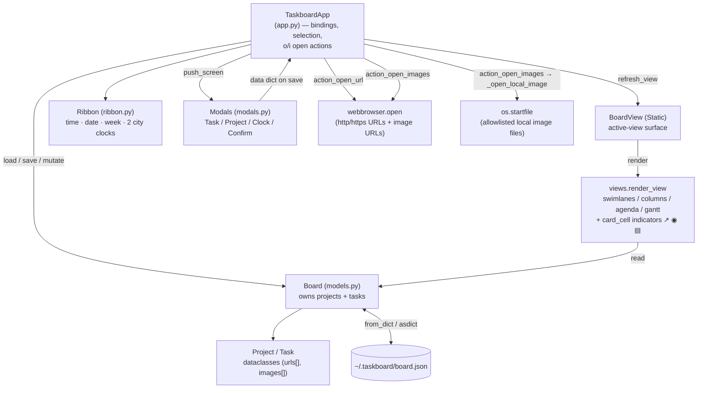

# Architecture — taskboard

How the pieces fit at runtime. The `TaskboardApp` owns selection + view state, renders the active view into `BoardView`, opens modals for writes, and delegates persistence to `Board`. The two open actions (`o`/`i`) reach out to the OS openers. ≤12 nodes.

**Notes**
- The **modal is the only write path** for task/project fields; it returns a `data` dict whose keys match `Task`/`Project` field names, applied by `_on_task_added` / `_on_task_edited` (`app.py:210-231`).
- `Board` is the single source of truth read by both the renderers (for `↗`/`◉`/`▤` indicators) and the open actions.
- `os.startfile` is reached only through `_open_local_image`'s security allowlist (`app.py:279-296`) — see the open-image sequence diagram.
