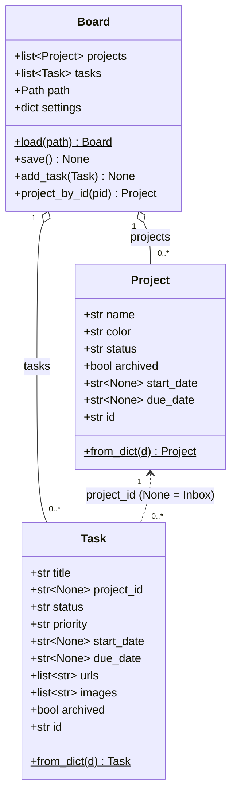

# Data model — taskboard

`Board` owns a list of `Project` and a list of `Task`, and round-trips them through one JSON file. This batch added `Task.urls[]` and `Task.images[]` (both `field(default_factory=list)`) and migrated the legacy singular `url`. Fields shown as they exist in `models.py` (2026-07-18).

**Field notes**
- `Project.status` ∈ `("on_track","paused","cancelled","completed")`; `Task.status` ∈ `("backlog","active","blocked","done")`; `Task.priority` ∈ `("low","normal","high")` — validated leniently (unknown → default) in `from_dict`.
- `Task.urls` (NEW): canonical list; `from_dict` reads a modern `urls` list, else wraps a legacy `url` string into a one-element list, else `[]` — never raises (`models.py:199-204`).
- `Task.images` (NEW): list of local paths and/or `http(s)` image URLs; non-list JSON degrades to `[]` (`models.py:205`).
- `Task.project_id is None` → the task is standalone, shown in the "Inbox" group.
- Persistence: `Board.save` serializes each dataclass via `asdict`; a missing file is seeded from `seed_data()`, a corrupt file starts empty and is left untouched (`models.py:234-256`).
