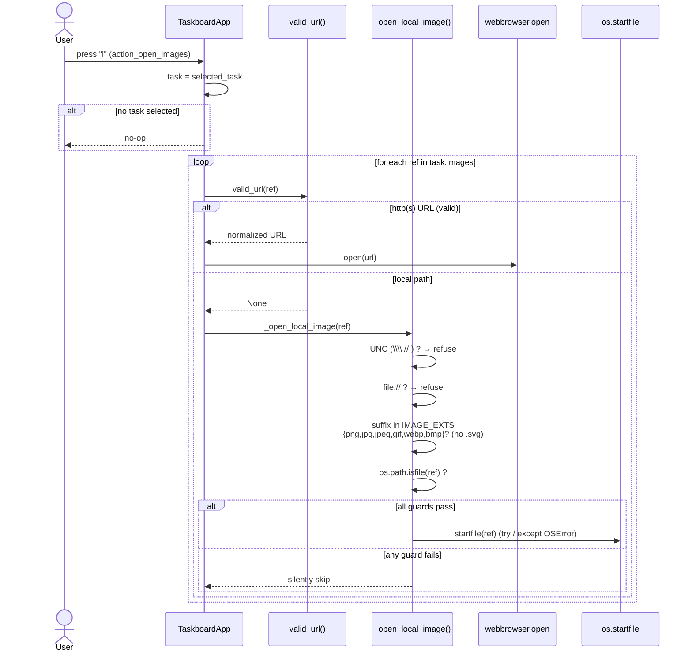

# Sequence — open-image action (`i` key)

What happens when the user presses `i` on the selected task. Each image ref is routed: a valid `http(s)` URL opens in the browser; a local path passes through the security allowlist before `os.startfile`. The guards (UNC / `file://` / extension allowlist / `isfile` / `try-except`) are the security core of US-003 (Constraint C-6). Source: `action_open_images` (`app.py:268-277`) → `_open_local_image` (`app.py:279-296`).

**Why each guard exists**
- **UNC / `file://` refused** — avoids opening remote/ambiguous paths (F3).
- **Extension allowlist, `.svg` excluded** — `os.startfile` executes by OS association; a non-image (e.g. `.exe`) would *run*, and `.svg` is scriptable (F4, C-6).
- **`os.path.isfile`** — only an existing regular file is passed through (F3).
- **`try/except OSError`** — a keypress must never crash the app.

Verified black-box by `test_at_003_images_black_box` and `test_open_images_allowlist_and_isfile`: a real `i` keypress over `[image-ext file, http URL, .svg, .exe, missing file, UNC, file://]` yields exactly one `startfile` (the image file) + one `webbrowser.open` (the URL); everything else is refused.
