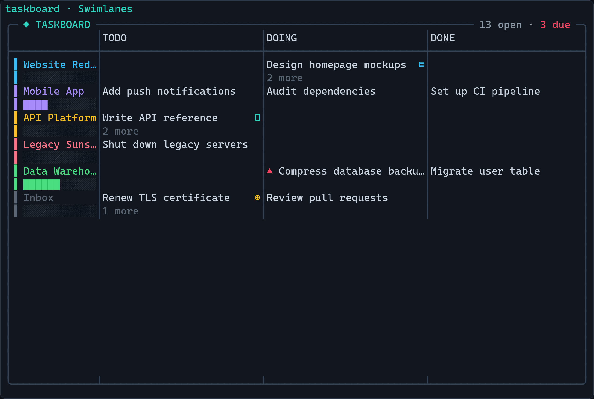

# taskboard

<p align="center">
  <br>
  <sub>Swimlanes · Columns · Agenda · Gantt — switch with keys 1–4.</sub>
</p>


A **frameless kanban desktop-widget task board** built in [Textual](https://textual.textualize.io/).
Run it in a borderless terminal, pin it always-on-top, and it floats on your desktop as a live
widget. Four switchable views over the same data; single dark theme tuned for a terminal.

Built and verified against **Textual 8.2.8 / rich 15.0.0** (Python 3.12).

```
╭─ ◆ TASKBOARD ───────────────────────────────── 4 open · 1 due ─╮
│▌ TEXTUAL                                    unaged  2 open  ▲4d│
│            ············╎····◆······················            │
│            ············╎·⣀⢀⣀·······················            │
│            ············╎⠸⣫⣾⣿·······················            │
│            ··········⣰⣶⢰⣶⣶⣾⣿·······················            │
│            ··········⣿⣿⢸⣿⣿⣿⣿·······················            │
│  M22 pitfalls module                                        ▲4d│
│▎ Systems   ············╎····⢠⣤⣤⣤⣿⣿⣿⣿⡇·············· 0/2    +26d│
│▎  ⠤ KServe rollout                                         +11d│
│▎  ⣀ k3s bootstrap                                          +18d│
│▏ Archive ✓  1/1 done · · · · · · · · · · · · · · ·    completed│
│            -24d      today                     +55d            │
╰────────────────────────────────────────────────────────────────╯
```

Every row sits on **one shared axis of days** — `╎` is today, one cell is two days — so
two projects' work is comparable by eye. The project under the most pressure leads with a
drawn field ending in `◆`, its own due date; the rest get a row each; anything with
nothing open **rests** at the bottom. Severity (`▲Nd`) is worn only by a date.

## Views

| Key | View | What it's for |
|-----|------|---------------|
| `1` | **Lanes** | One row per project on a shared day axis, **ranked by pressure**: a drawn field for the project that needs you now, a row for the rest, a resting row for anything with nothing open. Shows each project's status (`‖ ╳ ✓`), its `done/total`, its high-priority count `!N`, and how long its work has sat in phase. |
| `2` | **Columns** | Classic kanban: BACKLOG / DOING / BLOCKED / DONE, project-colored cards, WIP counts + throughput sparklines, due chips. |
| `3` | **Agenda** | Tasks grouped by urgency: OVERDUE / TODAY / THIS WEEK / LATER / NO DATE, with braille due-bars. |
| `4` | **Gantt** | An 8-week time axis; a bar per project (start→due) with its task bars underneath; undated items listed under UNSCHEDULED. |

## Install as a command

You have never packaged a CLI before, so here is the simplest correct path first.

### Recommended: pipx (isolated, gives you a global `taskboard` command)

`pipx` installs the app into its own isolated environment and puts the `taskboard` command on your PATH — it won't collide with anything else.

```powershell
python -m pip install --user pipx
python -m pipx ensurepath
# >>> close and REOPEN your terminal here so PATH updates <<<
pipx install "C:\Users\jjgh8\OneDrive\Documents\Github\taskboard"
```

Now, from any terminal:

```powershell
taskboard
```

To **update** after you edit the code:

```powershell
pipx reinstall taskboard
```

### Alternative: pip (user install)

```powershell
cd "C:\Users\jjgh8\OneDrive\Documents\Github\taskboard"
pip install --user .
taskboard
```

If `taskboard` is "not recognized", your Python **user scripts** dir isn't on PATH. Find it and add it:

```powershell
python -c "import site,os; print(os.path.join(site.getuserbase(), 'Scripts'))"
# add that folder to your PATH (System Settings → Environment Variables), reopen terminal
```

To update after edits: `pip install --user . --force-reinstall`.

### Run from source (development)

```powershell
cd "C:\Users\jjgh8\OneDrive\Documents\Github\taskboard"
python -m venv .venv
.\.venv\Scripts\Activate.ps1
pip install -r requirements.txt
python -m taskboard
```

Both `python -m taskboard` and the installed `taskboard` command launch the same app.

## Where your data lives

Tasks are stored as JSON at:

```
C:\Users\<you>\.taskboard\board.json
```

It is **not** inside the installed package (the package dir is read-only once pip/pipx-installed).
The file is created and seeded with demo data on first run. If it ever gets corrupted, the app
starts empty and leaves the file untouched so you can recover it by hand.

## Make it frameless

**Textual cannot remove the window chrome itself** — that's the terminal's job, and
**Windows Terminal / PowerShell cannot go borderless** (they always draw a title bar). Use
**WezTerm** (or Alacritty), which can.

A ready-made config ships in this repo: [`wezterm.lua`](wezterm.lua). It sets
`window_decorations = "NONE"`, turns the tab bar off, uses `window_background_opacity = 0.9`, sizes
the window, and launches `taskboard` via `default_prog`.

1. Install WezTerm: <https://wezterm.org>
2. Use the config — either copy it to your home dir as `C:\Users\<you>\.wezterm.lua`, or point
   WezTerm at it: `wezterm --config-file "…\taskboard\wezterm.lua"`.
3. Pin the window **always-on-top** with [PowerToys](https://learn.microsoft.com/windows/powertoys/)
   → *Always On Top* (default shortcut `Win+Ctrl+T`).

The frame is gone and the board **fills the window** — resize it and the four views reflow to the
new size. Textual paints the rest.

### Toggle the window border at runtime

The bundled `wezterm.lua` binds two keys (a WezTerm feature — an in-app button *cannot* remove the
OS frame):

| Key | Action |
|-----|--------|
| `Ctrl+Shift+B` | Flip the window frame on/off (`NONE` ↔ `TITLE \| RESIZE`) |
| `F11` | Toggle borderless fullscreen |

So you can start frameless, tap `Ctrl+Shift+B` to get the title bar back when you need to drag the
window, then tap it again to go frameless.

## Keybindings

| Key | Action |
|-----|--------|
| `1` `2` `3` `4` | Switch view (Swimlanes / Columns / Agenda / Gantt) |
| `↑` `↓` (or `k` `j`) | Move selection **in the current view's on-screen order**. In Columns/Swimlanes this moves *within* the column/lane. |
| `←` `→` (or `h` `l`) | Move between columns (Columns/Swimlanes) — jumps to the next column's first task. No-op in Agenda/Gantt (single column). |
| `a` | Add task |
| `p` | Add project |
| `P` | Manage projects (edit / archive / delete existing projects) |
| `e` | Edit selected task |
| `d` / `Delete` | Delete selected task (asks to confirm) |
| `x` | Archive / unarchive selected task |
| `v` | Toggle showing archived items (hidden by default) |
| `o` | Open the selected task's URLs in your browser (opens all of them) |
| `i` | Open the inline image viewer for the selected task (rescaled thumbnails) |
| `c` | Choose the two ribbon city clocks (type to find a city) |
| `q` | Quit |

Navigation follows what you **see**: Down in Columns walks down the current status
column (not some unrelated task in data order); Right jumps to the next column. The
selected task stays highlighted and is scrolled into view.

Inside a modal: `Esc` cancels, `Tab` moves between fields, `Enter` on a button activates it.

**Managing projects.** `p` only *adds* a project; press `P` to **manage the ones you already
have**. It opens a list of every project (name · status · task count, archived ones flagged). With a
project highlighted: `e` (or `Enter`) edits it — change its name, status
(`on_track`/`paused`/`cancelled`/`completed`), color, and start/due dates; `x` archives or
unarchives it; `d` deletes it. **Deleting a project never deletes its tasks** — they are reassigned
to Inbox (no-project). Every change saves immediately and the board re-renders behind the menu.

Tasks with a URL show a small `↗` and render their title as an OSC-8 hyperlink (clickable in
terminals that support it, e.g. WezTerm). The `o` key always works regardless of terminal.
High-priority tasks are marked `!` — a glyph, deliberately not a colour (see below).

### Project colours: eight, and why not twelve

Every hue in this app has exactly one job. A **project** hue says *which project*; the
**red** `#f43f5e` says *overdue*; the **amber** `#fbbf24` says *due today*; the **teal**
`#2dd4bf` marks *today / focus*. A colour that does two jobs cannot be read — and `amber`
used to be a project colour at the *identical* hex as "due today", so a project's spine, name
and bar were painted in the exact colour the app uses for urgency.

Four project colours were therefore retired, on measured rgb distance to the hue they
collided with: **amber** (0.0 from *due today*), **cyan** (48.3 from the teal), **orange**
(51.0), **rose** (63.8 from *overdue*). Eight remain: lime, green, sky, blue, indigo, violet,
fuchsia, pink.

**Existing boards keep working.** A project saved with a retired colour is remapped the first
time the board loads — `amber→lime`, `rose→pink`, `cyan→sky`, `orange→fuchsia` — and then never
changes again. The remap is one-to-one, so two projects that had different colours still have
different colours. To see in advance what your own board would change to:

```powershell
python -c "import json,pathlib;from taskboard.models import DROPPED_PROJECT_COLORS as M;d=json.loads(pathlib.Path.home().joinpath('.taskboard/board.json').read_text(encoding='utf-8'));print([(p['name'],p['color'],M[p['color']]) for p in d['projects'] if p.get('color') in M])"
```

For the same reason the high-priority marker is the glyph `!` rather than the amber `◉` it was
before: importance is not urgency, so it does not get to wear the urgency colour.

### Images

In the task editor, click **Paste image from clipboard** to attach a screenshot straight from the
clipboard. Pasted images are stored as **real files** under `~/.taskboard/images/<task-id>/`, so you
can open them raw with any app. Press `i` on a selected task to view its images rescaled **inline**
(crisp in graphics-capable terminals like WezTerm, half-block fallback elsewhere); inside the viewer
press `o` to open them all raw in your OS default app / browser. You can also paste plain image paths
or URLs directly into the Images field, one per line.

## The two city clocks

The bottom ribbon shows local time, date, ISO week (e.g. `W29`), and **two city clocks** —
e.g. `Mexico City 09:14 · Tokyo 23:14`.

Choose them **in-app**: press `c` to open the clock menu. Each clock is an Input you **type a
city into** — start typing and it autocompletes (type `mad` → `Madrid`, accept with `→` or
`Enter`). Save with the button (`Esc` cancels). An unknown or blank entry keeps the current city.
The two cities are saved to `board.json` and survive restarts. Defaults: **Mexico City** and
**New York**.

Times are **real and DST-aware** (via Python's `zoneinfo`, so `tzdata` is a dependency on
Windows). ~75 cities are available across LATAM, US/Canada, Europe, Middle East/Africa, and
Asia/Pacific — Mexico City, Monterrey, Bogotá, Lima, Santiago, São Paulo, Buenos Aires, New York,
Chicago, Denver, Los Angeles, Toronto, London, Madrid, Paris, Berlin, Rome, Istanbul, Dubai,
Cairo, Johannesburg, Mumbai, Bangkok, Singapore, Hong Kong, Shanghai, Tokyo, Seoul, Sydney,
Auckland, and more.

Upgrading from an older build? Previously-saved fixed-offset clocks (`CST`, `EST`, …) are
migrated automatically to a representative city (CST → Mexico City, EST → New York, PST → Los
Angeles, JST → Tokyo, …), so your saved board keeps working.

## Development

```powershell
.\.venv\Scripts\Activate.ps1
pip install -r requirements.txt
pytest            # 41 Pilot + render tests
```

## Project layout

```
taskboard/
  taskboard/
    __init__.py        package + version
    __main__.py        entry point: main() -> TaskboardApp().run()
    app.py             the App: view switching, selection, modals, one clock interval
    models.py          Project / Task dataclasses + Board (JSON persistence, seed)
    views.py           the four view renderers (rich markup, escaped user text)
    modals.py          add/edit task, add/edit project, project manager, confirm-delete modals
    ribbon.py          bottom status bar (time/date/week + two custom clocks)
    taskboard.tcss     palette + layout (single dark theme)
  tests/
    test_app.py        Pilot tests + pure-render tests
  pyproject.toml       packaging + console entry point (`taskboard`)
  requirements.txt     pinned deps
  README.md
```
