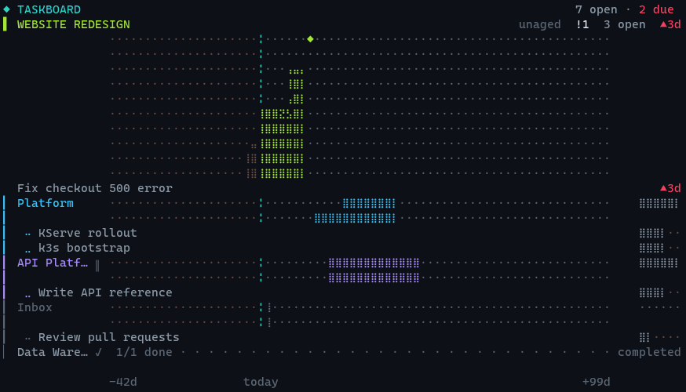
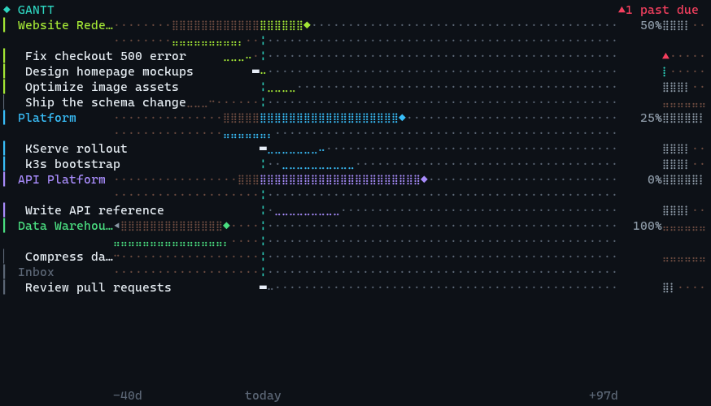
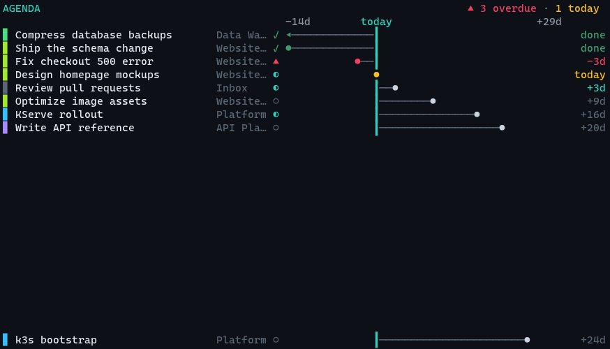
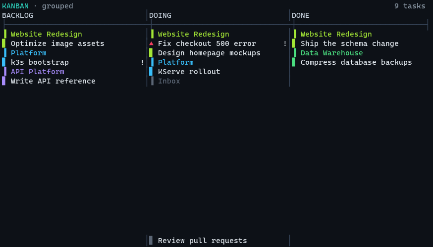

# taskboard

<p align="center">
  <br>
  <sub>The <b>lanes</b> view. Every frame is the real app; the today rule breathes on a 4 s cycle.</sub>
</p>

<p align="center">
  
  <br>
  
  <br>
  <sub><b>gantt · agenda · kanban · lanes</b> — real renders of the seeded demo board at 96×26.</sub>
</p>


A **frameless kanban desktop-widget task board** built in [Textual](https://textual.textualize.io/).
Run it in a borderless terminal, pin it always-on-top, and it floats on your desktop as a live
widget. Four switchable views over the same data; single dark theme tuned for a terminal.

Built and verified against **Textual 8.2.8 / rich 15.0.0** (Python 3.12).

```
◆ TASKBOARD                                             13 open · 3 due
▌ WEBSITE REDESIGN·········╎···················· unaged  !1  3 open  ▲2d
            ···············⢀⣀⣀⣿⣿⣿⣿⡇◆··························
            ··············⣰⢸⣿⣿⣿⣿⣿⣿⡇···························
  Fix checkout 500 error···╎········································ ▲2d
▎ Mobile…   ···············╎·····⣀⣀⣀⣶⣶⣶⣶⣶⣶⡆···················    ···30d
▎  ⠤ Audit dependencies····╎····································· ···12d
▎ API Pl… ‖ ···············╎·⢀⣀⣰⣶⣶⣶⣶⣶⣶⣶⣶⣶⣶⣶⣶⣶⣶⣶⣶⣶⣶············    ···45d
▎  ⣀ Write API reference···╎····································· ····5d
▎ Inbox     ···············⢀⣰·································    ·····—
▎  ⠤ Review pull requests··╎····································· ····1d
▎ Data W… ✓ ··············⢀╎··································    ··done
▎  ⠤ Compress database backups··································· ···▲1d
▎ Legacy… ╳ ···············╎··································    ··done
▎  ⣀ Shut down legacy servers···································· ····8d
            -30d         today                            +69d
```

Every row sits on **one shared axis of days** — `╎` is today, one cell is two days — so
two projects' work is comparable by eye. The project under the most pressure leads with a
drawn field ending in `◆`, its own due date; the rest get a row each; anything with
nothing open **rests** at the bottom. The right edge of every row is a **six-cell due
readout**: it says the number of days — `4d`, `today`, `▲3d` when overdue, `done` when
finished, `—` when there is no date. `▲` is the only alert on the row.

**There is no box.** The views commit with rules, not borders — every cell of the width
carries content or field, and the counts that a title bar would have held ride the head
row instead.

## Views

| Key | View | What it's for |
|-----|------|---------------|
| `1` | **Lanes** | One row per project on a shared day axis, **ranked by pressure**: a drawn field for the project that needs you now, a row for the rest, a resting row for anything with nothing open. Each row shows the project's status (`‖ ╳ ✓`) and ends in its due readout; the leader's band carries its open count, its high-priority count `!N`, and how long its work has sat in phase. |
| `2` | **Agenda** | Every dated task on one shared day axis, ordered by urgency, each drawing its reach from today to its due date. No meter here on purpose — the row already says the same thing twice, as order and as length. |
| `3` | **Gantt** | The same day axis, with a **past**: each project is two bands — its span (ash for elapsed, colour for what remains, ending at `◆`) over a progress band, so **the gap between them is the slip**, read as a length. Each task is a reach tipped by its phase glyph; finished work rests in ash at the tail. |
| `4` | **Kanban** | Every task in its phase column, grouped by project. |
| `6` | **Widget (aperture)** | The ambient face of the board, as a pushed screen: hero + meter + signal tiles + due calendar + up-next queue, rendered through the active design language (`t` cycles all 11). The number keys `1`-`4` exit *into* that view — the aperture is a launcher, the views are what you operate. |

> **Columns was retired** — kanban is the same phase grid and loses nothing, so the
> views renumbered to 1-4. The app says so once, on the first launch after the change.

## Install as a command

You have never packaged a CLI before, so here is the simplest correct path first.

### Recommended: pipx (isolated, gives you a global `taskboard` command)

`pipx` installs the app into its own isolated environment and puts the `taskboard` command on your PATH — it won't collide with anything else.

```powershell
python -m pip install --user pipx
python -m pipx ensurepath
# >>> close and REOPEN your terminal here so PATH updates <<<
pipx install "C:\Users\jjgh8\OneDrive\Documents\Github\taskboard"
```

Now, from any terminal:

```powershell
taskboard
```

To **update** after you edit the code:

```powershell
pipx reinstall taskboard
```

### Alternative: pip (user install)

```powershell
cd "C:\Users\jjgh8\OneDrive\Documents\Github\taskboard"
pip install --user .
taskboard
```

If `taskboard` is "not recognized", your Python **user scripts** dir isn't on PATH. Find it and add it:

```powershell
python -c "import site,os; print(os.path.join(site.getuserbase(), 'Scripts'))"
# add that folder to your PATH (System Settings → Environment Variables), reopen terminal
```

To update after edits: `pip install --user . --force-reinstall`.

### Run from source (development)

```powershell
cd "C:\Users\jjgh8\OneDrive\Documents\Github\taskboard"
python -m venv .venv
.\.venv\Scripts\Activate.ps1
pip install -r requirements.txt
python -m taskboard
```

Both `python -m taskboard` and the installed `taskboard` command launch the same app.

## Where your data lives

Tasks are stored as JSON at:

```
C:\Users\<you>\.taskboard\board.json
```

It is **not** inside the installed package (the package dir is read-only once pip/pipx-installed).
The file is created and seeded with demo data on first run. If it ever gets corrupted, the app
starts empty and leaves the file untouched so you can recover it by hand.

## Make it frameless

**Textual cannot remove the window chrome itself** — that's the terminal's job, and
**Windows Terminal / PowerShell cannot go borderless** (they always draw a title bar). Use
**WezTerm** (or Alacritty), which can.

A ready-made config ships in this repo: [`wezterm.lua`](wezterm.lua). It sets
`window_decorations = "NONE"`, turns the tab bar off, uses `window_background_opacity = 0.9`, sizes
the window, and launches `taskboard` via `default_prog`.

1. Install WezTerm: <https://wezterm.org>
2. Use the config — either copy it to your home dir as `C:\Users\<you>\.wezterm.lua`, or point
   WezTerm at it: `wezterm --config-file "…\taskboard\wezterm.lua"`.
3. Pin the window **always-on-top** with [PowerToys](https://learn.microsoft.com/windows/powertoys/)
   → *Always On Top* (default shortcut `Win+Ctrl+T`).

The frame is gone and the board **fills the window** — resize it and the four views reflow to the
new size. Textual paints the rest.

### Toggle the window border at runtime

The bundled `wezterm.lua` binds two keys (a WezTerm feature — an in-app button *cannot* remove the
OS frame):

| Key | Action |
|-----|--------|
| `Ctrl+Shift+B` | Flip the window frame on/off (`NONE` ↔ `TITLE \| RESIZE`) |
| `F11` | Toggle borderless fullscreen |

So you can start frameless, tap `Ctrl+Shift+B` to get the title bar back when you need to drag the
window, then tap it again to go frameless.

## Keybindings

| Key | Action |
|-----|--------|
| `?` | **Command palette** — search every command by name and run it without memorising the key |
| `;` | **More keys** — toggle the footer between the compact primary layer and the full grouped layer |
| `1` `2` `3` `4` | Switch view (Lanes / Agenda / Gantt / Kanban) |
| `↑` `↓` (or `k` `j`) | Move selection **in the current view's on-screen order**. In Kanban this moves *within* the phase column. |
| `←` `→` (or `h` `l`) | Move between phase columns (Kanban) — jumps to the next column's first task. No-op in the single-column views. |
| `a` | Add task |
| `p` | Add project |
| `P` | Manage projects (edit / archive / delete existing projects) |
| `e` | Edit selected task |
| `[` `]` | Move the selected task one phase back / forward — the move is **dated** (it restarts the card's in-phase clock). Already at the first / last phase? A silent no-op: no wrap, no re-dating. |
| `!` | Cycle the selected task's priority low → normal → high → low (high shows the `!` marker on the card) |
| `b` | Toggle the selected task's blocked flag (blocked cards wear the `▲` prefix instead of `▊`) |
| `s` | Kanban only: cycle the column sort — project → priority → due → recent (the header names the active mode, e.g. `· sort: due`) |
| `g` | Kanban only: cycle the column grouping — project → priority → horizon (group headers drawn inside each column, e.g. `Overdue`, `This week`, `No date`) |
| `z` | Kanban only: collapse the terminal phase column to one `✓ N` summary row (N = how many tasks rest there — on the terminal phase, every one of them is done). Works from anywhere, needs no selection; press `z` again to restore the column. |
| `F` | Kanban only: cycle a **project focus** — only that project's cards render and the header names it (`· focus: Name`). Steps through the visible projects in order, then back to the full board. |
| `esc` | Kanban only: leave the project focus (does nothing when no focus is active, so it never eats another screen's escape) |
| `+` / `=` | Due date one day **later** (an undated task starts from today) |
| `-` | Due date one day **earlier** |
| `u` | **Undo** the last quick mutation — phase move, priority, blocked, due-date bump, archive, or delete (a deleted task returns with its same id). Adding a task is deliberate and is not undoable; an empty history says so. |
| `S` | **Weekly standup** — a read-only modal of what moved (`→`) and what closed (`✓`) in the last 7 days, grouped per project with a `closed/total` line each. Derived entirely from the move date the board already records; a quiet week says so in one honest line. Closes on `S`, `q`, or `esc`. |
| `d` / `Delete` | Delete selected task (asks to confirm) |
| `x` | Archive / unarchive selected task (an archived task hides, so press `v` first to bring one back) |
| `X` | **Archive finished work the board has no completion date for** — a one-time purge for tasks that were already done before dates were recorded. Says how many and asks first. |
| `v` | Toggle showing archived items (hidden by default) |
| `o` | Open the selected task's URLs in your browser (opens all of them) |
| `i` | Open the inline image viewer for the selected task (rescaled thumbnails) |
| `Enter` | Details of the selected task (read-only: every field, notes, URLs, images) |
| `f` | Manage the board's phases (add / rename / reorder / delete) |
| `Ctrl+E` | **Insert an emoji** — in the task or project editor, search by name and insert the glyph at the cursor. Only emoji whose width is unambiguous are offered, so a title can never lean its row. |
| `Tab` | Kanban only: switch between the grouped and matrix layouts |
| `R` | **Write a report** — a self-contained HTML document of the board, saved beside your board file. It says where it went and does not open it. |
| `c` | Choose the two ribbon city clocks (type to find a city — accent-blind, so `Sao Paulo` finds `São Paulo`) |
| `q` | Quit |

Navigation follows what you **see**: Down in Kanban walks down the current phase
column (not some unrelated task in data order); Right jumps to the next column. The
selected task stays highlighted and is scrolled into view.

Inside a modal: `Esc` cancels, `Tab` moves between fields, `Enter` on a button activates it.

**Managing projects.** `p` only *adds* a project; press `P` to **manage the ones you already
have**. It opens a list of every project (name · status · task count, archived ones flagged). With a
project highlighted: `e` (or `Enter`) edits it — change its name, status
(`on_track`/`paused`/`cancelled`/`completed`), color, and start/due dates; `x` archives or
unarchives it; `d` deletes it. **Deleting a project never deletes its tasks** — they are reassigned
to Inbox (no-project). Every change saves immediately and the board re-renders behind the menu.

Tasks with a URL show a small `↗` and render their title as an OSC-8 hyperlink (clickable in
terminals that support it, e.g. WezTerm). The `o` key always works regardless of terminal.
High-priority tasks are marked `!` — a glyph, deliberately not a colour (see below).

**Finished work gets out of the way**, by two paths that never overlap.

*Automatically, when the date is known.* A task that has been in its done phase for **20 days
or more is archived at startup** — archived, never deleted. The app says when it has swept
any. It only counts from the moment a task **changes phase**, because that is when the board
learns the date.

*Deliberately, for everything older.* Work finished **before dates were recorded has no
completion date**, and the automatic sweep can never touch it — an undated task is not old,
it is undated, and guessing a date would be a fabrication. So press **`X`** for a one-time
purge: it tells you how many such tasks there are, asks, and only then archives them. It
still **stamps nothing** — those tasks keep their unknown date, honestly.

After that one purge, the 20-day rule handles everything from then on.

Either way the work is **archived, not deleted**: `v` shows archived items, `x` brings one
back, and you can also tick **Archived** inside the task editor (`e`).

### Project colours: eight, and why not twelve

Every hue in this app has exactly one job. A **project** hue says *which project*; the
**red** `#f43f5e` says *overdue*; the **amber** `#fbbf24` says *due today*; the **teal**
`#2dd4bf` marks *today / focus*. A colour that does two jobs cannot be read — and `amber`
used to be a project colour at the *identical* hex as "due today", so a project's spine, name
and bar were painted in the exact colour the app uses for urgency.

Four project colours were therefore retired, on measured rgb distance to the hue they
collided with: **amber** (0.0 from *due today*), **cyan** (48.3 from the teal), **orange**
(51.0), **rose** (63.8 from *overdue*). Eight remain: lime, green, sky, blue, indigo, violet,
fuchsia, pink.

**Existing boards keep working.** A project saved with a retired colour is remapped the first
time the board loads — `amber→lime`, `rose→pink`, `cyan→sky`, `orange→fuchsia` — and then never
changes again. The remap is one-to-one, so two projects that had different colours still have
different colours. To see in advance what your own board would change to:

```powershell
python -c "import json,pathlib;from taskboard.models import DROPPED_PROJECT_COLORS as M;d=json.loads(pathlib.Path.home().joinpath('.taskboard/board.json').read_text(encoding='utf-8'));print([(p['name'],p['color'],M[p['color']]) for p in d['projects'] if p.get('color') in M])"
```

For the same reason the high-priority marker is the glyph `!` rather than the amber `◉` it was
before: importance is not urgency, so it does not get to wear the urgency colour.

### Images

In the task editor, click **Paste image from clipboard** to attach a screenshot straight from the
clipboard. Pasted images are stored as **real files** under `~/.taskboard/images/<task-id>/`, so you
can open them raw with any app. Press `i` on a selected task to view its images rescaled **inline**
(crisp in graphics-capable terminals like WezTerm, half-block fallback elsewhere); inside the viewer
press `o` to open them all raw in your OS default app / browser. You can also paste plain image paths
or URLs directly into the Images field, one per line.

## Reports

Press **`R`** in the app, or run it from the shell:

```powershell
taskboard --report                 # the whole board
taskboard --report "Website Redesign"   # one project
```

Either way you get **one self-contained `.html` file** — CSS and figures inlined,
no CDN, no network — written to `reports/` beside your board file (so
`~/.taskboard/reports/`), and the path is printed. Nothing is opened for you.

It reports only what the board holds: open and done counts, the overdue pressure,
the due horizon, each project's cumulative load curve (drawn from the same engine
the board draws with), and how long work has sat in phase — **`unaged` where the
board never recorded a date, never a guessed zero.** No forecasts and no velocity;
the board stores no history to compute them from.

**Generating a report never modifies your board** — that is enforced by a test
that compares the file's checksum before and after.

## The two city clocks

The bottom ribbon shows local time, date, ISO week (e.g. `W29`), and **two city clocks** —
e.g. `Mexico City 09:14 · Tokyo 23:14`.

Choose them **in-app**: press `c` to open the clock menu. Each clock is an Input you **type a
city into** — start typing and it autocompletes (type `mad` → `Madrid`, accept with `→` or
`Enter`). Save with the button (`Esc` cancels). An unknown or blank entry keeps the current city.
The two cities are saved to `board.json` and survive restarts. Defaults: **Mexico City** and
**New York**.

Times are **real and DST-aware** (via Python's `zoneinfo`, so `tzdata` is a dependency on
Windows). **340 cities** are available across LATAM, US/Canada, Europe, the Middle East, Africa,
Asia and Oceania — and between them they cover **every UTC offset in current use**, including the
awkward ones you cannot guess a big city for: India +5:30 (Mumbai), Nepal +5:45 (Kathmandu),
Newfoundland −3:30 (St. John's), Chatham +12:45, Eucla +8:45, Kabul +4:30, Yangon +6:30,
Marquesas −9:30. So when the city you want is missing, some city on the same clock is not.

The search is **accent-blind on a fallback**: exact matching is unchanged, and only when nothing
matches does `Sao Paulo` find `São Paulo`, `Bogota` find `Bogotá`, `Dusseldorf` find `Düsseldorf`.
(Every zone is verified against your machine's own `tzdata` by the test suite, so a city that
cannot tell the time cannot ship.)

Upgrading from an older build? Previously-saved fixed-offset clocks (`CST`, `EST`, …) are
migrated automatically to a representative city (CST → Mexico City, EST → New York, PST → Los
Angeles, JST → Tokyo, …), so your saved board keeps working.

## Development

```powershell
.\.venv\Scripts\Activate.ps1
pip install -r requirements.txt
pytest            # 41 Pilot + render tests
```

## Project layout

```
taskboard/
  taskboard/
    __init__.py        package + version
    __main__.py        entry point: main() -> TaskboardApp().run()
    app.py             the App: view switching, selection, modals, one clock interval
    models.py          Project / Task dataclasses + Board (JSON persistence, seed)
    views.py           the four view renderers (rich markup, escaped user text)
    modals.py          add/edit task, add/edit project, project manager, confirm-delete modals
    ribbon.py          bottom status bar (time/date/week + two custom clocks)
    taskboard.tcss     palette + layout (single dark theme)
  tests/
    test_app.py        Pilot tests + pure-render tests
  pyproject.toml       packaging + console entry point (`taskboard`)
  requirements.txt     pinned deps
  README.md
```
