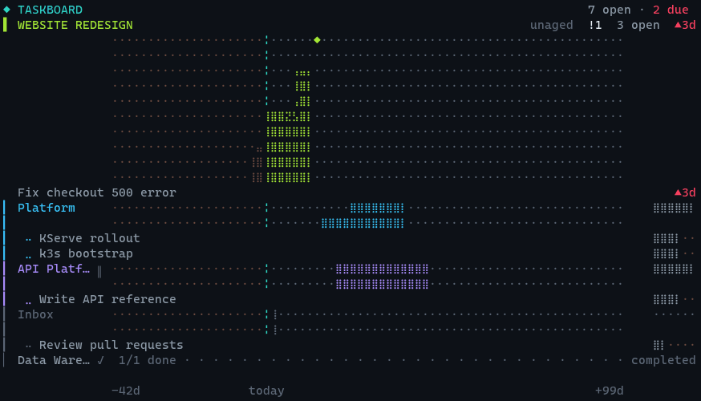
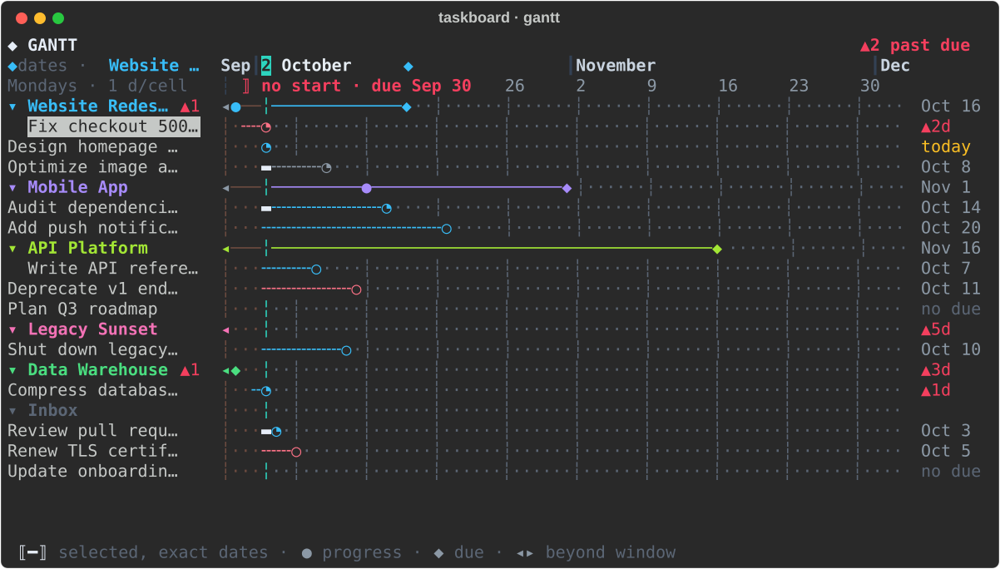
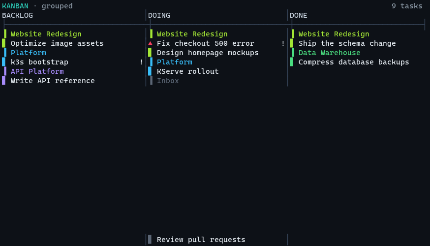
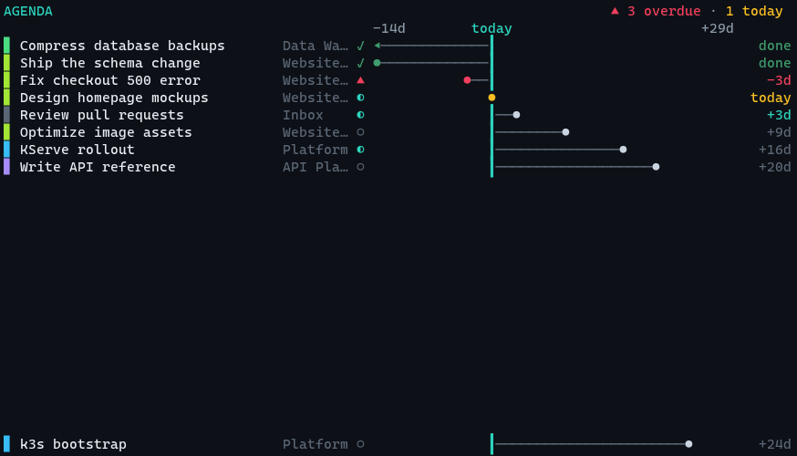

# taskboard

A keyboard-first task board for the terminal, built with [Textual](https://textual.textualize.io/).
Run it in a borderless terminal window, pin it on top, and it works as a desktop widget: ten
views over one JSON board, with optional team sync through a shared folder.

<p align="center">
  <br>
  
  <br>
  
  <br>
  <sub>Renders of the seeded demo board. The gantt is current; the other images predate this
  release's colour changes.</sub>
</p>

## What it is

- **A widget, not a window.** No borders: every view commits with rules, and it reflows to
  whatever size the terminal gives it.
- **Ten views** over the same tasks — lanes, agenda, gantt, kanban, focus, chains, flow, standup,
  people, setup — each one key away.
- **One file.** Your board is a single JSON file in your home directory; nothing goes to a
  server.
- **Optional team mode.** Point it at a shared folder and each person's board syncs there;
  teammates' cards show up read-only.

## Requirements

- Python **3.12 or newer** (`requires-python = ">=3.12"`).
- **Windows first.** It is built and used on Windows; opening raw image files uses
  `os.startfile`, which is Windows-only. The clipboard code has macOS and Linux branches, but
  those platforms are not tested here.
- Built and verified against **Textual 8.2.8 / rich 15.0.0** (pinned in `requirements.txt`).
  The install pulls in every runtime dependency (`textual`, `tzdata`, `pillow`,
  `textual-image`).

## Install

Clone the repository, then install it as a command.

```powershell
git clone https://github.com/jav201/taskboard.git
cd taskboard
```

**With pipx (recommended).** pipx gives the app its own environment and puts `taskboard` on
your PATH:

```powershell
python -m pip install --user pipx
python -m pipx ensurepath        # then open a new terminal so PATH updates
pipx install .
```

To update after pulling new code: `pipx reinstall taskboard`. This installs the newest
Textual; the exact versions the app is verified against are pinned in `requirements.txt`
(see [`RUN.md`](RUN.md)).

**With pip.** `pip install --user .` installs the same `taskboard` command. If the shell says
it is not recognized, your Python user-scripts folder is not on PATH; this prints it:

```powershell
python -c "import os, sysconfig; print(sysconfig.get_path('scripts', f'{os.name}_user'))"
```

**From source.** See [`RUN.md`](RUN.md): a virtual environment and `python -m taskboard`.

## Quick start

```powershell
taskboard
```

The first run creates your board and seeds it with demo data. Press `?` in any view for its
help — what the view is for, what its marks mean, an example and its keys; inside help, `m`
shows the full keymap and `?` opens the command palette. `q` quits.

## Views

| Key | View | One line |
|-----|------|----------|
| `1` | **Lanes** | One panel per project with its load and due work; `Tab` switches the grid (default) and the classic waves layout |
| `2` | **Agenda** | Every dated task on one shared day axis, by urgency |
| `3` | **Gantt** | The whole board on a window fitted to the open work, with a date ruler on top |
| `4` | **Kanban** | Every task in its phase column; `Tab` cycles grouped, matrix and lanes layouts |
| `5` | **Focus** | Pinned tasks and pinned projects, in five layouts (`Tab`) |
| `6` | **Chains** | The chain map: who waits on whom, per project — the ready/waits/late marks, the critical chain, and the per-chain `dates` rule on screen |
| `7` | **Flow** | Read-only: time in phase, a phase × week heatmap, weekly throughput |
| `8` | **Standup** | Team mode: one row per teammate — load, top task, sync age |
| `9` | **People** | Team mode: one lane per teammate; their cards are read-only |
| `0` | **Setup** | Team configuration, edited in the app with live health checks |

**Gantt.** Every project has a row. The window fits the open work (from half a day to a week
per cell, the smallest that holds it); when rows run out, projects fold to one span row
(`▸ name  N open`) while the selected task's project stays open (`▾`). Finished work folds into
a `✓n` count. Each row ends in one due chip (`▲3d` late, `today`, `Oct 6`, `no due`), and `↳`
marks a task waiting on open work. The two rows on top are the ruler: months, day numbers,
and the selected task's exact start and due (`⟦━⟧`).

## Keys

The key bar at the bottom shows the keys that work in the current view; `;` switches it
between the short and the full layer. Every key below is also in the command palette.

| Key | Name | One line |
|-----|------|----------|
| `?` | Help | Per-view help (usage, legend, example, keys); `m` there for the full map |
| `;` | More | Toggle the key bar's layer |
| `q` | Quit | Quit |
| `1`–`6`, `7`–`9`, `0` | Views | See [Views](#views) |
| `↑` `↓` / `k` `j` | Move | Move the selection in the order the view draws |
| `←` `→` / `h` `l` | Across | Move between columns (kanban) |
| `Enter` | Details | Every field of the selected task; its links can be changed there |
| `a` / `e` | Add / Edit | Add a task / edit the selected one in the full-screen editor |
| `d` / `Delete` | Delete | Delete the selected task (asks first) |
| `L` | Link | Make the selected task wait on another one (a picker; on the gantt, a link mode) |
| `M` | Milestone | Make the selected task a milestone — one date, its due — or a task again |
| `[` `]` | Phase | Move the selected task one phase back / forward |
| `!` | Priority | Cycle low → normal → high |
| `b` | Blocked | Mark an outside block (`▲`) on the task, or clear it |
| `+` `=` / `-` | Due | Due date one day later / earlier — what waits on it follows by the project's rule |
| `m` | Chain | Re-apply the last date move under the next mode (stay / push / together) |
| `u` | Undo | Undo the last quick change |
| `x` / `v` | Archive | Archive or unarchive / show archived tasks |
| `X` | Purge done | Archive all finished work that has no completion date (asks first) |
| `t` / `T` | Pin | Pin the task / its whole project (Focus view) |
| `o` / `i` | Links / Images | Open the task's http(s) links / view its images |
| `p` / `P` | Projects | Add a project / manage projects |
| `f` | Phases | Add, rename, reorder or delete the board's phases |
| `s` `g` `z` | Kanban | Sort, group, collapse the last phase |
| `F` / `/` / `esc` | Focus, filter | Kanban and gantt: focus one project / filter tasks / clear |
| `Tab` | Layout | Cycle the layouts of kanban, focus and lanes |
| `R` / `S` | Present / Standup | Present the selected task's project (gantt + brief, export SVG+PNG) / show the week's standup |
| `I` | Templates | Insert a process template (a named chain of tasks) into the selected task's project |
| `comma` | Save chain | Save the selected chain as a template (chain map) |
| `c` | Clocks | Choose the ribbon's two city clocks |
| `space` / `ctrl+s` | Setup | In Setup: toggle a control / save; `Enter` edits a row, `a` / `x` add or remove a row, `Tab` changes section, `esc` discards |

In the task and project editors, `Ctrl+E` inserts an emoji and `Ctrl+V` pastes text.

## Working with tasks

- **Phases.** A new board has `Backlog`, `Doing`, `Done`; `f` edits them. The last phase means
  done.
- **Undo.** `u` reverts the last phase move, priority, blocked flag, due change, pin, archive
  or delete. Adding a task is not undoable.
- **Finished work.** A task 20 days in its done phase is archived at startup (archived, never
  deleted). `X` archives all finished work that has no completion date (asks first); `v` shows archived
  tasks and `x` brings one back.
- **Projects.** `p` adds one; `P` manages them (edit, archive, delete). Archiving a project
  archives its open tasks too; deleting a project moves its tasks to the Inbox.

## Milestones

A **milestone** is a task with one date — its due — and no duration: a commitment, not work.
`M` on the selected task makes it one (its start becomes its due) or a task again; the editor
(`e`) has the same `milestone` box. A task with no date cannot be a milestone. `+`/`-` move a
milestone's single date, `u` undoes, and team sync carries the flag.

In the **gantt** a milestone is a row ` ◆ title` with a `◆` on its date and a chip saying how far
it is (`in 10d`, `today`, `▲2d` late); a reached one turns ash (`◆✓`, `✓ done`) and stays among its
project's rows while the project has open work. The ruler marks the selected project's milestones.

In the **kanban** a milestone is never a card and never counted: it rides its project's band rule
(`◆ Oct 10 Launch · in 10d`), late ones first, then the upcoming ones, then the last one reached.

**The one-time milestone offer.** The first time this version opens a board that holds one-day
tasks (start = due) or dated tasks with no start, it offers — once — to make milestones of them:
one-day tasks come pre-checked, the others unchecked; `space` toggles, `↵` converts exactly the
checked ones, `esc` converts none (and the offer does not come back). Converting first copies the
board file to `<board>.pre-milestones` and writes `<board>.milestones-log`; `u` undoes the whole
conversion. A board this version creates is never offered. Restoring the backup file brings back a
board without the offer's mark, so it is offered again at the next start.

## Links and blocking

A **link** says a task waits on another one. `L` on the selected task opens a picker: tasks of
the same project first, then by due date; type to filter; each row says what the link would mean
for the dates ("overlaps 3d", "ok — due 2d before this starts"). A task already linked says
`↵ removes`; one that would close a loop is shown with the loop and cannot be picked. The picker
can also create a new task to wait on. On the gantt, `L` opens a link mode that draws the link
before you make it. `u` undoes a link like any quick change.

Cards show `◂N` when the task waits on N open tasks and `▸N` when N open tasks wait on it. When
the last task it waits on is finished, the board says once that it is ready. The details view
(`Enter`) lists what a task waits on and what it unblocks, down the chain, with any date
conflict; there `tab` moves to the links, `x` removes one, `↵` jumps to it and `L` adds one.

`b` is the **outside block** (`▲`): something no task on the board stands for. It is independent
of links. A task that open tasks still wait on cannot be archived or deleted (nor its project
archived) until it is finished or the links are removed — the refusal names who waits.

The kanban `unblock` sort puts tasks with the most waiting work first, and the gantt draws the
critical chain (the longest chain of open links) as a heavy `━` line.

**The one-time link migration.** Boards written by earlier versions recorded a link every time
`b` blocked a task and kept it after unblocking. The first start of this version reads those
links once: a task still blocked on a task now waits on it, links that had been released are
dropped, and blocks with no task to point at stay. Before changing anything it copies the board
file to `<board file>.pre-links-migration` and writes every change to
`<board file>.links-migration-log`; `u` right after the start undoes it. It never runs again on
its own. To go back later, close the app and copy the backup over the board file — the restored
board is migrated again at the next start. If the backup cannot be written the app does not open
the board (free space or write access in its folder, or run `taskboard --board` on a copy).

## Kanban

- `s` cycles the sort: project → priority → due → recent → unblock.
- `g` cycles the grouping: project → priority → horizon.
- `z` collapses the last (done) phase to one count row.
- Open high-priority cards float to a `high` band at the top of each column (grouped layout),
  and every open card wears a priority badge: `!!` high, `==` normal, `++` low.
- Phase headers show a WIP limit as `count/limit`, red when over; the default is 3 for `Doing`
  (`wip_limits` in the board's settings).

## Notes, links and images

- In notes, `==text==`, `!!text!!` and `++text++` are highlighted yellow, red and green.
- A task with a URL shows `↗`; `o` opens its http(s) links in your browser.
- In the editor, **Paste image** saves the clipboard image as a real file; `i` views a task's
  images inline, and `o` inside the viewer opens them in your default app.

## Team mode

Team mode syncs boards through any shared folder — a synced drive or a git checkout works the
same. Turn it on in **Setup** (`0`): the shared folder, who you are, which projects are shared, the
roster, and a time in minutes after which a teammate whose board has not synced is shown as
stale. The app syncs every 30 minutes. The folder holds `team.json` (the roster and
shared projects) and one `board.<user>.json` per person. Teammates' cards appear read-only in
**Standup** (`8`) and **People** (`9`). Setup checks the folder as you edit and says what is
wrong.

## Presentation

`R` opens the presentation of the selected task's project (the focused project when set): the
gantt field on top, the brief blocks below, and a cursor whose task's notes expand (`←`/`→`
and `↑`/`↓` move it). `x` exports what it shows to an SVG and a PNG in the `reports` folder;
`esc` leaves. The presentation is read-only — it never writes the board.

## Reports

From the shell:

```powershell
taskboard --report                       # the whole board
taskboard --report "Website Redesign"    # one project
```

Each writes one self-contained HTML file to a `reports` folder beside your board file and
prints the path. It shows counts and dates only — no forecasts — and never modifies an
existing board (pointed at a board file that does not exist yet, it creates the demo board
first, as the app does). An unknown project name exits with code 2 and lists the projects.

## Clocks

The bottom ribbon shows the time, date, ISO week and two city clocks (default Mexico City and
New York). `c` changes them: type a city and it autocompletes. 340 cities are available,
daylight saving included (`zoneinfo`).

## Frameless window (WezTerm)

Windows Terminal always draws a title bar, so use [WezTerm](https://wezterm.org). This repo
ships a config, [`wezterm.lua`](wezterm.lua): no window decorations, no tab bar, a dark
background. Load it with `wezterm --config-file wezterm.lua`, or copy it to `~/.wezterm.lua`.

- It opens your normal shell; uncomment `default_prog` in the file to boot straight into
  `taskboard`.
- `Ctrl+Shift+B` toggles the window frame and `F11` borderless fullscreen (WezTerm keys).
- Keep it on top with PowerToys **Always On Top** (`Win+Ctrl+T`).

## Data files

Everything lives under `~/.taskboard/` (or beside the file you pass with `--board`):

| File | What |
|------|------|
| `board.json` | Your board: projects, tasks, settings |
| `board.json.corrupt` | A copy of an unreadable board, kept before the app starts empty |
| `history.jsonl` | One line per phase move and per added task — the Flow view reads it |
| `images/<task id>/` | Pasted images, as plain files |
| `reports/` | HTML reports and the presentation's SVG + PNG exports |

Never commit a real board: the repo's pre-commit hook (`tools/precommit_privacy.py`) refuses
files that carry your board's text.

## Command line

| Command | What |
|---------|------|
| `taskboard` | Run the app on `~/.taskboard/board.json` |
| `taskboard --board PATH` | Run it on another board file |
| `taskboard --report [PROJECT]` | Write a report and exit |

`python -m taskboard` is the same command.

## Development

See [`RUN.md`](RUN.md) for the environment, the test suite and the privacy hook. CI runs the
suite on pushes to `main` and on pull requests (`.github/workflows/ci.yml`).

```
taskboard/
  __main__.py     command line
  app.py          the App: views, selection, keys, team sync timer
  keymap.py       every key binding (the one source of the key bar and the palette)
  views.py        the view renderers, nav order and per-view help
  modals.py       editors, pickers, help and other modal screens
  models.py       Project / Task / Board: JSON store, seeding, rescue
  history.py      the log of phase moves and added tasks (history.jsonl)
  team_sync.py    team mode: the shared folder's files, merge, health check
  report.py       the HTML report
  ribbon.py       the bottom clock ribbon
  wave.py         the lanes waves engine
  taskboard.tcss  styles
tests/            pytest suite
tools/            privacy sweep and pre-commit check
docs/             screenshots and a sample report
wezterm.lua       frameless WezTerm config
```

## Colours

Eight project colours (lime, green, sky, blue, indigo, violet, fuchsia, pink); red, amber and
teal are kept for overdue, for due today, and for today and the filter field. Boards saved with a retired colour are remapped
once on load.

## History

- **Columns was retired**: the kanban is the same phase grid and loses nothing, so the views
  were renumbered.
- Key `6` is free: it belonged to the aperture widget view, which was removed.

## Limitations

- Raw image opening is Windows-only; macOS and Linux are untested.
- The Standup and People views need team mode.
- A real board is never part of this repo; the screenshots use the seeded demo data.
